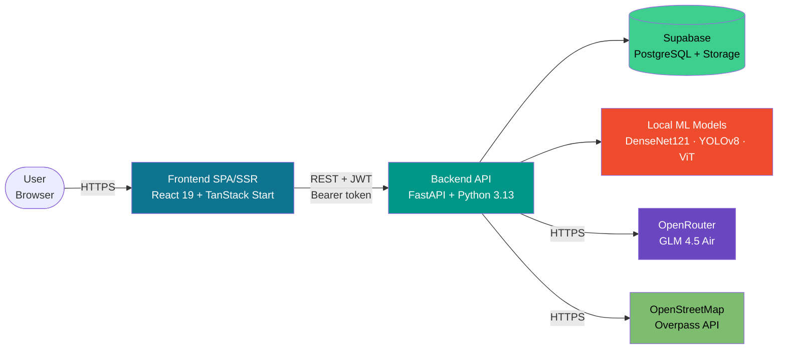
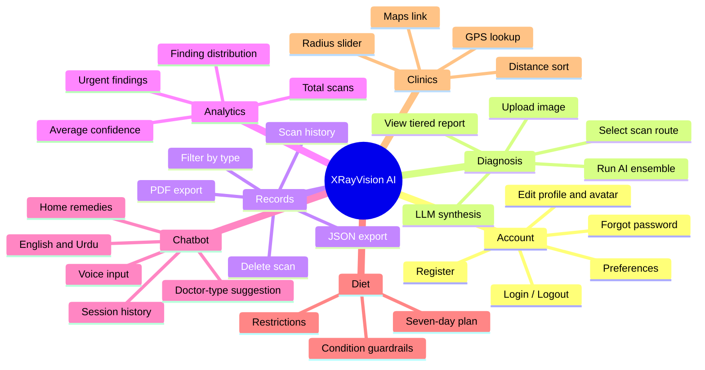
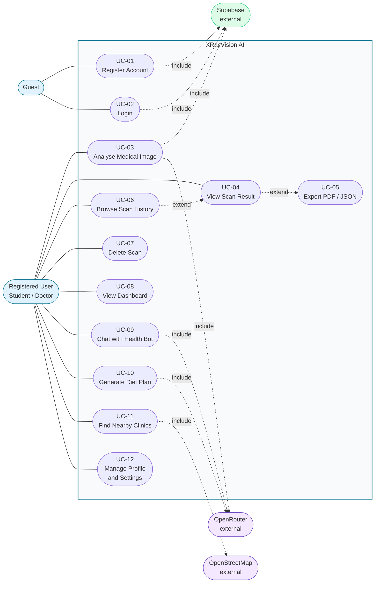
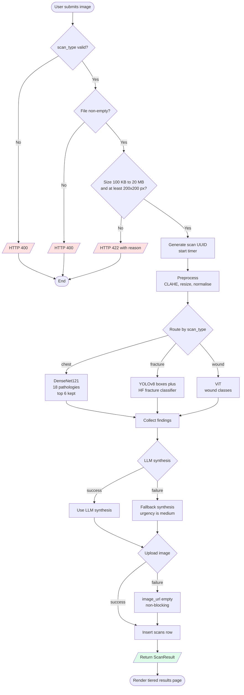

# Software Requirements Specification (SRS)

## XRayVision AI — Web-Based AI Chatbot for Automated X-Ray Fracture Detection

| Field | Value |
|---|---|
| **Document** | Software Requirements Specification |
| **Version** | 1.0 |
| **Standard** | IEEE Std 830-1998 (adapted) |
| **Project** | XRayVision AI — Full-Stack Medical Diagnostic Platform |
| **Institution** | Minhaj University Lahore — School of Software Engineering |
| **Programme** | BSSE, 8th Semester — Final Year Project |
| **Students** | Muhammad Ali Raza (2022F-MUL-BSSWE-017), Hamza Afzal (2022F-MUL-BSSWE-027) |
| **Supervisor** | Maam Misbah — Lecturer, School of Software Engineering |
| **Session** | May 2026 |

---

## Table of Contents

1. [Introduction](#1-introduction)
2. [Overall Description](#2-overall-description)
3. [External Interface Requirements](#3-external-interface-requirements)
4. [Functional Requirements](#4-functional-requirements)
5. [Use Case Model](#5-use-case-model)
6. [Non-Functional Requirements](#6-non-functional-requirements)
7. [Other Requirements](#7-other-requirements)
8. [Appendices](#8-appendices)

---

## 1. Introduction

### 1.1 Purpose

This document specifies the complete software requirements for **XRayVision AI**, a web-based medical
diagnostic platform that analyses medical images using a multi-model deep-learning ensemble and produces a
structured clinical report through an LLM synthesis layer.

The intended audience is:

- The project supervisor and the FYP evaluation committee
- The development team (for implementation and verification)
- Future maintainers who extend the system

This SRS defines **what** the system must do. The **how** is specified in the companion
[Software Design Document](02-SDD.md).

### 1.2 Scope

**Product name:** XRayVision AI

XRayVision AI allows an authenticated user to upload a chest X-ray, a bone X-ray, or an external wound
photograph and receive, within seconds, an AI-generated diagnostic report containing named findings,
confidence scores, ICD-10 codes, bounding-box localisation, an urgency rating, recommended actions and
a specialist referral suggestion.

**In scope**

| # | Capability |
|---|---|
| 1 | User registration, login, password reset, profile and settings management |
| 2 | Chest X-ray pathology detection (18 classes) |
| 3 | Bone fracture localisation with bounding boxes + image-level fracture screening |
| 4 | External wound classification |
| 5 | LLM synthesis of model outputs into a readable clinical report |
| 6 | Permanent scan history with PDF and JSON export |
| 7 | Bilingual (English / Urdu) health chatbot with voice input and session persistence |
| 8 | Personalised 7-day diet plan generation with medical guardrails |
| 9 | GPS-based nearby clinic and hospital locator via OpenStreetMap |
| 10 | Dashboard analytics over the user's own scan history |

**Out of scope**

- Clinical or diagnostic certification of any kind — the system is an educational aid only
- PACS / HL7 / FHIR hospital-system integration
- Multi-tenant hospital administration, billing, or appointment booking
- Real-time collaboration or multi-radiologist review workflows
- Training of new models from user-uploaded data

### 1.3 Definitions, Acronyms and Abbreviations

| Term | Definition |
|---|---|
| **AI** | Artificial Intelligence |
| **API** | Application Programming Interface |
| **CLAHE** | Contrast Limited Adaptive Histogram Equalisation — contrast enhancement applied during preprocessing |
| **CNN** | Convolutional Neural Network |
| **DenseNet121** | A 121-layer densely-connected CNN; here pretrained by TorchXRayVision on 700,000+ clinical chest X-rays |
| **DICOM** | Digital Imaging and Communications in Medicine — the standard medical imaging file format (`.dcm`) |
| **FYP** | Final Year Project |
| **ICD-10** | International Classification of Diseases, 10th revision — standard diagnostic coding system |
| **JWT** | JSON Web Token — the stateless authentication token format used by the API |
| **LLM** | Large Language Model |
| **Overpass API** | The query API of the OpenStreetMap project, used to look up healthcare facilities |
| **RLS** | Row Level Security — PostgreSQL feature restricting row access per authenticated user |
| **SPA** | Single Page Application |
| **SSR** | Server Side Rendering |
| **ViT** | Vision Transformer — a transformer-based image classification architecture |
| **YOLOv8** | "You Only Look Once" v8 — a single-pass object detection model used for fracture localisation |

### 1.4 References

| # | Reference |
|---|---|
| R1 | IEEE Std 830-1998, *Recommended Practice for Software Requirements Specifications* |
| R2 | Cohen J.P. et al., *TorchXRayVision: A library of chest X-ray datasets and models*, https://github.com/mlmed/torchxrayvision |
| R3 | Ultralytics YOLOv8 Documentation, https://docs.ultralytics.com |
| R4 | Dosovitskiy A. et al., *An Image is Worth 16x16 Words: Transformers for Image Recognition at Scale*, ICLR 2021 |
| R5 | FastAPI Documentation, https://fastapi.tiangolo.com |
| R6 | TanStack Start / Router / Query Documentation, https://tanstack.com |
| R7 | Supabase Documentation, https://supabase.com/docs |
| R8 | OpenRouter API Documentation, https://openrouter.ai/docs |
| R9 | OpenStreetMap Overpass API, https://wiki.openstreetmap.org/wiki/Overpass_API |
| R10 | WHO, *International Classification of Diseases 10th Revision (ICD-10)* |
| R11 | XRayVision AI — Software Design Document, [`docs/02-SDD.md`](02-SDD.md) |

### 1.5 Overview of the Document

Section 2 describes the product at a high level — its context, its users and its constraints.
Section 3 defines the external interfaces. Section 4 enumerates every functional requirement with a unique
identifier. Section 5 presents the use case model. Section 6 states the measurable non-functional
requirements. Sections 7 and 8 cover legal constraints and supporting appendices.

---

## 2. Overall Description

### 2.1 Product Perspective

XRayVision AI is a **new, self-contained web product**. It is not a replacement for, nor a component of,
an existing system. It is built as three independently deployable tiers communicating over HTTPS:

The system depends on four **external services** it does not own: Supabase (database, auth backing store
and object storage), OpenRouter (LLM inference), Hugging Face Hub (model weight distribution) and
OpenStreetMap (facility lookup).

### 2.2 Product Functions

### 2.3 User Classes and Characteristics

| User class | Technical skill | Frequency of use | Primary functions used | Priority |
|---|---|---|---|---|
| **Medical Student** (default role) | Moderate — familiar with web apps, learning radiology | Daily during study periods | Analysis, history, chatbot | High |
| **Radiologist / Doctor** | Moderate — domain expert, not a developer | Occasional, for preliminary screening | Analysis, PDF export, clinics | High |
| **Healthcare Professional** (nurse, dietitian) | Basic | Weekly | Chatbot, diet planner, clinics | Medium |
| **Evaluator / Examiner** | Any | One-off | Demo account, all features | Medium |
| **System Administrator** | High — developer | Setup and maintenance only | Deployment, environment configuration, Supabase console | Low |

> **Note:** The system does not implement role-based access control. `role` is a descriptive profile
> attribute (default `"Medical Student"`); all authenticated users have identical permissions over
> their own data.

### 2.4 Operating Environment

**Client side**

| Item | Requirement |
|---|---|
| Browser | Chrome 120+, Edge 120+, Firefox 120+, Safari 17+ |
| JavaScript | Must be enabled |
| Screen | Minimum 360 px width (responsive down to mobile) |
| Permissions | Geolocation required only for the Clinic Locator; microphone required only for chatbot voice input |
| Network | Broadband recommended (image upload up to 20 MB) |

**Server side**

| Item | Requirement |
|---|---|
| Backend runtime | Python 3.11+ (3.13 in production) |
| Backend framework | FastAPI 0.115, served by Uvicorn |
| Container | Docker, listening on port 7860 (Hugging Face Spaces convention) |
| Memory | ≥ 2 GB RAM recommended for model preloading; `DISABLE_PRELOAD=true` supported on ≤ 512 MB free tiers |
| Frontend runtime | Node.js 18+ for build; served as a static + SSR bundle |
| Database | Supabase-managed PostgreSQL 15+ |

### 2.5 Design and Implementation Constraints

| ID | Constraint |
|---|---|
| **C-1** | The system must remain deployable entirely on **free-tier** cloud services (Vercel, Hugging Face Spaces, Supabase free plan, OpenRouter free models). This is a hard FYP budget constraint. |
| **C-2** | The LLM must be `z-ai/glm-4.5-air:free` via OpenRouter. No paid inference provider may be required. |
| **C-3** | Model weights must come from public sources (TorchXRayVision, Hugging Face Hub) or be bundled in the repository (`backend/models/fracture_yolov8.pt`). |
| **C-4** | All AI outputs must carry an explicit "educational use only — not a medical device" disclaimer. |
| **C-5** | The backend must start and accept requests **before** model loading completes, so free-tier health checks do not time out. |
| **C-6** | No patient-identifying information may be requested or stored. Uploaded images are keyed only by an opaque user UUID. |
| **C-7** | Authentication must be stateless (JWT), because the backend host may cold-start or scale to zero. |
| **C-8** | Rate limiting must be applied to every LLM-backed endpoint to stay within free-tier quotas. |
| **C-9** | All model inference must run on **CPU**; no GPU may be assumed. |

### 2.6 Assumptions and Dependencies

**Assumptions**

- **A-1** Users upload genuine medical images. The system validates format and quality but cannot verify clinical provenance.
- **A-2** Users understand the output is advisory and not a diagnosis.
- **A-3** The uploading user has the right to upload the image.

**Dependencies**

| Dependency | Failure impact | Mitigation implemented |
|---|---|---|
| Supabase availability | Scans cannot be saved or listed | Image upload failure is non-blocking — analysis still returns to the user |
| OpenRouter availability | No synthesis paragraph | Hard-coded fallback synthesis returned with `urgency: "medium"` |
| Hugging Face Hub | ViT / fracture classifier cannot download | Per-model try/except; other models still run, errors recorded in `model_results.model_errors` |
| YOLO weight file present | Fracture localisation unavailable | Image-level fracture screening classifier still runs |
| Overpass API | Clinic search unavailable | Three mirror endpoints are tried in sequence before failing |

---

## 3. External Interface Requirements

### 3.1 User Interfaces

The frontend uses two layout shells:

| Shell | Used by | Description |
|---|---|---|
| `AuthShell` | Login, Register, Forgot Password | Split layout — marketing panel plus a centred credential card |
| `AppShell` | All authenticated pages | Collapsible left sidebar + top header with page title, search and user menu |

**Sidebar navigation (fixed order):** Dashboard · New Analysis · Health Chat · Diet Planner · Clinics ·
History · Profile · Settings.

| ID | Requirement |
|---|---|
| **UI-1** | All pages shall be responsive from 360 px to 1920 px width. |
| **UI-2** | Light, dark and system theme modes shall be selectable in Settings and persisted per user. |
| **UI-3** | Every long-running action (analysis, chat reply, diet generation) shall display a visible loading state. |
| **UI-4** | Urgency shall be communicated by both colour **and** text label, so the UI never relies on colour alone. |
| **UI-5** | Every error returned by the API shall be surfaced as readable text, never as a raw stack trace. |
| **UI-6** | An "Educational use only" badge shall be permanently visible in the application shell. |
| **UI-7** | Findings shall be presented in three confidence tiers so the user can immediately judge reliability (see FR-028a). |

### 3.2 Hardware Interfaces

| ID | Interface | Purpose |
|---|---|---|
| **HW-1** | Browser Geolocation API | Supplies latitude/longitude to the Clinic Locator. If permission is denied the feature degrades gracefully with an explanatory message. |
| **HW-2** | Browser SpeechRecognition API (microphone) | Optional voice input for the health chatbot, using locale `en-US` or `ur-PK`. Text input remains fully available. |

No GPU is required — all models run on CPU inference.

### 3.3 Software Interfaces

| Interface | Type | Direction | Data exchanged |
|---|---|---|---|
| **Supabase PostgreSQL** | Supabase Python client | Backend ⇄ DB | Profile, scan, chat session and chat message rows |
| **Supabase Storage** | Supabase Python client | Backend → Storage | Uploaded images (`xray-images` bucket), avatars (`avatars` bucket); returns a public URL |
| **Supabase Auth** | Supabase Python client | Backend ⇄ Auth | User creation, credential verification, password-reset email |
| **OpenRouter Chat Completions** | HTTPS REST | Backend → OpenRouter | Structured clinical prompt; returns synthesis JSON. Model `z-ai/glm-4.5-air:free`, timeout 60 s |
| **Hugging Face Hub** | HTTPS | Backend → HF | Downloads ViT wound classifier and fracture screening classifier weights on first use |
| **OpenStreetMap Overpass** | HTTPS | Backend → Overpass | Healthcare facility query within a radius; three mirrors tried in order |
| **TorchXRayVision** | Python library | In-process | Supplies pretrained DenseNet121 weights |
| **Ultralytics** | Python library | In-process | Runs YOLOv8 inference on the bundled `.pt` weights |

### 3.4 Communications Interfaces

| ID | Requirement |
|---|---|
| **CM-1** | All client–server communication shall use HTTPS in production. |
| **CM-2** | The API shall be RESTful, accepting and returning `application/json`, except `POST /analyze` (`multipart/form-data`) and `GET /scans/{id}/report.pdf` (`application/pdf`). |
| **CM-3** | Authenticated requests shall carry the token in an `Authorization: Bearer <jwt>` header. |
| **CM-4** | CORS shall permit only the configured frontend origin(s) in production; localhost origins are permitted only when `FRONTEND_URL` is itself a localhost URL. |
| **CM-5** | Allowed methods shall be `GET, POST, PUT, PATCH, DELETE, OPTIONS`; allowed headers `Authorization, Content-Type, Accept`. |

---

## 4. Functional Requirements

Priority: **M** = Must have, **S** = Should have, **C** = Could have.

### 4.1 Module: Authentication & Account (FR-001 – FR-010a)

| ID | Requirement | Priority |
|---|---|---|
| **FR-001** | The system shall allow a new user to register with full name, email, password and an optional role. | M |
| **FR-002** | The system shall reject a password shorter than **8 characters** at both client and server. | M |
| **FR-003** | The system shall reject registration with an existing email, returning a readable error. | M |
| **FR-004** | On successful registration the system shall create a `profiles` row via a database trigger and return a JWT, signing the user in immediately. | M |
| **FR-005** | The system shall authenticate a returning user by email and password and return a JWT plus the user profile. | M |
| **FR-006** | The system shall issue JWTs signed with **HS256** expiring after **24 hours** (configurable via `JWT_EXPIRY_HOURS`). | M |
| **FR-007** | The system shall reject any request to a protected endpoint carrying a missing, malformed or expired token, with HTTP **401**. | M |
| **FR-008** | The system shall provide a "forgot password" flow that triggers a Supabase password-reset email. | S |
| **FR-009** | The system shall allow a signed-in user to update their full name, role and avatar image. | S |
| **FR-010** | The system shall allow logout by clearing the locally stored token and user object; no server call is required. | M |
| **FR-010a** | The login page shall provide a one-click **demo account** button so evaluators can explore the system without registering. | S |

### 4.2 Module: Image Analysis (FR-011 – FR-025a)

| ID | Requirement | Priority |
|---|---|---|
| **FR-011** | The system shall let the user select exactly one analysis route: `chest`, `fracture`, or `wound`. | M |
| **FR-012** | The system shall accept image uploads in **JPEG, PNG and DICOM (`.dcm`)** formats. | M |
| **FR-013** | The system shall reject a file smaller than **100 KB** with HTTP 422 and an explanatory message. | M |
| **FR-014** | The system shall reject a file larger than **20 MB** with HTTP 422 and an explanatory message. | M |
| **FR-015** | The system shall reject a non-DICOM image whose width or height is below **200 px** with HTTP 422. | M |
| **FR-016** | The system shall reject an empty upload with HTTP 400. | M |
| **FR-017** | The system shall reject an invalid `scan_type` value with HTTP 400. | M |
| **FR-018** | The system shall allow an optional session/patient label and optional free-text clinical notes per analysis. | S |
| **FR-019** | The system shall apply CLAHE contrast enhancement and model-specific resizing/normalisation before inference. | M |
| **FR-020** | The system shall route the image correctly: `chest` → DenseNet121; `fracture` → YOLOv8 **and** the HF fracture screening classifier; `wound` → ViT. | M |
| **FR-021** | For chest scans, the system shall return at most the **top 6** findings ranked by descending confidence. | M |
| **FR-022** | For fracture scans, the system shall return bounding boxes only for **positive** fracture detections. `Not_Fracture` detector boxes shall be ignored, because absence of a detection does not prove the scan is normal. | M |
| **FR-023** | The system shall pass all findings, the scan type and the user's notes to the LLM, which shall return an urgency rating, a synthesis paragraph, recommended actions and a suggested specialist. | M |
| **FR-024** | If LLM synthesis fails, the system shall still return a complete result using a fallback synthesis with `urgency: "medium"`. The analysis shall **not** fail. | M |
| **FR-025** | If image upload to storage fails, the system shall still return the analysis result. The upload shall be non-blocking. | M |
| **FR-025a** | The system shall record and return per-request diagnostics: models run, model errors, and processing time in milliseconds. | S |

**Urgency vocabulary (closed set):** `critical`, `high`, `medium`, `low`, `clear`
**Severity vocabulary (closed set):** `critical`, `high`, `moderate`, `low`

### 4.3 Module: Results & Records (FR-026 – FR-033)

| ID | Requirement | Priority |
|---|---|---|
| **FR-026** | The system shall persist every completed analysis with its findings, synthesis, image URL, urgency and timestamp. | M |
| **FR-027** | The results page shall render the uploaded image with bounding-box overlays drawn at the correct scale for any viewport size. | M |
| **FR-028** | The results page shall display, per finding: name, confidence percentage, severity, originating model, anatomical region and ICD-10 code where available. | M |
| **FR-028a** | Findings shall be grouped into three confidence tiers: **Primary** (≥ 65 %), **Secondary** (50–65 %) and **Borderline** (< 50 %, collapsed by default). | M |
| **FR-028b** | If any finding has confidence below **60 %**, the results page shall display a banner recommending radiologist review. | M |
| **FR-028c** | The results page shall provide image controls: toggle AI finding boxes, toggle heatmap overlay, toggle labels, and zoom between **0.5×** and **2.5×** with reset. | S |
| **FR-028d** | The results page shall display a confidence summary table listing every finding with its model, confidence and severity. | S |
| **FR-029** | The system shall list the signed-in user's scan history in reverse-chronological order. | M |
| **FR-030** | The system shall allow filtering scan history by scan type. | S |
| **FR-031** | The system shall generate a formatted **PDF report** for any of the user's scans, streamed as a download. | M |
| **FR-032** | The system shall export the raw findings of any scan as **JSON**. | S |
| **FR-033** | The system shall allow a user to delete their own scan; both the record and its stored image shall be removed. | M |

### 4.4 Module: Dashboard Analytics (FR-034 – FR-037)

| ID | Requirement | Priority |
|---|---|---|
| **FR-034** | The dashboard shall display total scan count, count of critical + high urgency findings, average model confidence, and average report generation time. | M |
| **FR-035** | The dashboard shall display a distribution of finding names by frequency. | S |
| **FR-036** | The dashboard shall display the user's most recent scans, each linking to its full result. | S |
| **FR-036a** | The dashboard shall display per-model average confidence (DenseNet121, YOLOv8, ViT). | S |
| **FR-037** | All dashboard figures shall be computed from **only the signed-in user's own** scans. | M |

### 4.5 Module: Health Chatbot (FR-038 – FR-043a)

| ID | Requirement | Priority |
|---|---|---|
| **FR-038** | The system shall provide a conversational health Q&A chatbot. | M |
| **FR-039** | The chatbot shall support **English (`en`)** and **Urdu (`ur`)**, selected per message, using a language-specific system prompt. Urdu input shall render right-to-left. | M |
| **FR-040** | The chatbot shall include the previous **10 messages** of the session as context in each request. | M |
| **FR-041** | Every chatbot reply shall be constrained by a system prompt that forbids definitive diagnosis and directs users to a qualified professional. | M |
| **FR-042** | The system shall extract `DOCTOR_TYPE` and `HOME_REMEDIES` from the model reply and return them as structured fields for display in styled cards. | S |
| **FR-043** | Chat sessions and messages shall be persisted and restored on the user's next visit; a new session shall be created automatically when `session_id` is null. | M |
| **FR-043a** | The chatbot shall accept **voice input** via the browser SpeechRecognition API, using locale `en-US` or `ur-PK` to match the selected language. | C |

### 4.6 Module: Diet Planner (FR-044 – FR-048)

| ID | Requirement | Priority |
|---|---|---|
| **FR-044** | The system shall generate a **7-day** meal plan containing breakfast, lunch and dinner for each day, plus optional snacks. | M |
| **FR-045** | The user shall be able to specify a medical condition, dietary preference, restrictions and health goals. | M |
| **FR-046** | The system shall apply condition-specific safety rules — DASH guidance for hypertension, low-glycaemic-index guidance for diabetes, and a renal-dietitian referral note for kidney disease. | M |
| **FR-047** | The system shall validate the generated plan; if it does not contain exactly 7 complete days, a validated hard-coded fallback plan shall be returned instead of a malformed one. | M |
| **FR-048** | Each meal shall include a name, a description and, where available, calories and key nutrients. | S |

### 4.7 Module: Clinic Locator (FR-049 – FR-052)

| ID | Requirement | Priority |
|---|---|---|
| **FR-049** | The system shall accept latitude, longitude and a search radius in kilometres (**0.5 – 25 km**, default **5 km**). | M |
| **FR-050** | The system shall query the OpenStreetMap Overpass API for facilities tagged `hospital`, `clinic`, `doctors`, `pharmacy` or `health_centre`, and shall try up to **three mirror endpoints** before failing. | M |
| **FR-051** | The system shall compute distance using the **Haversine formula** and return results sorted by ascending distance. | M |
| **FR-052** | Each result shall include facility name, type, address, coordinates, distance in km and a Google Maps link. | M |
| **FR-052a** | If the browser denies geolocation permission, the UI shall display an explanatory message rather than failing silently. | S |

### 4.8 Module: Settings (FR-053 – FR-056)

| ID | Requirement | Priority |
|---|---|---|
| **FR-053** | The user shall be able to select a theme: light, dark or system. | S |
| **FR-054** | The user shall be able to toggle display of AI detection boxes on result images. | S |
| **FR-055** | The user shall be able to toggle the confidence heatmap overlay and email notifications for critical findings. | C |
| **FR-056** | Preferences shall be persisted server-side in the `profiles.settings` JSONB column. | S |

### 4.9 Module: Cross-Cutting (FR-057 – FR-060)

| ID | Requirement | Priority |
|---|---|---|
| **FR-057** | The system shall expose an unauthenticated `GET /health` endpoint returning `{"status": "ok"}` for platform health checks. | M |
| **FR-058** | The system shall expose interactive API documentation at `/docs` (Swagger UI) and `/redoc` (ReDoc). | S |
| **FR-059** | The backend shall begin accepting requests immediately at startup, with model loading performed in a background thread. | M |
| **FR-060** | When `DISABLE_PRELOAD=true`, models shall load lazily on first use so auth, chat and diet remain available on memory-constrained hosts. | M |

---

## 5. Use Case Model

### 5.1 Use Case Diagram — System Overview

### 5.2 Use Case Specifications

#### UC-01 — Register Account

| Field | Detail |
|---|---|
| **Actor** | Guest |
| **Goal** | Create an account and gain access to the platform |
| **Pre-conditions** | User is not authenticated; email is not already registered |
| **Post-conditions** | `auth.users` and `profiles` rows created; JWT issued; user lands on Dashboard |
| **Trigger** | User submits the registration form at `/auth/register` |

**Main flow**

1. User opens `/auth/register`.
2. User enters full name, email, password and password confirmation.
3. System validates that both passwords match and the password is ≥ 8 characters.
4. System calls `POST /auth/register`.
5. Backend creates the user in Supabase Auth.
6. A database trigger inserts the corresponding `profiles` row.
7. Backend returns a JWT and the user profile.
8. Frontend stores the token and redirects to `/dashboard`.

**Alternative and exception flows**

- **A1 — Passwords do not match:** inline error at step 3; return to step 2.
- **A2 — Password too short:** "at least 8 characters" shown; return to step 2.
- **E1 — Email already registered:** backend returns 400; message displayed; return to step 2.
- **E2 — Supabase unreachable:** backend returns 500; a retry message is displayed.

---

#### UC-02 — Login

| Field | Detail |
|---|---|
| **Actor** | Guest (returning user) |
| **Goal** | Authenticate and resume access |
| **Pre-conditions** | Account exists |
| **Post-conditions** | JWT stored in browser local storage; user on Dashboard |

**Main flow**

1. User opens `/auth/login`.
2. User enters email and password, or clicks **Try demo account**.
3. System calls `POST /auth/login`.
4. Backend verifies credentials against Supabase Auth.
5. Backend returns JWT plus profile; frontend stores both and redirects to `/dashboard`.

**Exception flows**

- **E1 — Invalid credentials:** HTTP 401; "Invalid email or password"; return to step 2.
- **E2 — Demo login fails:** "Demo login failed. Please try again."

---

#### UC-03 — Analyse Medical Image *(primary use case)*

| Field | Detail |
|---|---|
| **Actor** | Registered User |
| **Secondary actors** | OpenRouter (LLM), Supabase (persistence) |
| **Goal** | Obtain an AI-generated diagnostic report for a medical image |
| **Pre-conditions** | User is authenticated; a valid image file is available |
| **Post-conditions** | A `scans` row exists; the image is stored; the results page is displayed |
| **Frequency** | Highest-traffic use case |

**Main flow**

1. User navigates to `/analyze`.
2. **Step 1 —** User drags-and-drops or selects an image file.
3. **Step 2 —** User selects an analysis route: Chest pathology, Fracture detection, or External wound.
4. **Step 3 —** User optionally enters a patient/session label and notes for the AI agent.
5. User clicks **Analyze image**. A full-screen processing overlay appears.
6. System sends `POST /analyze` as `multipart/form-data` with the Bearer token.
7. Backend validates `scan_type`, then validates the file (non-empty, 100 KB – 20 MB, ≥ 200×200 px, decodable).
8. Backend generates a scan UUID and starts a timer.
9. Backend preprocesses the image (CLAHE + resize + normalise).
10. Backend runs the routed model(s) in a thread pool.
11. Backend sends findings, scan type and notes to the LLM for synthesis.
12. Backend uploads the image to Supabase Storage.
13. Backend inserts the complete scan record into PostgreSQL.
14. Backend returns a `ScanResult` object.
15. Frontend navigates to `/results/{scanId}` and renders the image, overlays, tiered finding cards, urgency badge and synthesis.

**Alternative flows**

- **A1 — No findings above threshold:** empty findings list returned with urgency `clear`; the results page shows a "no significant findings" state.
- **A2 — DICOM file:** step 7 skips the PIL dimension check; `pydicom` handles decoding at step 9.

**Exception flows**

- **E1 — Empty file:** HTTP 400 "Empty file uploaded."
- **E2 — File fails quality validation:** HTTP 422 with the specific reason (too small / too large / too low resolution / undecodable).
- **E3 — Invalid scan type:** HTTP 400.
- **E4 — Not authenticated:** HTTP 401; frontend redirects to `/auth/login`.
- **E5 — Model inference fails:** HTTP 500 with the model error message; the "Analysis failed" screen is shown.
- **E6 — LLM synthesis fails:** *not an error.* Fallback synthesis used (FR-024); flow continues at step 12.
- **E7 — Image upload fails:** *not an error.* `image_url` is empty (FR-025); flow continues at step 13.
- **E8 — Rate limit exceeded:** HTTP 429 "Rate limit exceeded. Please slow down."

---

#### UC-05 — Export PDF / JSON

| Field | Detail |
|---|---|
| **Actor** | Registered User |
| **Pre-conditions** | The scan exists and belongs to the requesting user |
| **Post-conditions** | A file is downloaded to the user's device |

**Main flow**

1. User opens a scan result or a history row.
2. User clicks **Download PDF Report** or **Export JSON**.
3. System calls `GET /scans/{id}/report.pdf` or `GET /scans/{id}/export.json`.
4. Backend verifies ownership, renders the document and streams it.
5. The browser downloads the file.

**Exception flow**

- **E1 — Scan not found or not owned:** HTTP 404.

---

#### UC-09 — Chat with Health Bot

| Field | Detail |
|---|---|
| **Actor** | Registered User |
| **Pre-conditions** | User is authenticated |
| **Post-conditions** | Message pair persisted to `chat_messages` under a `chat_sessions` row |

**Main flow**

1. User opens `/chat`.
2. System loads existing sessions via `GET /chat/sessions`.
3. User selects a language (**EN** or **اردو**) and types a question, or dictates it using the microphone.
4. System calls `POST /chat` with `message`, `session_id` (null for a new session) and `language`.
5. Backend loads the last 10 messages of the session as context.
6. Backend applies the language-specific system prompt and calls the LLM.
7. Backend parses `DOCTOR_TYPE` and `HOME_REMEDIES` out of the reply.
8. Backend persists both messages and returns the structured reply.
9. Frontend appends the reply and renders the doctor-type and remedies cards.

**Exception flows**

- **E1 — Rate limit exceeded (20/min):** HTTP 429.
- **E2 — LLM unavailable:** an error message is shown; the user's text is not lost from the input.
- **E3 — Microphone permission denied:** voice button is disabled; text input remains available.

---

#### UC-11 — Find Nearby Clinics

| Field | Detail |
|---|---|
| **Actor** | Registered User |
| **Pre-conditions** | Browser geolocation permission granted |

**Main flow**

1. User opens `/clinics`.
2. User sets the search radius with the slider (1–20 km in the UI; default 5 km).
3. User clicks **Use My Location**; the browser requests geolocation permission.
4. On grant, the frontend calls `GET /clinics?lat=..&lon=..&radius_km=..`.
5. Backend queries the Overpass API, computes Haversine distances and returns facilities sorted by distance.
6. Frontend renders name, type, address, distance and a Maps link per result.

**Exception flows**

- **E1 — Permission denied:** an explanatory message is shown; the API is not called.
- **E2 — No facilities within radius:** an empty-state message suggests a larger radius.
- **E3 — All Overpass mirrors unreachable:** an error message is shown and the user may retry.

### 5.3 Activity Diagram — Analysis Pipeline

---

## 6. Non-Functional Requirements

### 6.1 Performance Requirements

| ID | Requirement | Target |
|---|---|---|
| **NFR-P1** | End-to-end analysis time (upload → rendered result) on a warm backend | ≤ 15 s typical; 8–15 s observed |
| **NFR-P2** | Backend shall accept HTTP requests after startup without waiting for model loading | ≤ 5 s to first accepted request |
| **NFR-P3** | Non-AI endpoints (`/scans`, `/stats`, `/auth/me`) response time | ≤ 1 s at p95 |
| **NFR-P4** | Chatbot reply latency | ≤ 10 s typical |
| **NFR-P5** | Model inference shall run in a thread pool so the event loop is never blocked | `asyncio.to_thread` required |
| **NFR-P6** | Maximum accepted upload size | 20 MB |
| **NFR-P7** | Concurrent analyses supported per instance | ≥ 3 without failure (the rate limiter caps sustained load) |
| **NFR-P8** | Clinic search response time | ≤ 30 s (Overpass timeout), typically ≤ 5 s |

> **Note:** On free-tier hosts a cold start can add 30–60 s while model weights load. This is an accepted
> consequence of constraint **C-1**.

### 6.2 Safety Requirements

| ID | Requirement |
|---|---|
| **NFR-S1** | Every AI-generated output shall carry a visible disclaimer stating the system is for educational purposes only and is not a certified medical device. |
| **NFR-S2** | The chatbot system prompt shall prohibit definitive diagnosis and shall direct the user to a qualified medical professional. |
| **NFR-S3** | The diet planner shall apply condition-specific clinical guardrails and shall never emit an unvalidated plan. |
| **NFR-S4** | Fracture reporting shall not claim a scan is normal on the basis of a `Not_Fracture` detector box — absence of a detection is not evidence of absence of pathology. |
| **NFR-S5** | Confidence scores shall always be displayed alongside findings so the user can judge reliability. |
| **NFR-S6** | Urgency ratings shall use a fixed, documented five-level vocabulary so severity is never ambiguous. |
| **NFR-S7** | Low-confidence results (< 60 %) shall trigger an explicit recommendation for radiologist review. |

### 6.3 Security Requirements

| ID | Requirement |
|---|---|
| **NFR-SEC1** | Passwords shall never be stored in plaintext; hashing is delegated to Supabase Auth. |
| **NFR-SEC2** | JWTs shall be signed with HS256 using a secret of at least 32 characters. The server shall refuse to operate with the default placeholder secret. |
| **NFR-SEC3** | Row Level Security shall be enabled on `profiles`, `scans`, `chat_sessions` and `chat_messages`, restricting `SELECT` to `auth.uid()`-owned rows. |
| **NFR-SEC4** | Every scan, chat and stats endpoint shall verify ownership server-side and shall not rely on client-supplied user identifiers. |
| **NFR-SEC5** | Rate limiting shall be enforced: 200 req/min globally, 10 req/min on `/analyze`, 20 req/min on `/chat`, 10 req/min on `/diet`, keyed by client IP. |
| **NFR-SEC6** | CORS shall be restricted to configured origins in production. |
| **NFR-SEC7** | All request bodies shall be validated by Pydantic schemas before any processing. |
| **NFR-SEC8** | Secrets (API keys, service-role keys, JWT secret) shall be supplied via environment variables and shall never be committed to source control. |
| **NFR-SEC9** | Uploaded images shall be stored under a path keyed by the opaque user UUID; no patient-identifying filename shall be required. |

### 6.4 Software Quality Attributes

| Attribute | ID | Requirement |
|---|---|---|
| **Availability** | NFR-Q1 | The system shall degrade gracefully: failure of the LLM, of storage, or of any single model shall not prevent a result from being returned. |
| **Reliability** | NFR-Q2 | Every external call shall be wrapped in error handling; per-model failures shall be recorded in `model_results.model_errors` rather than aborting the request. |
| **Usability** | NFR-Q3 | A first-time user shall be able to complete an analysis within 3 interactions from the dashboard, with no training. |
| **Usability** | NFR-Q4 | Error messages shall state the cause and the corrective action, e.g. "File is too large (24.3 MB). Maximum allowed size is 20 MB." |
| **Maintainability** | NFR-Q5 | Backend code shall be organised as routers (HTTP), services (business/ML logic) and utils (persistence), with no ML logic inside a router. |
| **Maintainability** | NFR-Q6 | All frontend API calls shall pass through the single client module `src/lib/api.ts`; no component shall call `fetch` directly. |
| **Portability** | NFR-Q7 | The backend shall be containerised and runnable on any Docker host with a single `docker run` plus an env file. |
| **Portability** | NFR-Q8 | Configuration shall be environment-driven (Pydantic Settings); no host-specific value shall be hard-coded. |
| **Interoperability** | NFR-Q9 | Findings shall carry ICD-10 codes where a mapping exists, so results relate to standard clinical coding. |
| **Testability** | NFR-Q10 | Every endpoint shall be exercisable through the auto-generated Swagger UI at `/docs`. |
| **Accessibility** | NFR-Q11 | Interactive controls shall be keyboard-reachable, carry `aria-label`s where iconographic, and urgency shall not be conveyed by colour alone. |

### 6.5 Business Rules

| ID | Rule |
|---|---|
| **BR-1** | A user may access only their own scans, chat sessions and statistics. |
| **BR-2** | A chest analysis returns at most 6 findings. |
| **BR-3** | A diet plan is always exactly 7 days. |
| **BR-4** | A JWT is valid for 24 hours; after expiry the user must sign in again. |
| **BR-5** | Deleting a scan deletes both the database record and the stored image. |
| **BR-6** | Deleting a user cascades to their profile, scans, chat sessions and chat messages. |
| **BR-7** | A finding is reported only if its confidence meets `CONFIDENCE_THRESHOLD` (default 0.40). |

---

## 7. Other Requirements

### 7.1 Legal and Regulatory

| ID | Requirement |
|---|---|
| **LR-1** | The system shall state, on the landing page, the results page and in the README, that it is an educational tool and **not** a certified medical device. |
| **LR-2** | The system shall not be represented as suitable for clinical diagnosis or treatment decisions. |
| **LR-3** | The software is distributed under the **MIT License**. |
| **LR-4** | Third-party models and libraries shall be attributed in the project documentation (TorchXRayVision, Ultralytics, the Hugging Face model authors, OpenRouter, Supabase, TanStack, Shadcn/ui, OpenStreetMap contributors). |

### 7.2 Data Retention

| ID | Requirement |
|---|---|
| **DR-1** | Scan records and images shall persist until the owning user deletes them or deletes their account. |
| **DR-2** | Deleting a user account shall cascade-delete all associated rows (`ON DELETE CASCADE` on every foreign key to `profiles`). |

---

## 8. Appendices

### 8.1 Appendix A — Requirements Traceability Matrix

| Requirement | Design element (SDD) | Test cases |
|---|---|---|
| FR-001 – FR-010a | `routers/auth.py`, `services/auth_service.py` | TC-AUTH-01 … TC-AUTH-11 |
| FR-011 – FR-025a | `routers/analyze.py`, `services/image_preprocess.py`, `services/*_model.py` | TC-ANLZ-01 … TC-ANLZ-16 |
| FR-026 – FR-033 | `routers/scans.py`, `routes/results.$scanId.tsx`, `routes/history.tsx` | TC-SCAN-01 … TC-SCAN-12 |
| FR-034 – FR-037 | `routers/stats.py`, `routes/dashboard.tsx` | TC-DASH-01 … TC-DASH-05 |
| FR-038 – FR-043a | `routers/chat.py`, `services/chatbot_service.py` | TC-CHAT-01 … TC-CHAT-08 |
| FR-044 – FR-048 | `routers/diet.py`, `services/diet_service.py` | TC-DIET-01 … TC-DIET-06 |
| FR-049 – FR-052a | `routers/clinics.py`, `routes/clinics.tsx` | TC-CLIN-01 … TC-CLIN-06 |
| FR-053 – FR-056 | `routers/auth.py` (`PATCH /auth/settings`), `routes/settings.tsx` | TC-SET-01 … TC-SET-04 |
| FR-057 – FR-060 | `app/main.py` | TC-SYS-01 … TC-SYS-05 |
| NFR-SEC1 – SEC9 | `services/auth_service.py`, `supabase_schema.sql`, `main.py` | TC-SEC-01 … TC-SEC-09 |
| NFR-P1 – P8 | Whole system | TC-PERF-01 … TC-PERF-05 |

Full test specifications: [`docs/03-Test-Cases.md`](03-Test-Cases.md).

### 8.2 Appendix B — Chest Pathology Classes (DenseNet121)

Atelectasis · Cardiomegaly · Consolidation · Edema · Effusion · Emphysema · Fibrosis · Hernia ·
Infiltration · Mass · Nodule · Pleural Thickening · Pneumonia · Pneumothorax ·
Enlarged Cardiomediastinum · Lung Opacity · Lung Lesion · Fracture — **18 classes**

### 8.3 Appendix C — Configuration Parameters

| Variable | Default | Purpose |
|---|---|---|
| `SUPABASE_URL` | — | Supabase project URL |
| `SUPABASE_KEY` | — | Service-role key (server-side only) |
| `SUPABASE_ANON_KEY` | — | Public anon key |
| `OPENROUTER_API_KEY` | — | LLM API key |
| `OPENROUTER_MODEL` | `z-ai/glm-4.5-air:free` | LLM model identifier |
| `OPENROUTER_TIMEOUT_SECONDS` | `60` | LLM request timeout |
| `HF_TOKEN` | — | Hugging Face read token for model download |
| `JWT_SECRET` | — | HS256 signing secret (≥ 32 chars) |
| `JWT_ALGORITHM` | `HS256` | Token signing algorithm |
| `JWT_EXPIRY_HOURS` | `24` | Token lifetime |
| `YOLO_WEIGHTS_PATH` | `models/fracture_yolov8.pt` | Fracture detector weights |
| `ALLOW_GENERIC_YOLO_WEIGHTS` | `false` | Guard against running a non-medical YOLO checkpoint |
| `FRACTURE_CLASSIFIER_ENABLED` | `true` | Enable image-level fracture screening |
| `FRACTURE_CLASSIFIER_MODEL_NAME` | `prithivMLmods/Bone-Fracture-Detection` | HF fracture classifier |
| `WOUND_MODEL_NAME` | `PayamFard123/dermaintel-wound-classifier` | HF ViT wound classifier |
| `CONFIDENCE_THRESHOLD` | `0.40` | Minimum confidence for a finding to be reported |
| `FRONTEND_URL` | `http://localhost:5173` | Primary CORS origin |
| `ALLOWED_ORIGINS` | — | Additional comma-separated production origins |
| `DISABLE_PRELOAD` | `false` | Skip model preloading on memory-constrained hosts |

### 8.4 Appendix D — Document Revision History

| Version | Date | Author | Description |
|---|---|---|---|
| 1.0 | August 2026 | Muhammad Ali Raza, Hamza Afzal | Initial complete SRS |

---

*XRayVision AI — Software Requirements Specification v1.0 — Minhaj University Lahore*
