# Software Design Document (SDD)

## XRayVision AI — Full-Stack Medical Diagnostic Platform

| Field | Value |
|---|---|
| **Document** | Software Design Document / System Design Specification |
| **Version** | 1.0 |
| **Standard** | IEEE Std 1016 (adapted) |
| **Companion documents** | [SRS](01-SRS.md) · [Test Cases](03-Test-Cases.md) · [User Manual](04-User-Manual.md) |
| **Institution** | Minhaj University Lahore — School of Software Engineering |
| **Programme** | BSSE, 8th Semester — Final Year Project |
| **Students** | Muhammad Ali Raza (2022F-MUL-BSSWE-017), Hamza Afzal (2022F-MUL-BSSWE-027) |
| **Supervisor** | Maam Misbah — Lecturer, School of Software Engineering |

---

## Table of Contents

1. [Introduction](#1-introduction)
2. [System Architecture](#2-system-architecture)
3. [Data Design](#3-data-design)
4. [Data Flow Diagrams](#4-data-flow-diagrams)
5. [Component Design](#5-component-design)
6. [Interface Design](#6-interface-design)
7. [Behavioural Design](#7-behavioural-design)
8. [Algorithm Design](#8-algorithm-design)
9. [Security Design](#9-security-design)
10. [Error Handling and Degradation Design](#10-error-handling-and-degradation-design)
11. [Deployment Design](#11-deployment-design)
12. [Design Decisions and Rationale](#12-design-decisions-and-rationale)

---

## 1. Introduction

### 1.1 Purpose

This document describes **how** XRayVision AI is built. It translates each requirement in the
[SRS](01-SRS.md) into concrete architecture, data structures, module boundaries, interfaces and
algorithms. It is written for the evaluation committee and for any developer who must extend or
maintain the system.

### 1.2 Scope

The design covers three deployable units — the React frontend, the FastAPI backend, and the Supabase
data tier — plus the integrations with OpenRouter, Hugging Face Hub and OpenStreetMap.

### 1.3 Design Goals

| Goal | How the design achieves it |
|---|---|
| **Separation of concerns** | Strict three-layer backend: routers handle HTTP only, services hold business and ML logic, utils own persistence. |
| **Graceful degradation** | Every external dependency is wrapped so a failure downgrades the result instead of destroying it. |
| **Free-tier viability** | Lazy/background model loading, CPU-only inference, rate limiting, and a single small container. |
| **Statelessness** | JWT authentication; the backend keeps no session state, so it can scale to zero and cold-start safely. |
| **Single source of truth for I/O** | One HTTP client module on the frontend, one Supabase wrapper on the backend. |
| **Safety by construction** | Closed vocabularies for urgency and severity, confidence tiering in the UI, and disclaimers rendered from the shell rather than per page. |

### 1.4 Definitions

See [SRS §1.3](01-SRS.md#13-definitions-acronyms-and-abbreviations). Additional design-level terms:

| Term | Meaning in this document |
|---|---|
| **Router** | A FastAPI `APIRouter` module — the HTTP boundary. Contains no ML or database code. |
| **Service** | A pure-Python module holding one unit of business or ML logic, callable without HTTP. |
| **Routed ensemble** | The dispatch strategy that sends an image to the model(s) matching its `scan_type` rather than running every model on every image. |
| **Synthesis** | The LLM step that converts structured model findings into a clinical paragraph plus actions. |

---

## 2. System Architecture

### 2.1 Architectural Style

XRayVision AI uses a **three-tier, layered architecture** with a **client–server** deployment topology.
The backend internally follows a **router → service → repository** layering.

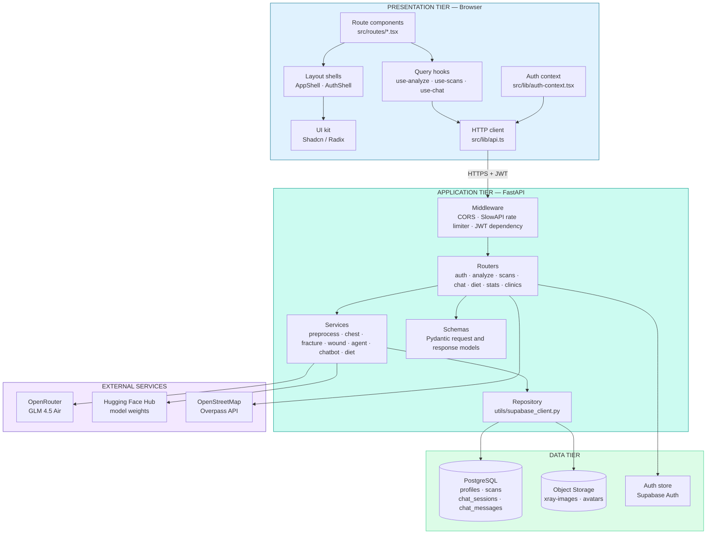

### 2.2 Component Diagram

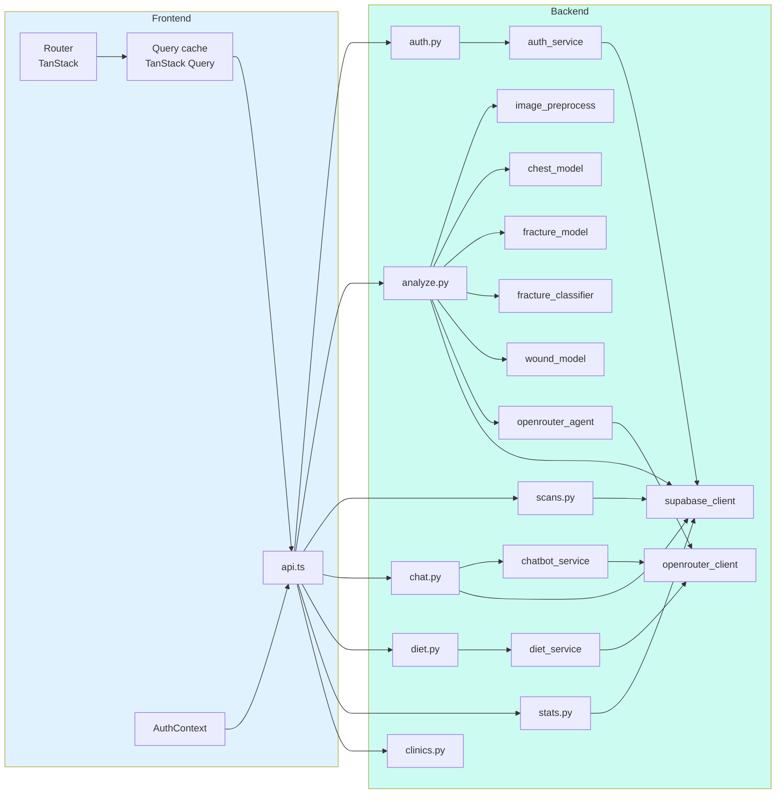

### 2.3 Layer Responsibilities

| Layer | Module pattern | Allowed to do | Forbidden from doing |
|---|---|---|---|
| **Route component** | `src/routes/*.tsx` | Render UI, call hooks | Call `fetch` directly |
| **Query hook** | `src/hooks/use-*.ts` | Wrap TanStack Query around `api.ts` calls | Contain business rules |
| **HTTP client** | `src/lib/api.ts` | Build requests, attach JWT, normalise errors | Render anything |
| **Router** | `backend/app/routers/*.py` | Validate input, enforce auth and rate limits, shape responses | Run ML, write SQL |
| **Service** | `backend/app/services/*.py` | ML inference, LLM prompting, business rules | Know about HTTP or FastAPI |
| **Repository** | `backend/app/utils/supabase_client.py` | All database and storage calls | Contain domain logic |

---

## 3. Data Design

### 3.1 Entity Relationship Diagram

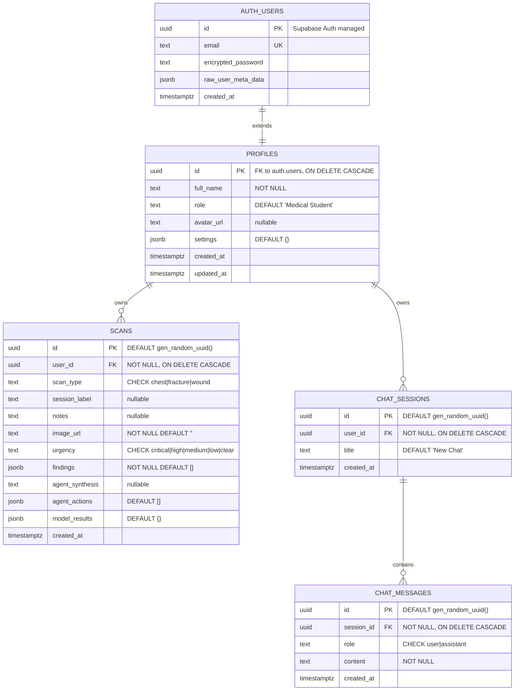

### 3.2 Data Dictionary

#### 3.2.1 Table `profiles`

| Column | Type | Constraints | Description |
|---|---|---|---|
| `id` | UUID | PK, FK → `auth.users(id)` ON DELETE CASCADE | Same identifier as the auth user |
| `full_name` | TEXT | NOT NULL | Display name shown in the header and PDF reports |
| `role` | TEXT | DEFAULT `'Medical Student'` | Descriptive label only — not an access-control role |
| `avatar_url` | TEXT | nullable | Public URL in the `avatars` bucket |
| `settings` | JSONB | DEFAULT `'{}'` | Theme, overlay toggles, notification preferences |
| `created_at` | TIMESTAMPTZ | DEFAULT `now()` | Registration time |
| `updated_at` | TIMESTAMPTZ | DEFAULT `now()` | Last profile edit |

#### 3.2.2 Table `scans`

| Column | Type | Constraints | Description |
|---|---|---|---|
| `id` | UUID | PK, DEFAULT `gen_random_uuid()` | Scan identifier used in the results URL |
| `user_id` | UUID | NOT NULL, FK → `profiles(id)` CASCADE | Owner |
| `scan_type` | TEXT | NOT NULL, CHECK IN (`chest`,`fracture`,`wound`) | Selected analysis route |
| `session_label` | TEXT | nullable | User-supplied patient or session tag |
| `notes` | TEXT | nullable | Clinical notes forwarded to the LLM |
| `image_url` | TEXT | NOT NULL, DEFAULT `''` | Public storage URL; empty when upload failed |
| `urgency` | TEXT | CHECK IN (`critical`,`high`,`medium`,`low`,`clear`) | LLM-assigned urgency |
| `findings` | JSONB | NOT NULL, DEFAULT `'[]'` | Array of `Finding` objects |
| `agent_synthesis` | TEXT | nullable | The LLM clinical paragraph |
| `agent_actions` | JSONB | DEFAULT `'[]'` | Recommended action strings |
| `model_results` | JSONB | DEFAULT `'{}'` | Diagnostics: models run, model errors, processing time |
| `created_at` | TIMESTAMPTZ | DEFAULT `now()` | Analysis timestamp |

**Embedded `Finding` object (inside `findings` JSONB)**

| Field | Type | Description |
|---|---|---|
| `name` | string | Pathology, fracture or wound label |
| `confidence` | float | Percentage, 0–100 |
| `severity` | string | `critical` / `high` / `moderate` / `low` |
| `model` | string | Originating model name |
| `region` | string \| null | Anatomical region |
| `icd_code` | string \| null | ICD-10 code |
| `bbox` | object \| null | `{x, y, w, h}` normalised bounding box |
| `color` | string | UI hint: `destructive` / `warning` / `info` |

#### 3.2.3 Table `chat_sessions`

| Column | Type | Constraints | Description |
|---|---|---|---|
| `id` | UUID | PK | Session identifier |
| `user_id` | UUID | NOT NULL, FK → `profiles(id)` CASCADE | Owner |
| `title` | TEXT | DEFAULT `'New Chat'` | Session label in the sidebar |
| `created_at` | TIMESTAMPTZ | DEFAULT `now()` | Session start |

#### 3.2.4 Table `chat_messages`

| Column | Type | Constraints | Description |
|---|---|---|---|
| `id` | UUID | PK | Message identifier |
| `session_id` | UUID | NOT NULL, FK → `chat_sessions(id)` CASCADE | Parent session |
| `role` | TEXT | NOT NULL, CHECK IN (`user`,`assistant`) | Message author |
| `content` | TEXT | NOT NULL | Message body |
| `created_at` | TIMESTAMPTZ | DEFAULT `now()` | Message time |

### 3.3 Indexes

| Index | Table | Column(s) | Purpose |
|---|---|---|---|
| `idx_scans_user_id` | `scans` | `user_id` | Fast history and stats lookups per user |
| `idx_scans_created_at` | `scans` | `created_at DESC` | Reverse-chronological history ordering |
| `idx_chat_sessions_user_id` | `chat_sessions` | `user_id` | Session list per user |
| `idx_chat_messages_session_id` | `chat_messages` | `session_id` | Message thread retrieval |

### 3.4 Object Storage Design

| Bucket | Visibility | Path convention | Contents |
|---|---|---|---|
| `xray-images` | Public | `{user_id}/{scan_id}.{ext}` | Uploaded medical images |
| `avatars` | Public | `{user_id}.{ext}` | Profile pictures |

Both buckets are created idempotently at first use by `_ensure_bucket()`. Avatar URLs are returned with
a `?t={timestamp}` cache-buster so a replaced avatar appears immediately.

> **Design note.** The buckets are public because the frontend renders images directly via ``
> and the backend may be cold. Paths contain an opaque UUID and no patient identifier, so a URL is
> unguessable, but it is not access-controlled. A production deployment should switch to private
> buckets with short-lived signed URLs — this is recorded as a known limitation.

### 3.5 Row Level Security Policy Design

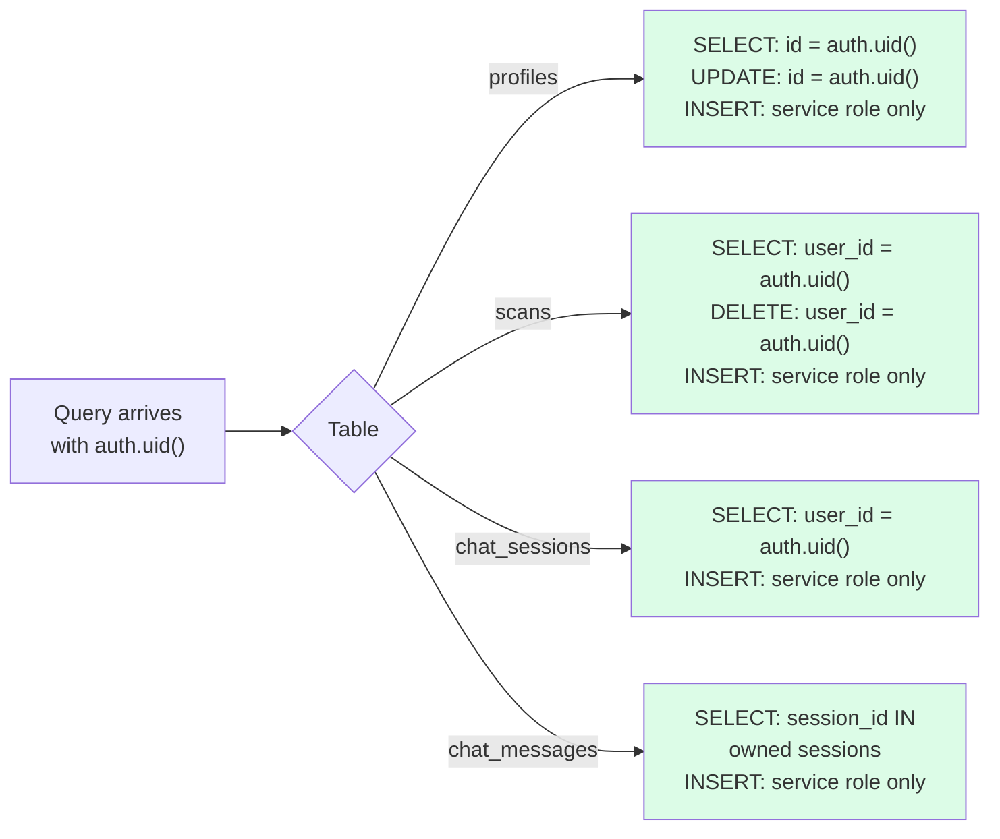

Writes are performed with the **service-role key** from the backend, which has already verified the JWT
and resolved the owning `user_id`. Reads are additionally constrained by RLS, so a leaked anon key
cannot expose another user's data.

---

## 4. Data Flow Diagrams

### 4.1 DFD Level 0 — Context Diagram

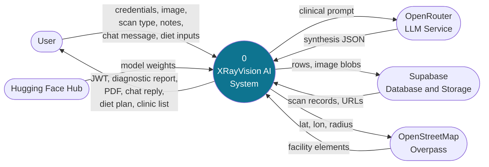

### 4.2 DFD Level 1 — Major Processes

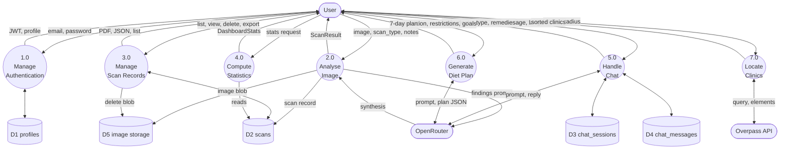

### 4.3 DFD Level 2 — Process 2.0 "Analyse Image" Decomposed

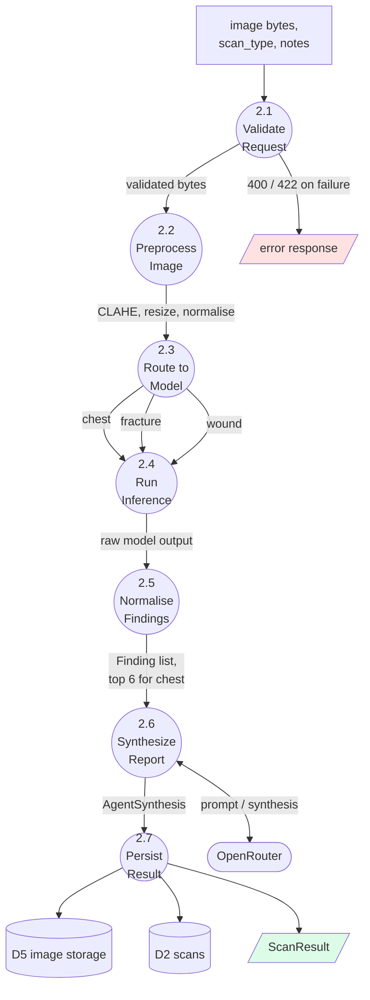

---

## 5. Component Design

### 5.1 Backend Package Structure

```
backend/app/
├── main.py                      Application factory, lifespan, CORS, rate limiter, router registration
├── config.py                    Pydantic Settings — every environment variable, cached with lru_cache
│
├── models/
│   └── schemas.py               All Pydantic request and response models
│
├── routers/                     HTTP boundary — no ML, no SQL
│   ├── auth.py                  register, login, forgot-password, me, avatar, profile, settings
│   ├── analyze.py               POST /analyze — the routed ensemble pipeline
│   ├── scans.py                 list, get, delete, report.pdf, export.json
│   ├── chat.py                  POST /chat, session and message listing
│   ├── diet.py                  POST /diet
│   ├── stats.py                 GET /stats
│   └── clinics.py               GET /clinics — Overpass query and Haversine sort
│
├── services/                    Business and ML logic — framework-agnostic
│   ├── auth_service.py          JWT create/decode, FastAPI auth dependencies
│   ├── image_preprocess.py      Validation, DICOM decode, CLAHE, resize, normalise
│   ├── chest_model.py           DenseNet121 inference, 18-class mapping
│   ├── fracture_model.py        YOLOv8 detection, positive-box filtering
│   ├── fracture_classifier.py   Image-level fracture screening
│   ├── wound_model.py           ViT wound classification
│   ├── openrouter_client.py     Shared HTTP client for OpenRouter
│   ├── openrouter_agent.py      Clinical synthesis prompt and response parsing
│   ├── chatbot_service.py       Bilingual system prompts, context window, field extraction
│   └── diet_service.py          Diet prompt, guardrails, plan validation, fallback plan
│
└── utils/
    └── supabase_client.py       Every database and storage operation
```

### 5.2 Frontend Structure

```
src/
├── router.tsx                   Router creation, default options
├── routeTree.gen.ts             Generated route tree (do not edit)
├── styles.css                   Design tokens, keyframes, theme variables
│
├── routes/                      One file per URL
│   ├── __root.tsx               Root layout, providers, error boundary
│   ├── index.tsx                Public landing page
│   ├── auth.login.tsx           Login with demo-account shortcut
│   ├── auth.register.tsx        Registration
│   ├── auth.forgot-password.tsx Password reset request
│   ├── dashboard.tsx            Analytics
│   ├── analyze.tsx              Three-step upload wizard + processing overlay
│   ├── results.$scanId.tsx      Tiered findings, overlays, exports
│   ├── history.tsx              Scan list
│   ├── chat.tsx                 Bilingual chatbot with voice input
│   ├── diet.tsx                 Diet plan generator
│   ├── clinics.tsx              GPS clinic locator
│   ├── profile.tsx              Profile and avatar
│   └── settings.tsx             Theme and analysis preferences
│
├── components/
│   ├── app/AppShell.tsx         Sidebar, header, disclaimer badge
│   ├── app/AuthShell.tsx        Split auth layout
│   ├── landing/                 Landing sections, Hero3D, Reveal, XrayViewer
│   ├── ui/                      Shadcn/Radix primitives
│   └── ui-x/                    Project-specific composites
│
├── hooks/
│   ├── use-analyze.ts           POST /analyze mutation
│   ├── use-scans.ts             Scan list, single scan, stats queries
│   ├── use-chat.ts              Chat mutation and session queries
│   └── use-mobile.tsx           Responsive breakpoint hook
│
└── lib/
    ├── api.ts                   Single HTTP client — every call, JWT attachment, error normalisation
    ├── auth-context.tsx         Global auth state, useAuth hook
    ├── types.ts                 TypeScript mirrors of the Pydantic schemas
    ├── error-capture.ts         Runtime error capture
    └── utils.ts                 Shared helpers
```

### 5.3 Class Diagram — Domain Model (Pydantic Schemas)

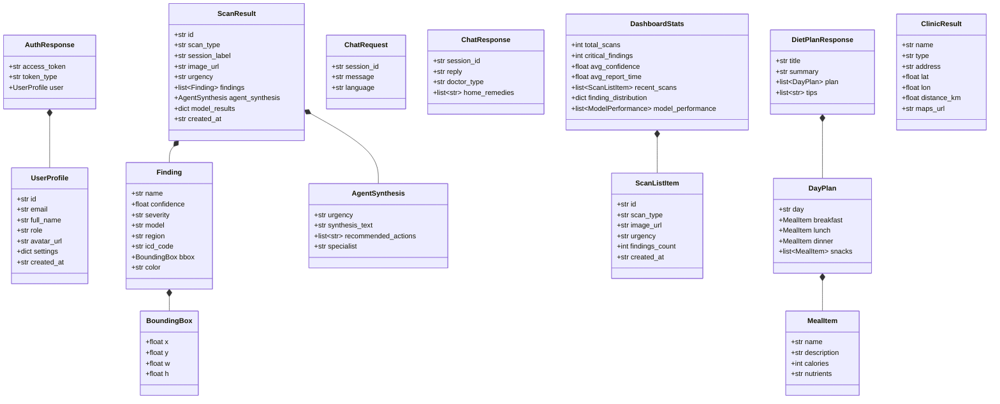

### 5.4 Service Module Specifications

| Module | Key operations | Inputs | Outputs | Failure behaviour |
|---|---|---|---|---|
| `image_preprocess` | `validate_image_file`, `load_image_from_bytes`, `load_dicom_from_bytes`, CLAHE + resize | raw bytes, filename, content type | numpy array | Raises `ValueError` with a user-readable reason → router maps to HTTP 422 |
| `chest_model` | `_get_model` (cached), inference, 18-class mapping | 224×224 grayscale tensor | list of findings with ICD-10 codes | Exception recorded in `model_errors`; pipeline continues |
| `fracture_model` | YOLOv8 predict, filter positive boxes | original-size BGR array | findings with `bbox` | Same as above |
| `fracture_classifier` | Image-level fracture screening | 224×224 RGB | single finding | Disabled via `FRACTURE_CLASSIFIER_ENABLED` |
| `wound_model` | ViT classification | RGB PIL image | top-1 wound finding | Same as above |
| `openrouter_agent` | `synthesize_report` — build clinical prompt, parse response | findings, scan type, notes | `AgentSynthesis` dict | Router substitutes a fallback synthesis |
| `chatbot_service` | Language-specific system prompt, 10-message context, `DOCTOR_TYPE` / `HOME_REMEDIES` extraction | message, history, language | reply + structured fields | Error surfaced to the UI |
| `diet_service` | Guardrail prompt, JSON parse, 7-day validation | condition, preferences, restrictions, goals | `DietPlanResponse` | Validated hard-coded fallback plan |
| `auth_service` | `hash_password`, `verify_password`, `create_access_token`, `decode_token`, `get_current_user_id` | credentials / token | JWT / user id | Raises HTTP 401 |
| `supabase_client` | `insert_scan`, `upload_image`, `_ensure_bucket`, profile and chat operations | domain objects | rows, URLs | Caller decides whether the failure is blocking |

---

## 6. Interface Design

### 6.1 REST API Contract

| # | Method | Path | Auth | Rate limit | Request | Response |
|---|---|---|---|---|---|---|
| 1 | POST | `/auth/register` | — | 200/min | `RegisterRequest` | `AuthResponse` |
| 2 | POST | `/auth/login` | — | 200/min | `LoginRequest` | `AuthResponse` |
| 3 | POST | `/auth/forgot-password` | — | 200/min | `{email}` | `{message}` |
| 4 | GET | `/auth/me` | JWT | 200/min | — | `UserProfile` |
| 5 | POST | `/auth/avatar` | JWT | 200/min | `multipart/form-data` | `{avatar_url}` |
| 6 | PATCH | `/auth/profile` | JWT | 200/min | `ProfileUpdateRequest` | `UserProfile` |
| 7 | PATCH | `/auth/settings` | JWT | 200/min | `SettingsUpdateRequest` | `UserProfile` |
| 8 | POST | `/analyze` | JWT | **10/min** | `multipart/form-data`: `file`, `scan_type`, `session_label`, `notes` | `ScanResult` |
| 9 | GET | `/scans` | JWT | 200/min | optional `scan_type` filter | `ScanListResponse` |
| 10 | GET | `/scans/{id}` | JWT | 200/min | — | `ScanResult` |
| 11 | DELETE | `/scans/{id}` | JWT | 200/min | — | `{message}` |
| 12 | GET | `/scans/{id}/report.pdf` | JWT | 200/min | — | `application/pdf` stream |
| 13 | GET | `/scans/{id}/export.json` | JWT | 200/min | — | raw findings JSON |
| 14 | POST | `/chat` | JWT | **20/min** | `ChatRequest` | `ChatResponse` |
| 15 | GET | `/chat/sessions` | JWT | 200/min | — | `list[ChatSession]` |
| 16 | GET | `/chat/sessions/{id}/messages` | JWT | 200/min | — | `list[ChatMessage]` |
| 17 | POST | `/diet` | JWT | **10/min** | `DietRequest` | `DietPlanResponse` |
| 18 | GET | `/stats` | JWT | 200/min | — | `DashboardStats` |
| 19 | GET | `/clinics` | JWT | 200/min | `lat`, `lon`, `radius_km` (0.5–25) | `ClinicSearchResponse` |
| 20 | GET | `/` | — | 200/min | — | service metadata |
| 21 | GET | `/health` | — | 200/min | — | `{"status": "ok"}` |

### 6.2 HTTP Status Code Design

| Code | Meaning in this system | Example trigger |
|---|---|---|
| 200 | Success | Any successful request |
| 400 | Malformed domain input | Empty file, invalid `scan_type`, duplicate email |
| 401 | Authentication failure | Missing, malformed or expired JWT; bad credentials |
| 404 | Resource not found or not owned | `GET /scans/{id}` for another user's scan |
| 422 | Input failed quality validation | File too small, too large, or below 200×200 px |
| 429 | Rate limit exceeded | 11th `/analyze` call within a minute |
| 500 | Unrecoverable server error | All models failed to run |

### 6.3 Frontend–Backend Interface Rules

| Rule | Rationale |
|---|---|
| Every call passes through `src/lib/api.ts` | One place to attach the JWT, set the base URL, and normalise errors |
| `API_URL` has its trailing slash stripped | Prevents double-slash 404s |
| The token is read from local storage on each request | Survives page reloads without a server session |
| A 401 response clears the stored token and redirects to `/auth/login` | Expired-token recovery without a manual logout |
| TanStack Query owns caching and invalidation | After a successful analysis, the scans and stats queries are invalidated so the dashboard is fresh |

---

## 7. Behavioural Design

### 7.1 Sequence Diagram — Registration and Login

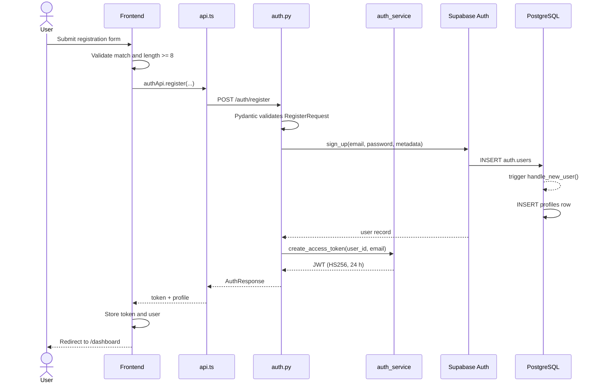

### 7.2 Sequence Diagram — Image Analysis (primary flow)

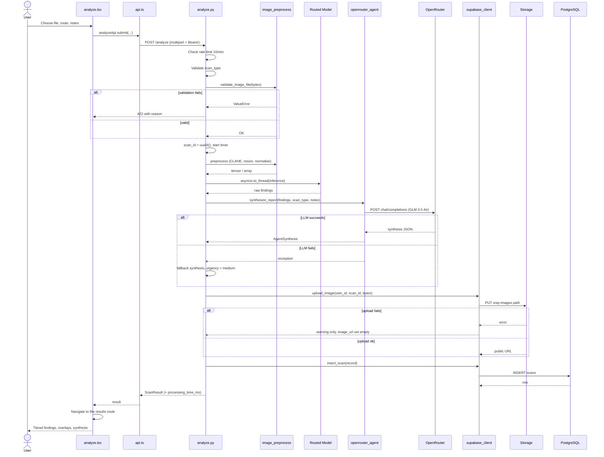

### 7.3 Sequence Diagram — Bilingual Chat

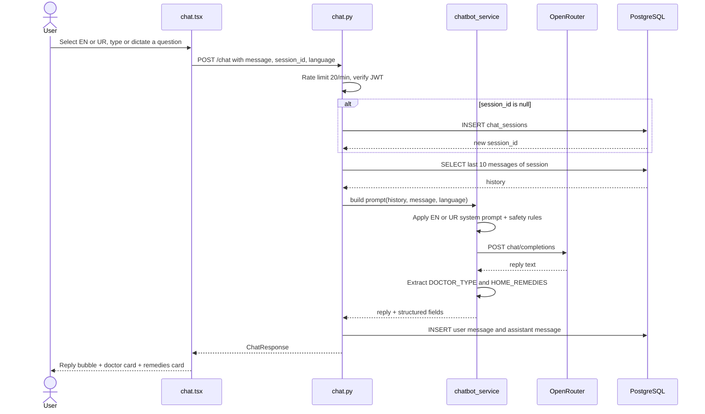

### 7.4 Sequence Diagram — PDF Report Export

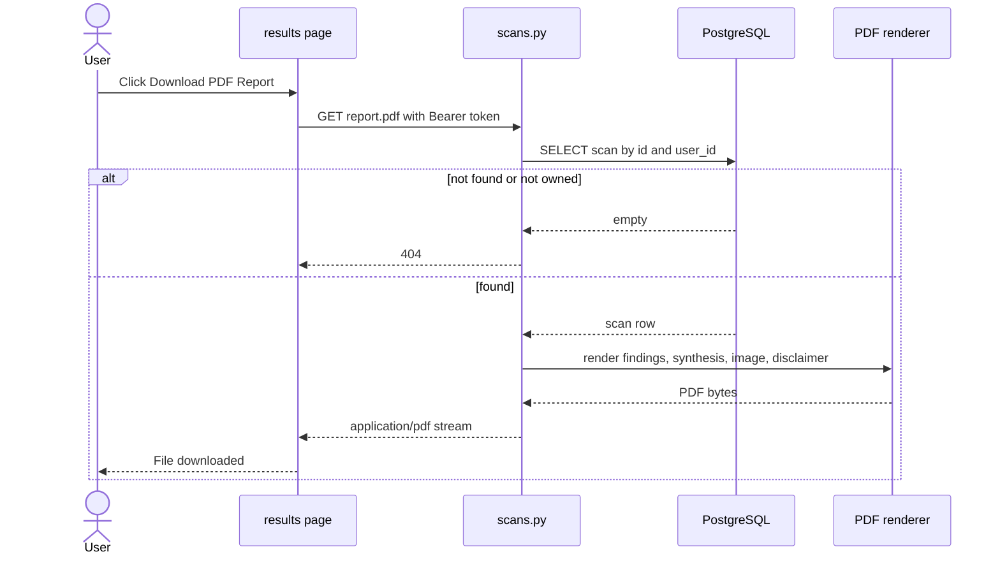

### 7.5 State Diagram — Scan Lifecycle

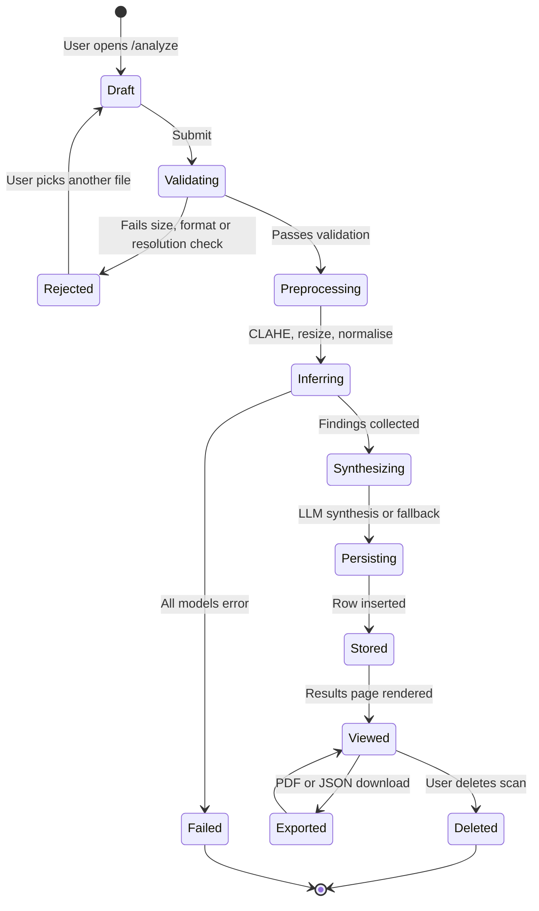

### 7.6 State Diagram — Authentication Session

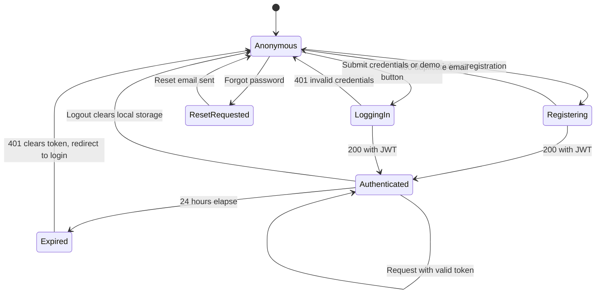

---

## 8. Algorithm Design

### 8.1 Routed Ensemble Dispatch

Rather than running all models on every image, the pipeline routes by `scan_type`. This keeps
inference cheap enough for free-tier CPU hosts and keeps the report clinically focused.

```
FUNCTION run_routed_ensemble(file_bytes, scan_type, confidence_threshold):
    findings   ← []
    errors     ← {}
    models_run ← []

    IF scan_type = "chest":
        TRY
            result ← await to_thread(chest_model.infer, file_bytes, confidence_threshold)
            IF length(result) > MAX_CHEST_FINDINGS:                  // MAX_CHEST_FINDINGS = 6
                result ← sort(result, by confidence DESC)[0 .. 6]
            findings ← result ; models_run += "DenseNet121"
        CATCH e: errors["chest"] ← message(e)

    ELSE IF scan_type = "fracture":
        TRY
            boxes ← await to_thread(fracture_model.detect, file_bytes)
            boxes ← filter(boxes WHERE label ≠ "Not_Fracture")       // negative boxes prove nothing
            findings += boxes ; models_run += "YOLOv8"
        CATCH e: errors["fracture_detector"] ← message(e)

        IF FRACTURE_CLASSIFIER_ENABLED:
            TRY
                screen ← await to_thread(fracture_classifier.classify, file_bytes)
                findings += screen ; models_run += "FractureClassifier"
            CATCH e: errors["fracture_classifier"] ← message(e)

    ELSE IF scan_type = "wound":
        TRY
            findings ← await to_thread(wound_model.classify, file_bytes)
            models_run += "ViT"
        CATCH e: errors["wound"] ← message(e)

    RETURN findings, errors, models_run
```

**Complexity.** One or two model forward passes per request — O(1) in the number of registered models,
not O(n). Inference runs in a worker thread via `asyncio.to_thread`, so the event loop stays responsive.

### 8.2 Image Validation

```
FUNCTION validate_image_file(bytes, filename, content_type):
    size ← length(bytes)
    IF size < 100 KB:  RAISE ValueError("too small — insufficient pixel data")
    IF size > 20 MB:   RAISE ValueError("too large — maximum is 20 MB")

    is_dicom ← filename ends with ".dcm"
               OR content_type ∈ {"application/dicom", "application/octet-stream"}

    IF NOT is_dicom:
        TRY  PIL.open(bytes).verify()
        CATCH RAISE ValueError("not a decodable image — upload JPEG, PNG or DICOM")

        (w, h) ← PIL.open(bytes).size
        IF w < 200 OR h < 200:
            RAISE ValueError("resolution too low — minimum 200x200 px")
```

DICOM files skip the PIL checks because `pydicom` decodes them separately at preprocessing time.

### 8.3 Confidence Tiering (Results Page)

```
primary    ← findings WHERE confidence ≥ 65
secondary  ← findings WHERE 50 ≤ confidence < 65
borderline ← findings WHERE confidence < 50            // collapsed by default

IF ANY finding WITH confidence < 60:
    SHOW banner "radiologist review recommended"
```

This makes uncertainty visible by construction rather than leaving the user to interpret raw
percentages, satisfying **NFR-S5** and **NFR-S7**.

### 8.4 Haversine Distance

Used to rank clinics returned by the Overpass API.

```
d = 2R * arcsin( sqrt( sin^2(dphi/2) + cos(phi1) * cos(phi2) * sin^2(dlambda/2) ) )

where R = 6371 km, phi = latitude in radians, lambda = longitude in radians
```

where `R = 6371.0` km, `φ` is latitude in radians and `λ` is longitude in radians.

```
FUNCTION find_nearby_clinics(lat, lon, radius_km):
    radius_m ← radius_km × 1000
    FOR EACH mirror IN [overpass-api.de, overpass.kumi.systems, z.overpass-api.de]:
        TRY
            elements ← HTTP POST mirror WITH query(amenity|healthcare, around radius_m)
            BREAK
        CATCH timeout, HTTP error, transport error:
            CONTINUE                                    // try the next mirror

    clinics ← []
    FOR EACH element IN elements:
        d ← haversine(lat, lon, element.lat, element.lon)
        IF d ≤ radius_km:
            clinics += ClinicResult(name, type, address, lat, lon, d, maps_url)

    RETURN sort(clinics, by distance_km ASC)
```

### 8.5 Diet Plan Validation

```
plan ← LLM(prompt WITH condition guardrails)
TRY
    parsed ← JSON.parse(plan)
    IF length(parsed.plan) ≠ 7:                    RAISE Invalid
    FOR EACH day IN parsed.plan:
        IF day lacks breakfast OR lunch OR dinner: RAISE Invalid
    RETURN parsed
CATCH Invalid, ParseError:
    RETURN HARDCODED_VALIDATED_FALLBACK_PLAN
```

A malformed plan is never shown to the user — the design prefers a known-safe plan over a partially
generated one.

---

## 9. Security Design

### 9.1 Authentication and Authorisation Flow

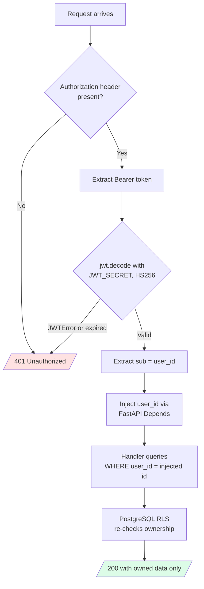

Ownership is enforced **twice** — once in the handler using the token-derived `user_id`, and again by
RLS in the database. A bug in one layer does not become a data leak.

### 9.2 Defence-in-Depth Summary

| Layer | Control | Implementation |
|---|---|---|
| Transport | HTTPS only in production | Platform-provided TLS |
| Origin | CORS allowlist | Explicit origins; localhost only in dev mode |
| Volume | Rate limiting | SlowAPI, keyed by client IP; per-endpoint overrides |
| Identity | Stateless JWT | HS256, 24-hour expiry, ≥ 32-char secret enforced |
| Input | Schema validation | Pydantic on every body; explicit file quality checks |
| Data | Row Level Security | Policies on all four tables, `auth.uid()` scoped |
| Secrets | Environment variables | Pydantic Settings; nothing committed to source control |
| Privacy | No patient identifiers | Storage paths keyed by opaque UUIDs |

### 9.3 Known Security Limitations

Recorded honestly for the evaluation committee:

| # | Limitation | Impact | Suggested remedy |
|---|---|---|---|
| 1 | Storage buckets are public | Anyone holding an image URL can view it | Private buckets plus short-lived signed URLs |
| 2 | Rate limiting is per-IP, in-memory | Resets on restart; shared NAT users share a bucket | Redis-backed limiter keyed by user id |
| 3 | No refresh-token rotation | The user must sign in again every 24 hours | Add refresh tokens |
| 4 | No audit log | Deletions are not traceable | Append-only audit table |
| 5 | No malware scanning of uploads | A crafted file is passed to image decoders | Scan uploads before decoding |

---

## 10. Error Handling and Degradation Design

The central design principle: **a partial result is more useful than an error page.**

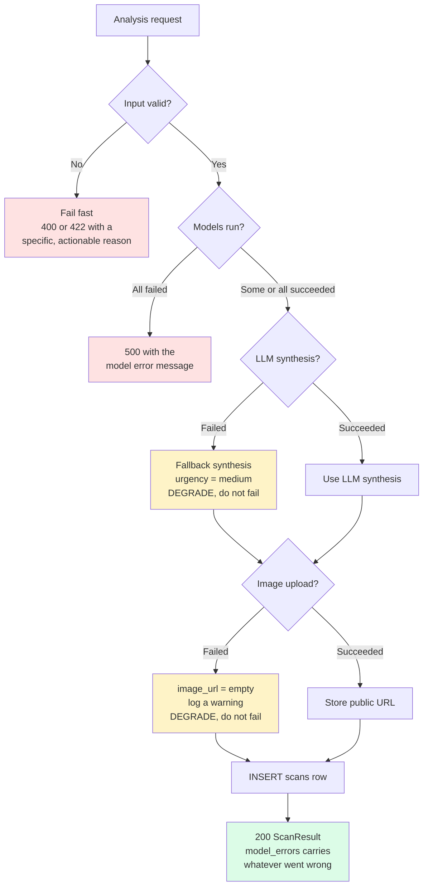

| Failure | Classification | System behaviour |
|---|---|---|
| Invalid input | Fail fast | 400/422 with a specific reason |
| Every model failed | Hard failure | 500 with the underlying message |
| One of several models failed | Degrade | Continue; record in `model_results.model_errors` |
| LLM unavailable | Degrade | Fallback synthesis, `urgency = medium` |
| Storage unavailable | Degrade | Empty `image_url`, warning logged |
| Diet plan malformed | Degrade | Validated hard-coded fallback plan |
| All Overpass mirrors down | Soft failure | Error message; user may retry |
| Rate limit exceeded | Reject | 429 "Rate limit exceeded. Please slow down." |

---

## 11. Deployment Design

### 11.1 Deployment Diagram

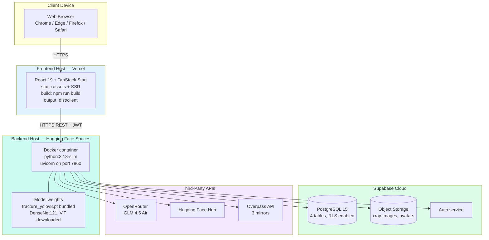

> **Deployment note.** The repository also contains `render.yaml` (Render as an alternative backend
> host) and `wrangler.jsonc` (Cloudflare Workers as an alternative frontend host). The **live
> deployment of record** is Vercel for the frontend and Hugging Face Spaces for the backend; the other
> configurations are retained as portability evidence for constraint **C-1**.

### 11.2 Startup Sequence

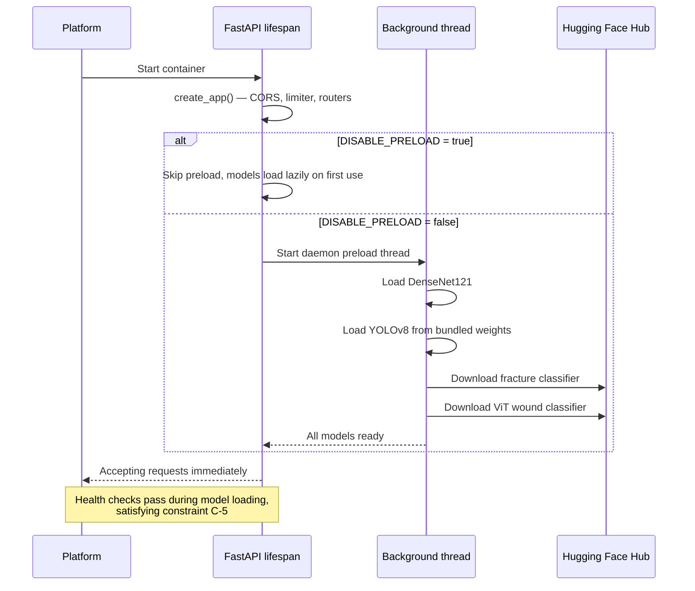

Each model load is individually wrapped in try/except, so one unavailable model never blocks startup.

### 11.3 Environment Matrix

| Environment | Frontend URL | Backend URL | `DISABLE_PRELOAD` | CORS origins |
|---|---|---|---|---|
| Local development | `http://localhost:5173` | `http://localhost:8000` | `false` | localhost set auto-added |
| Production | Vercel domain | Hugging Face Space | `false` on ≥ 2 GB hosts, `true` on 512 MB tiers | `FRONTEND_URL` + `ALLOWED_ORIGINS` |

---

## 12. Design Decisions and Rationale

| # | Decision | Alternatives considered | Rationale |
|---|---|---|---|
| **D-1** | Routed ensemble instead of running every model | Run all models and merge | A chest model on a wound photo produces noise. Routing cuts CPU cost roughly threefold and keeps reports clinically focused. |
| **D-2** | LLM synthesis on top of model outputs | Show raw model scores only | Raw multi-label probabilities are unreadable to a student. The LLM converts them into an urgency, a paragraph and next steps. |
| **D-3** | Fallback synthesis when the LLM fails | Return 503 | Model findings are the valuable part; losing the prose should not lose the analysis. |
| **D-4** | Non-blocking image upload | Fail the request on upload error | The report is worth more than the thumbnail. `image_url` is nullable by design. |
| **D-5** | Ignore `Not_Fracture` YOLO boxes | Report them as "normal" | A detector's negative box covers a region, not the whole study. Reporting it as normal would be a clinically unsafe claim (**NFR-S4**). |
| **D-6** | Background model preloading | Load models during startup | Free-tier health checks time out during a synchronous multi-model load. |
| **D-7** | Stateless JWT | Server-side sessions | The backend may scale to zero and cold-start; sessions in memory would be lost. |
| **D-8** | Ownership checked in handler **and** RLS | Handler check only | Defence in depth — a single missed `WHERE` clause cannot leak data. |
| **D-9** | Single `api.ts` HTTP client | `fetch` inside components | One place for JWT attachment, base-URL normalisation and 401 handling. |
| **D-10** | Confidence tiering in the UI | Flat, sorted list | Uncertainty must be structurally visible, not left to the reader. |
| **D-11** | Top-6 cap on chest findings | Report all 18 probabilities | 18 near-threshold labels bury the signal; 6 keeps the report readable. |
| **D-12** | Hard-coded fallback diet plan | Return the malformed LLM output | Nutrition advice for a medical condition must never be partially generated. |
| **D-13** | Three Overpass mirrors | A single endpoint | The public Overpass instances rate-limit aggressively; mirrors make the feature usable. |
| **D-14** | JSONB for `findings` | Normalised `findings` table | Findings are always read whole with their scan and never queried across scans. JSONB avoids a join with no loss of function. |
| **D-15** | Public storage buckets | Signed URLs | Simplifies rendering while the backend may be cold. Recorded as a known limitation in §9.3. |

---

## Appendix A — Design Traceability

| SRS requirement | SDD section |
|---|---|
| FR-011 – FR-025a | §7.2 Sequence, §8.1 Routed ensemble, §8.2 Validation, §10 Degradation |
| FR-026 – FR-033 | §3.2 Data dictionary, §6.1 API contract, §7.4 PDF export |
| FR-028a – FR-028d | §8.3 Confidence tiering |
| FR-038 – FR-043a | §7.3 Chat sequence, §5.4 `chatbot_service` |
| FR-044 – FR-048 | §8.5 Diet validation |
| FR-049 – FR-052a | §8.4 Haversine and mirror fallback |
| FR-057 – FR-060 | §11.2 Startup sequence |
| NFR-SEC1 – SEC9 | §9 Security design |
| NFR-Q1 – Q2 | §10 Error handling and degradation |
| NFR-P2, NFR-P5 | §11.2 Startup, §8.1 thread-pool inference |

## Appendix B — Revision History

| Version | Date | Author | Description |
|---|---|---|---|
| 1.0 | August 2026 | Muhammad Ali Raza, Hamza Afzal | Initial complete SDD |

---

*XRayVision AI — Software Design Document v1.0 — Minhaj University Lahore*
