# User Manual

## XRayVision AI — Getting Started and Complete Feature Guide

| Field | Value |
|---|---|
| **Document** | User Manual |
| **Version** | 1.0 |
| **Product version** | 2.1.0 |
| **Live application** | https://x-ray-vision-board.vercel.app |
| **Companion documents** | [SRS](01-SRS.md) · [SDD](02-SDD.md) · [Test Cases](03-Test-Cases.md) |
| **Institution** | Minhaj University Lahore — School of Software Engineering |
| **Students** | Muhammad Ali Raza (2022F-MUL-BSSWE-017), Hamza Afzal (2022F-MUL-BSSWE-027) |
| **Supervisor** | Maam Misbah — Lecturer, School of Software Engineering |

---

> ## ⚠️ Important Medical Disclaimer — read this first
>
> **XRayVision AI is an educational tool. It is NOT a certified medical device.**
>
> - Every result is an AI-generated estimate produced to **support**, never to replace, the clinical judgement of a qualified radiologist or physician.
> - Do **not** use this software to make a diagnosis, to start or stop treatment, or to decide whether to seek care.
> - The chatbot and the diet planner give general health information only. They are not a consultation.
> - If you have a medical emergency, contact emergency services immediately — do not use this application.
>
> An **EDUCATIONAL USE ONLY** badge is displayed permanently in the sidebar of every page, and a fuller disclaimer appears at the foot of every diagnostic report.

---

## Table of Contents

1. [What XRayVision AI Does](#1-what-xrayvision-ai-does)
2. [Before You Begin](#2-before-you-begin)
3. [Creating an Account and Signing In](#3-creating-an-account-and-signing-in)
4. [Finding Your Way Around](#4-finding-your-way-around)
5. [The Dashboard](#5-the-dashboard)
6. [Running an Analysis](#6-running-an-analysis-core-feature)
7. [Reading Your Diagnostic Report](#7-reading-your-diagnostic-report)
8. [Scan History and Exports](#8-scan-history-and-exports)
9. [The Health Chatbot](#9-the-health-chatbot)
10. [The Diet Planner](#10-the-diet-planner)
11. [Finding Nearby Clinics](#11-finding-nearby-clinics)
12. [Your Profile](#12-your-profile)
13. [Settings](#13-settings)
14. [Using XRayVision AI on a Phone](#14-using-xrayvision-ai-on-a-phone)
15. [Troubleshooting](#15-troubleshooting)
16. [Frequently Asked Questions](#16-frequently-asked-questions)
17. [Glossary](#17-glossary)

---

## 1. What XRayVision AI Does

XRayVision AI takes a medical image you upload and returns a structured diagnostic report in seconds.
Behind the scenes, four AI models work together — think of them as a team of four specialists:

| Specialist | Model | What it does |
|---|---|---|
| 🫁 **Chest specialist** | DenseNet121 | Screens chest X-rays for 18 pathologies, trained on 700,000+ clinical images |
| 🦴 **Orthopaedic specialist** | YOLOv8 | Draws boxes around suspected fractures on bone X-rays |
| 🩹 **Wound care specialist** | ViT | Classifies photographs of external wounds |
| 🤖 **Senior consultant** | GLM 4.5 Air | Reads all their findings and writes one clear clinical summary with next steps |

You choose which specialist to consult by selecting an **analysis route**. The system does not run
every model on every image — sending a chest model a photograph of a wound would only produce noise.

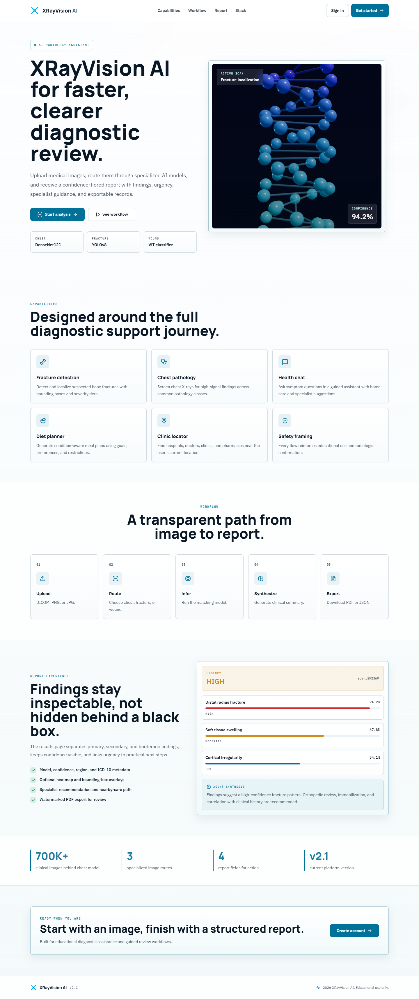

*The public landing page at https://x-ray-vision-board.vercel.app*

---

## 2. Before You Begin

### 2.1 What you need

| Requirement | Detail |
|---|---|
| **Browser** | Chrome, Edge, Firefox or Safari — a recent version |
| **Internet** | A stable connection. Images can be up to 20 MB. |
| **An account** | Free — see [Section 3](#3-creating-an-account-and-signing-in) |
| **Location permission** | Only for the Clinic Locator. Optional. |
| **Microphone permission** | Only for chatbot voice input. Optional. |

### 2.2 What images the system accepts

| Property | Requirement |
|---|---|
| **Formats** | DICOM (`.dcm`), PNG, JPG |
| **File size** | Between **100 KB** and **20 MB** |
| **Resolution** | At least **200 × 200 pixels** |
| **Recommended** | Clear, well-lit, non-blurry, at least 512 × 512 px for best accuracy |

> **Why the minimum size?** Very small or low-resolution images simply do not contain enough pixel
> detail for reliable inference. The system rejects them rather than returning an unreliable result.

---

## 3. Creating an Account and Signing In

### 3.1 Creating a new account

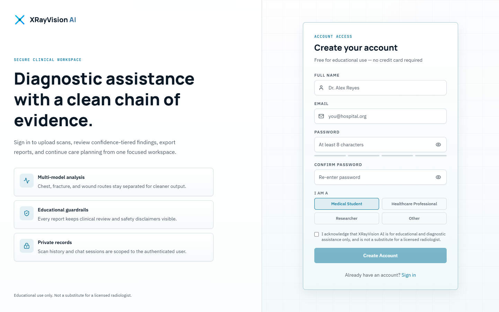

1. Go to **https://x-ray-vision-board.vercel.app**.
2. Click **Get started** (top right) — or open `/auth/register` directly.
3. Fill in:
   - **Full name** — shown in the header and on your PDF reports
   - **Email** — your sign-in identifier
   - **Password** — must be **at least 8 characters**
   - **Confirm password** — must match exactly
4. Click **Create account**.

You are signed in automatically and taken straight to your Dashboard.

> **If you see "email already registered"** — that address already has an account. Use
> [Sign in](#32-signing-in) instead, or [reset your password](#33-forgot-your-password).

### 3.2 Signing in

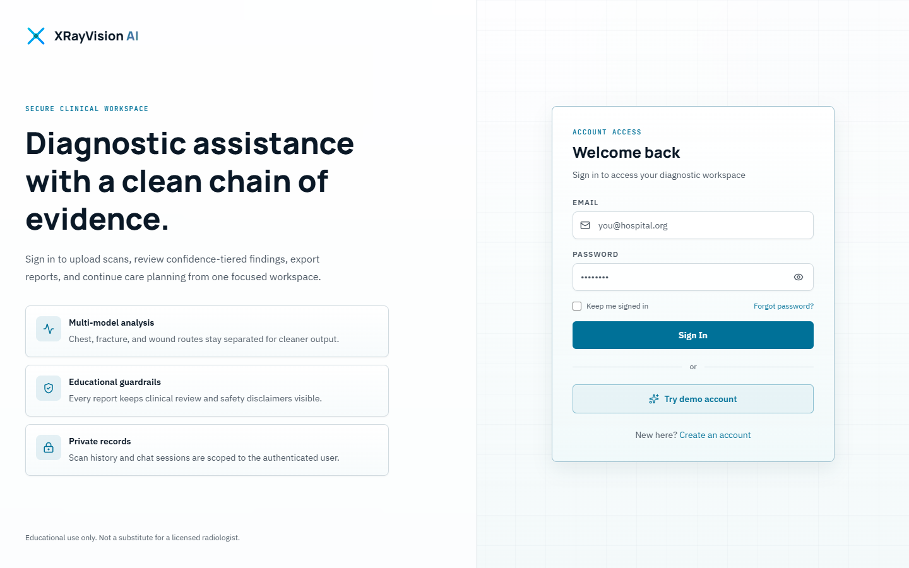

1. Open `/auth/login` or click **Sign in**.
2. Enter your email and password.
3. Click **Sign In**.

**Trying the app without registering.** Click **Try demo account** to sign in instantly to a
pre-populated demonstration account. This is the fastest way for a reviewer or evaluator to explore
every feature with real data already in place.

> **How long you stay signed in.** Your session lasts **24 hours**. After that you will be returned to
> the sign-in page and will need to sign in again. This is a security measure.

### 3.3 Forgot your password?

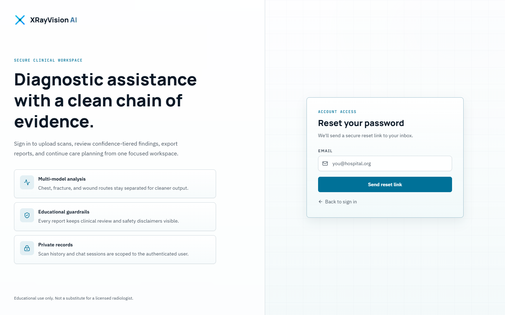

1. On the sign-in page, click the **Forgot password** link.
2. Enter the email address of your account.
3. Click **Send reset link**.
4. Check your inbox — including the spam folder — and follow the link in the email.

---

## 4. Finding Your Way Around

Once signed in, every page shares the same layout.

**The sidebar (left)** — your main navigation:

| Item | What it is for |
|---|---|
| **Dashboard** | Your statistics and recent activity |
| **New Analysis** | Upload an image and run the AI |
| **Health Chat** | Ask health questions in English or Urdu |
| **Diet Planner** | Generate a personalised 7-day meal plan |
| **Clinics** | Find hospitals and clinics near you |
| **History** | Every scan you have ever run |
| **Profile** | Your name, role and profile picture |
| **Settings** | Theme and display preferences |

At the top of the sidebar, **AI Ensemble — 4 models online** shows the models are ready. At the bottom,
the **EDUCATIONAL USE ONLY** badge is always visible. **Collapse** narrows the sidebar to give the
content more room.

**The header (top)** — shows the current page name, a search box (`Ctrl K`), a notifications bell, and
your account menu with the sign-out button.

---

## 5. The Dashboard

The Dashboard is your home page after signing in.

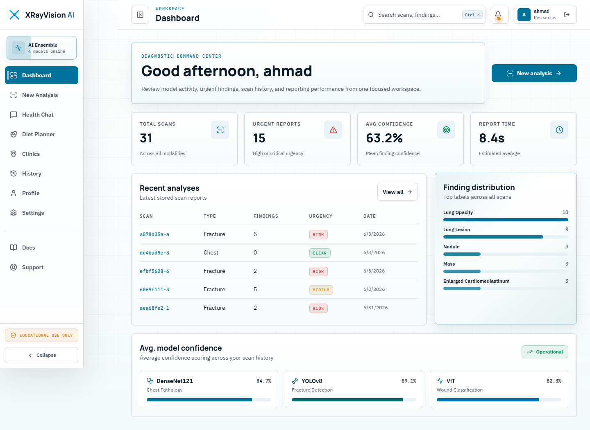

### 5.1 The four headline tiles

| Tile | Meaning |
|---|---|
| **Total scans** | How many analyses you have run, across all image types |
| **Urgent reports** | How many of your scans came back rated **high** or **critical** |
| **Avg confidence** | The mean confidence score across all findings in your history |
| **Report time** | The average time your analyses took to complete |

### 5.2 Recent analyses

The five most recent scans, with scan id, image type, number of findings, urgency badge and date.
Click any row to open the full report. **View all** takes you to the complete History.

### 5.3 Finding distribution

A ranked bar chart of the labels that appear most often across your scans — useful for spotting
patterns in the images you have been studying.

### 5.4 Average model confidence

How confident each of the three imaging models has been, on average, across your scan history.

> **These figures are yours alone.** Every number on this page is calculated from only your own scans.
> No other user's data is ever included.

---

## 6. Running an Analysis (core feature)

This is the heart of the application. Click **New Analysis** in the sidebar.

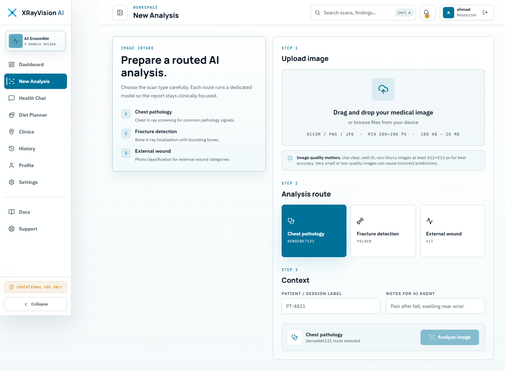

The page guides you through **three steps**.

### Step 1 — Upload your image

Drag your file onto the upload area, or click it to browse your device.

The panel restates the limits: `DICOM / PNG / JPG · MIN 200×200 PX · 100 KB – 20 MB`.

> 💡 **Image quality matters.** Use clear, well-lit, non-blurry images of at least 512 × 512 px for best
> accuracy. Very small or low-quality images can cause incorrect predictions.

### Step 2 — Choose your analysis route

Pick the one route that matches your image. This decides which AI model examines it.

| Route | Model | Use it for |
|---|---|---|
| **Chest pathology** | DenseNet121 | Chest X-rays — screens for common pathology classes |
| **Fracture detection** | YOLOv8 | Bone X-rays — localises fractures with bounding boxes |
| **External wound** | ViT | Photographs of external wounds |

> ⚠️ **Choose carefully.** Selecting the wrong route gives a meaningless result. A chest model looking
> at a wound photograph has nothing useful to say about it.

### Step 3 — Add context (optional but recommended)

| Field | Purpose | Example |
|---|---|---|
| **Patient / session label** | A tag so you can find this scan later in History | `PT-4821` |
| **Notes for AI agent** | Clinical context passed to the AI, which uses it when writing the summary | `Pain after fall; swelling near wrist` |

Notes genuinely change the output — the AI weighs your clinical context when assessing urgency and
recommending next steps.

### Running it

Click **Analyze image**. A full-screen processing overlay appears while the models work — this
typically takes **8 to 15 seconds**.

> **First analysis of the day may be slower.** The backend runs on a free-tier host that sleeps when
> idle. The very first request can take 30–60 seconds while the AI models load into memory. Subsequent
> analyses are fast.

When it finishes you are taken automatically to your report.

---

## 7. Reading Your Diagnostic Report

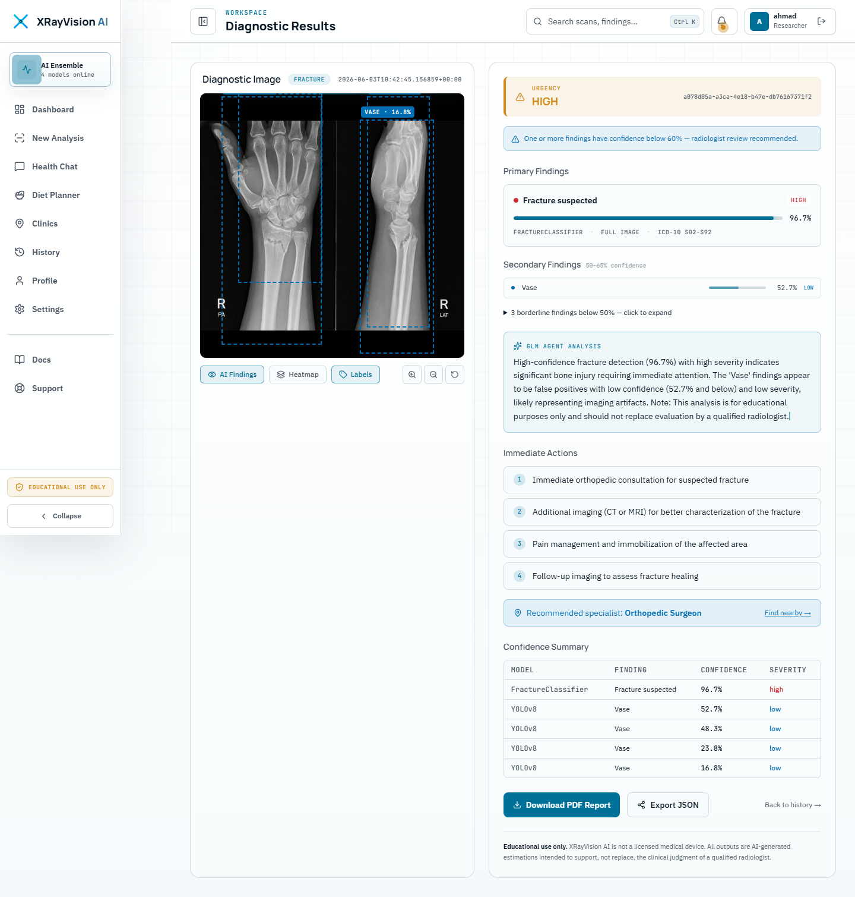

The report has two columns.

### 7.1 Left column — the image

Your uploaded image is displayed with the AI's findings drawn on top as dashed boxes, each labelled
with its finding name and confidence.

**The controls beneath the image:**

| Control | Effect |
|---|---|
| **AI Findings** | Show or hide the bounding boxes |
| **Heatmap** | Show or hide the confidence heatmap overlay |
| **Labels** | Show or hide the text labels on each box |
| 🔍 **+ / −** | Zoom between 0.5× and 2.5× |
| ↺ | Reset the zoom to normal |

### 7.2 Right column — the findings

**The urgency banner** at the top gives the overall assessment, in one of five levels:

| Level | Meaning |
|---|---|
| **CRITICAL** | Findings suggest an immediately serious condition |
| **HIGH** | Significant findings requiring prompt professional attention |
| **MEDIUM** | Findings warranting follow-up |
| **LOW** | Minor or uncertain findings |
| **CLEAR** | No significant findings detected |

> Each level is shown as **both** a colour and a word, so the meaning is never ambiguous.

**The low-confidence warning.** If any finding scored below 60 % confidence, a blue banner appears:
*"One or more findings have confidence below 60% — radiologist review recommended."* Take this
seriously — it means the AI itself is uncertain.

**Findings, grouped by confidence.** This grouping is deliberate — it makes uncertainty visible
instead of leaving you to interpret raw percentages:

| Group | Confidence | How it is shown |
|---|---|---|
| **Primary Findings** | 65 % and above | Full cards with confidence bars — the AI's strongest signals |
| **Secondary Findings** | 50 % – 65 % | Compact rows, labelled with the confidence range |
| **Borderline** | Below 50 % | Collapsed behind a "click to expand" control — weak signals, shown for completeness |

Each finding card shows the finding name, confidence percentage, severity, the model that produced it,
the anatomical region, and an ICD-10 diagnostic code where one is mapped.

**GLM Agent Analysis.** The AI's written clinical summary — what the findings suggest, taken together,
and what the confidence levels mean in context. It always ends by reminding you that this is
educational, not a substitute for a qualified radiologist.

**Immediate Actions.** A numbered list of practical next steps — consultations, further imaging,
management measures, follow-up.

**Recommended specialist.** Which kind of doctor these findings would normally be referred to, with a
**Find nearby →** link that takes you straight to the Clinic Locator.

**Confidence Summary.** A complete table of every finding — model, finding, confidence, severity — so
nothing is hidden behind the tiered grouping.

### 7.3 Saving your report

At the bottom of the report:

- **Download PDF Report** — a formatted document with the image, findings, summary and disclaimer. This is the version to attach to a referral or a case study.
- **Export JSON** — the raw structured findings, for further analysis or research.
- **Back to history** — returns to your scan list.

---

## 8. Scan History and Exports

Click **History** in the sidebar to see every analysis you have ever run.

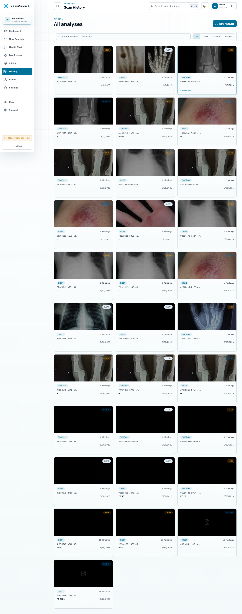

Scans are listed **newest first**. Each row shows the image thumbnail, scan type, number of findings,
urgency badge and date. Hovering a row reveals a **View report →** link.

**What you can do here:**

| Action | How |
|---|---|
| **Open a report** | Click the row |
| **Filter by type** | Use the scan-type filter to show only chest, fracture or wound scans |
| **Download a PDF** | Open the report, then click **Download PDF Report** |
| **Export JSON** | Open the report, then click **Export JSON** |
| **Delete a scan** | Use the delete control on the scan |

> ⚠️ **Deletion is permanent.** Deleting a scan removes both the database record and the stored image.
> There is no undo and no recycle bin. Download the PDF first if you might need it.

---

## 9. The Health Chatbot

Click **Health Chat** for general medical questions in **English or Urdu**.

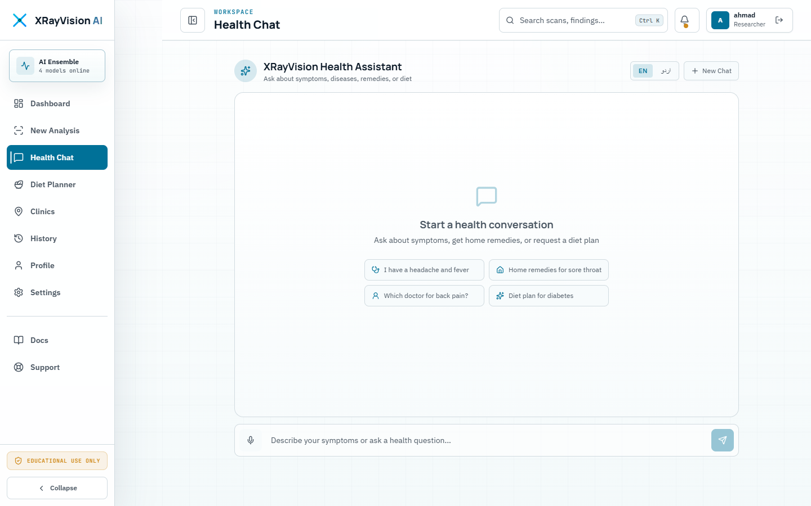

### 9.1 Asking a question

1. Choose your language with the **EN** / **اردو** toggle at the top.
2. Type your question in the box at the bottom — or click the microphone to dictate it.
3. Press Enter or click send.

When you select Urdu, the interface switches to right-to-left and the placeholder changes to
*اپنی علامات بتائیں...*

### 9.2 What you get back

Alongside the written reply, the assistant surfaces two structured cards where relevant:

- **Doctor type** — the kind of specialist your described symptoms would normally be taken to
- **Home remedies** — general self-care suggestions

### 9.3 Conversation memory

The chatbot remembers the last **10 messages** in your conversation, so you can ask follow-up
questions naturally:

> **You:** I've had a fever for two days.
> **Bot:** *(replies about fever)*
> **You:** How long should it last?  ← the bot knows you still mean the fever

Your conversations are saved. When you come back to the Health Chat page, previous sessions are listed
and can be reopened.

> ⚠️ **What the chatbot will not do.** It will never give you a definitive diagnosis, and it will always
> point you toward a qualified professional for real medical decisions. This is deliberate. If you press
> it for a yes-or-no answer about a serious condition, it will decline and refer you to a doctor.

---

## 10. The Diet Planner

Click **Diet Planner** to generate a personalised **7-day meal plan**.

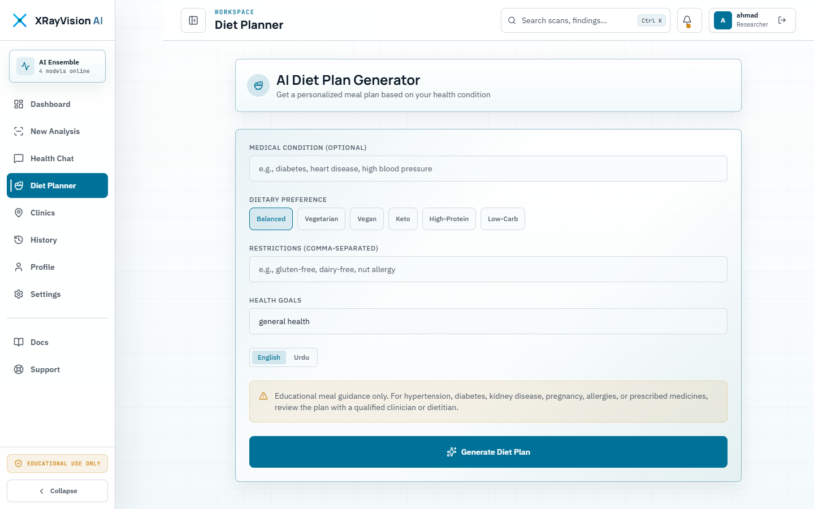

### 10.1 Filling in the form

| Field | What to enter | Example |
|---|---|---|
| **Medical condition** | Any condition the plan should account for | `diabetes`, `high blood pressure` |
| **Dietary preference** | Your general eating style | `balanced`, `vegetarian` |
| **Restrictions** | Allergies and foods to avoid | `gluten-free, dairy-free, nut allergy` |
| **Goals** | What you want the plan to achieve | `weight loss`, `muscle gain` |

Click generate and the plan appears below.

### 10.2 Built-in medical safety rules

The planner applies condition-specific clinical guardrails automatically:

| If you enter | The plan applies |
|---|---|
| **Hypertension / high blood pressure** | DASH dietary principles — reduced sodium, more fruit, vegetables and low-fat dairy |
| **Diabetes** | Low-glycaemic-index food choices |
| **Kidney disease** | An explicit recommendation to consult a **renal dietitian** — kidney nutrition needs individual professional supervision |

### 10.3 Your plan

Each of the seven days shows **Breakfast**, **Lunch** and **Dinner** — with a name, a description and,
where available, calories and key nutrients. Snacks are included where appropriate, along with a
summary and general tips.

> ⚠️ **General guidance only.** If you have a medical condition, discuss any diet plan with your doctor
> or a qualified dietitian before following it.

---

## 11. Finding Nearby Clinics

Click **Clinics** to find hospitals, clinics, doctors and pharmacies near you.

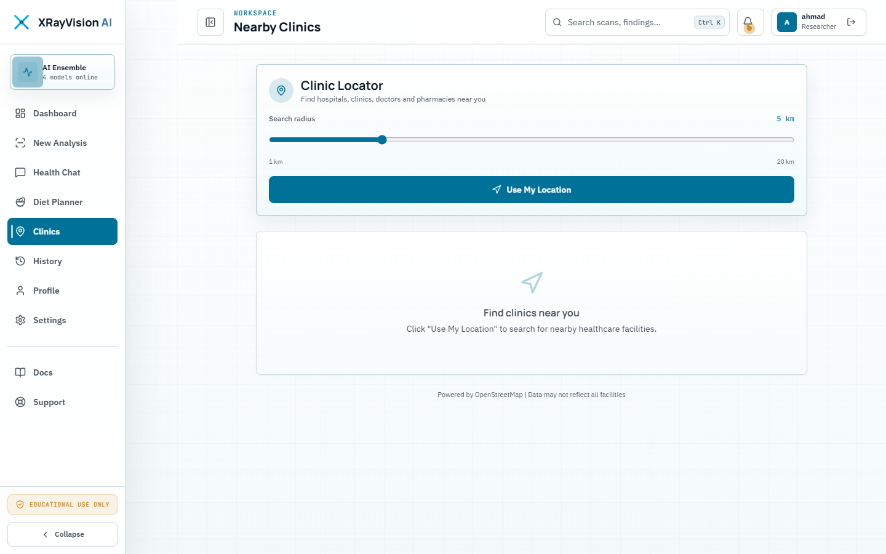

1. Set your **search radius** with the slider — anywhere from **1 km to 20 km**. It starts at 5 km.
2. Click **Use My Location**.
3. Your browser will ask permission to share your location. Click **Allow**.

Results appear sorted by distance, nearest first. Each shows the facility name, its type, its address,
how far away it is, and a link that opens it in Google Maps.

Facility data comes from **OpenStreetMap**, a community-maintained map database. The page notes:
*"Data may not reflect all facilities."*

**If you decline location permission,** the page explains what happened and no search is run. You can
grant permission in your browser's site settings and try again.

**If no results appear,** increase the radius with the slider and search again. Coverage varies by
region.

---

## 12. Your Profile

Click **Profile** to view and edit your account details.

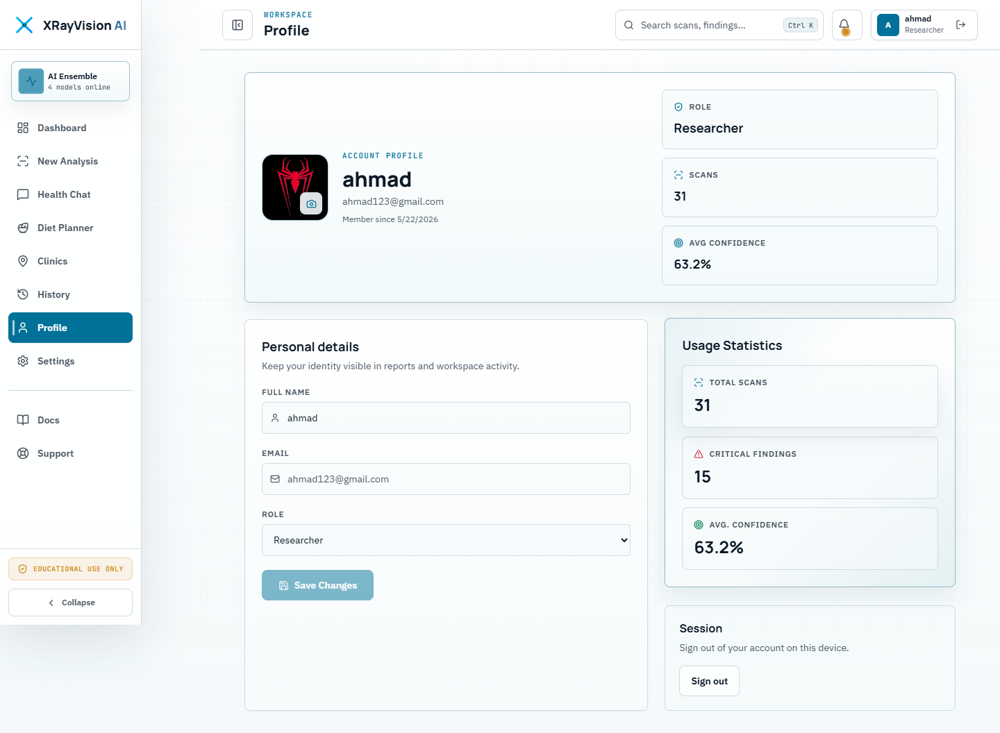

Here you can:

- Change your **display name** — this appears in the header and on your PDF reports
- Update your **role** (for example Medical Student, Radiologist, Researcher) — this is a descriptive label only and does not change what you can access
- Upload a **profile picture**

Your scan statistics are also summarised on this page.

---

## 13. Settings

Click **Settings** to personalise how the application looks and behaves.

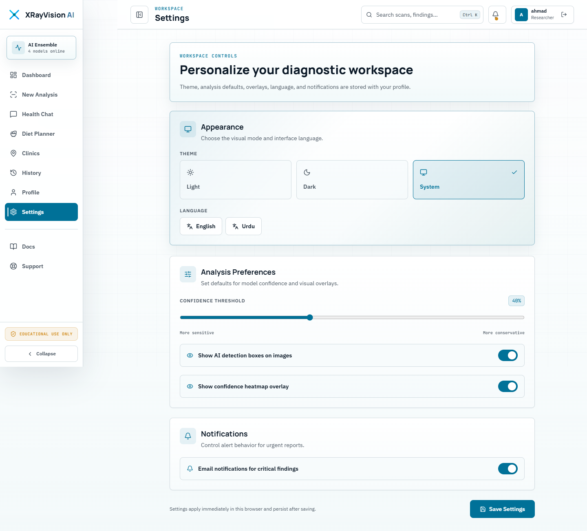

### 13.1 Appearance

Choose **Light**, **Dark** or **System** (which follows your operating system's setting).

### 13.2 Analysis preferences

| Setting | Effect |
|---|---|
| **Show AI detection boxes on images** | Whether bounding boxes are drawn by default on result images |
| **Show confidence heatmap overlay** | Whether the heatmap layer is shown by default |

### 13.3 Notifications

| Setting | Effect |
|---|---|
| **Email notifications for critical findings** | Whether you are emailed when a scan returns a critical result |

Your preferences are saved to your account, so they follow you to any device you sign in from.

---

## 14. Using XRayVision AI on a Phone

The application is fully responsive and works on mobile browsers.

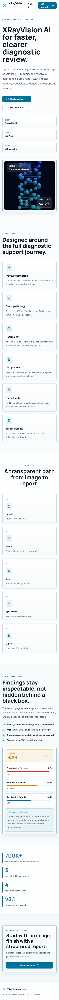

On a small screen the layout reflows to a single column and the sidebar becomes a menu. Everything
works, though reviewing bounding boxes on a detailed X-ray is naturally easier on a larger screen.

---

## 15. Troubleshooting

### Upload and analysis

| Message or symptom | What it means | What to do |
|---|---|---|
| *"File is too small (40 KB). Minimum is 100 KB…"* | The image lacks enough pixel data for reliable inference | Use a higher-quality export of the image |
| *"File is too large (24.3 MB). Maximum allowed size is 20 MB."* | The file exceeds the upload limit | Compress or resize the image below 20 MB |
| *"Image resolution is too low (150×150 px)…"* | Below the 200 × 200 px minimum | Use an image of at least 200 × 200 px — 512 × 512 px or larger is recommended |
| *"File could not be decoded as a valid image…"* | The file is not a readable JPEG, PNG or DICOM | Check the file actually opens in an image viewer; renaming a PDF to `.jpg` will not work |
| *"Empty file uploaded."* | The file contains no data | Re-export or re-download the image |
| *"Rate limit exceeded. Please slow down."* | More than 10 analyses in one minute | Wait a minute and try again |
| **Analysis failed** screen | The AI models could not process the image | Verify you selected the right route for the image type, then retry. If it persists, the backend may be restarting — wait a minute. |
| *"AI synthesis temporarily unavailable. Please review findings manually."* | The AI models worked, but the summary-writing service was unreachable | The findings are still valid — read them directly. Re-run later for a written summary. |
| The first analysis takes 30–60 seconds | The free-tier backend was asleep and is loading models | Normal. Subsequent analyses are fast. |
| Results appear but the image is missing | Image storage was unavailable during upload | The findings are still valid. Re-run the analysis if you need the image saved. |

### Signing in

| Symptom | What to do |
|---|---|
| Signed out unexpectedly | Sessions last 24 hours. Simply sign in again. |
| *"Invalid email or password"* | Check for typos and caps lock. If you still cannot get in, use **Forgot password**. |
| *"Demo login failed. Please try again."* | The backend may be waking up. Wait 30 seconds and retry. |
| Reset email never arrived | Check your spam folder, and confirm you entered the address the account was registered with. |

### Other features

| Symptom | What to do |
|---|---|
| Clinic search finds nothing | Increase the radius. OpenStreetMap coverage varies by region. |
| Clinic search shows an error | The public map service may be busy. Wait a moment and try again. |
| Location permission blocked | Grant location access for this site in your browser's site settings. |
| Microphone does not work in chat | Grant microphone permission, or just type your question instead. |
| Chatbot replies are slow | Replies typically take a few seconds. Longer waits usually mean the AI service is busy. |
| Diet plan looks generic | If the AI's response failed validation, a safe pre-written plan is shown instead. Try again with more specific inputs. |

---

## 16. Frequently Asked Questions

**Can I use this to diagnose a patient?**
No. XRayVision AI is an educational tool and is not a certified medical device. Every output is an
AI estimate to support learning and preliminary review. Clinical decisions must be made by a qualified
professional.

**How accurate is it?**
Accuracy varies by model, by image quality and by the condition being examined. That is precisely why
every finding shows a confidence percentage, why findings are grouped into confidence tiers, and why
anything below 60 % triggers an explicit recommendation for radiologist review. Treat low-confidence
findings as prompts to look more carefully — not as conclusions.

**What happens to the images I upload?**
They are stored in your account so you can review them later, and are only ever shown alongside your
own scans. Deleting a scan removes both the record and the image permanently.

**Can other users see my scans?**
No. Every scan, chat conversation and statistic is tied to your account. Ownership is checked in the
application and again in the database.

**Why do I have to sign in again every day?**
Sessions expire after 24 hours as a security measure.

**Why was my image rejected?**
Almost always size or resolution — the minimums are 100 KB and 200 × 200 px. The error message always
states the specific reason and the limit involved.

**Can I upload a DICOM file straight from a scanner?**
Yes. DICOM (`.dcm`) files are supported alongside PNG and JPG.

**Which route should I pick?**
Chest X-ray → **Chest pathology**. Bone X-ray where you suspect a fracture → **Fracture detection**.
Photograph of a wound on the skin → **External wound**.

**Why did I get no findings at all?**
No finding met the confidence threshold. The urgency will read **CLEAR**. This does not prove the image
is normal — it means this model found nothing it was confident about.

**Is the chatbot a doctor?**
No. It provides general health information and points you toward the right kind of specialist. It will
not diagnose you.

**Is it free?**
Yes. The entire platform runs on free-tier services. That is also why the first request after a period
of inactivity can be slow.

---

## 17. Glossary

| Term | Plain-English meaning |
|---|---|
| **Bounding box** | The rectangle the AI draws around a region it thinks is abnormal |
| **CLAHE** | A contrast-enhancement step applied to your image before analysis, so faint details become easier for the model to see |
| **Confidence** | How sure the model is, as a percentage. Higher is more certain — but it is never a guarantee. |
| **DenseNet121** | The neural network that examines chest X-rays, trained on over 700,000 clinical images |
| **DICOM** | The standard file format that medical imaging equipment produces (`.dcm`) |
| **Finding** | One thing the AI thinks it has spotted, with a name and a confidence score |
| **ICD-10 code** | The internationally standard code for a diagnosis, e.g. `S02-S92` for certain fractures |
| **LLM** | Large Language Model — the AI that writes the readable clinical summary |
| **Severity** | How serious a single finding is judged to be: critical, high, moderate or low |
| **Synthesis** | The AI-written paragraph that pulls all the findings together into one clinical picture |
| **Urgency** | The overall rating for the whole scan: critical, high, medium, low or clear |
| **ViT** | Vision Transformer — the neural network that classifies wound photographs |
| **YOLOv8** | The object-detection model that finds and boxes fractures on bone X-rays |

---

## Getting Help

| Need | Where to go |
|---|---|
| **Technical API reference** | `/docs` on the backend (Swagger UI) |
| **What the system is required to do** | [Software Requirements Specification](01-SRS.md) |
| **How the system is built** | [Software Design Document](02-SDD.md) |
| **How it was verified** | [Test Documentation](03-Test-Cases.md) |
| **Reporting a security issue** | [SECURITY.md](../SECURITY.md) |
| **Contributing** | [CONTRIBUTING.md](../CONTRIBUTING.md) |

---

## Revision History

| Version | Date | Author | Description |
|---|---|---|---|
| 1.0 | August 2026 | Muhammad Ali Raza, Hamza Afzal | Initial user manual with screenshots from the live deployment |

---

*XRayVision AI — User Manual v1.0 — Minhaj University Lahore*
*Educational use only. Not a certified medical device.*
