<!-- center -->
# XRayVision AI

## A Web-Based AI-Assisted Platform for Automated X-Ray Fracture Detection, Chest Pathology Screening and Clinical Report Generation

**A Final Year Project Thesis**

Submitted in partial fulfilment of the requirements
for the degree of

**Bachelor of Science in Software Engineering (BSSE)**

**Submitted by**

Muhammad Ali Raza — 2022F-MUL-BSSWE-017

Hamza Afzal — 2022F-MUL-BSSWE-027

**Supervised by**

Maam Misbah

Lecturer, School of Software Engineering

**School of Software Engineering**

**Minhaj University Lahore**

August 2026
<!-- endcenter -->

<!-- pagebreak -->

<!-- center -->
# Certificate of Approval

<!-- endcenter -->

This is to certify that the Final Year Project titled **"XRayVision AI — A Web-Based AI-Assisted
Platform for Automated X-Ray Fracture Detection, Chest Pathology Screening and Clinical Report
Generation"** has been carried out by **Muhammad Ali Raza (2022F-MUL-BSSWE-017)** and
**Hamza Afzal (2022F-MUL-BSSWE-027)** under my supervision, and is submitted in partial fulfilment
of the requirements for the degree of Bachelor of Science in Software Engineering at the School of
Software Engineering, Minhaj University Lahore.

The work presented in this thesis is, to the best of my knowledge, the original work of the
candidates and has not been submitted elsewhere for the award of any other degree.

I recommend this project for evaluation by the Final Year Project Evaluation Committee.

&nbsp;

| | |
|---|---|
| **Supervisor** | **Date** |
| _______________________ | _______________________ |
| Maam Misbah | |
| Lecturer, School of Software Engineering | |
| | |
| **Project Coordinator** | **Date** |
| _______________________ | _______________________ |
| | |
| | |
| **Head of Department** | **Date** |
| _______________________ | _______________________ |
| School of Software Engineering | |
| | |
| **External Examiner** | **Date** |
| _______________________ | _______________________ |

<!-- pagebreak -->

<!-- center -->
# Declaration of Originality

<!-- endcenter -->

We, **Muhammad Ali Raza** and **Hamza Afzal**, hereby declare that the work presented in this thesis
titled **"XRayVision AI — A Web-Based AI-Assisted Platform for Automated X-Ray Fracture Detection,
Chest Pathology Screening and Clinical Report Generation"** is our own original work, carried out
under the supervision of Maam Misbah at the School of Software Engineering, Minhaj University Lahore.

We further declare that:

1. This thesis has not been submitted, in whole or in part, for the award of any other degree or
   qualification at this or any other institution.
2. All external sources — including research papers, datasets, pretrained models, open-source
   libraries and web resources — have been explicitly acknowledged and cited in the References.
3. Third-party pretrained machine-learning models used in this project are the intellectual property
   of their respective authors and are used under their published licences. Their contribution is
   documented in Chapter 5 and the References.
4. All source code written by us is our own. Where third-party code or components have been adapted,
   this is stated in the relevant section.
5. We understand that any act of plagiarism or misrepresentation is a serious academic offence and
   may result in disciplinary action under the regulations of Minhaj University Lahore.

&nbsp;

| | |
|---|---|
| _______________________ | _______________________ |
| **Muhammad Ali Raza** | **Hamza Afzal** |
| 2022F-MUL-BSSWE-017 | 2022F-MUL-BSSWE-027 |
| Date: _______________ | Date: _______________ |

<!-- pagebreak -->

<!-- center -->
# Dedication

&nbsp;

*To our parents,
whose patience and sacrifice made this education possible.*

*To our teachers at Minhaj University Lahore,
who taught us to build things that matter.*

*And to the radiologists and clinicians of Pakistan,
who read more images in a day than most of us will see in a lifetime.*
<!-- endcenter -->

<!-- pagebreak -->

# Acknowledgement

All praise is due to Allah, the Most Gracious, the Most Merciful, who granted us the health, patience
and clarity of mind to complete this work.

We are deeply grateful to our supervisor, **Maam Misbah**, Lecturer at the School of Software
Engineering, for her guidance throughout this project. Her insistence that we justify every design
decision — rather than simply implement whatever was convenient — shaped both this system and the way
we now approach engineering problems. The emphasis this thesis places on safety framing, graceful
degradation and honest reporting of limitations is a direct result of her supervision.

We thank the faculty and administration of the **School of Software Engineering, Minhaj University
Lahore**, for providing the academic environment, laboratory access and institutional support that
made this project possible.

We acknowledge the open-source and research communities whose work this project stands on. In
particular, the authors of **TorchXRayVision** for making clinically pretrained chest radiograph
models freely available; **Ultralytics** for the YOLOv8 framework; the **Hugging Face** community for
hosting and distributing model weights; and the maintainers of **FastAPI**, **React**, **TanStack**
and **Supabase**. This project would not have been feasible for two undergraduate students without
their generosity. We also acknowledge the **OpenStreetMap** contributors whose community-maintained
data powers our clinic locator.

We are grateful to **OpenRouter** for providing free-tier access to large language models, without
which the clinical synthesis component of this system could not have been built within our budget.

Finally, we thank our families and our classmates for their encouragement during the long stretches
of debugging that no one sees in a finished demonstration.

**Muhammad Ali Raza**
**Hamza Afzal**

*August 2026*

<!-- pagebreak -->

# Abstract

Radiological interpretation is a bottleneck in healthcare systems worldwide, and acutely so in
Pakistan, where the ratio of trained radiologists to patients is severely constrained. Medical
students, meanwhile, have limited access to structured feedback while learning to read radiographs.
This project addresses both problems with an educational decision-support tool rather than a
diagnostic device.

This thesis presents **XRayVision AI**, a full-stack web platform that accepts a chest radiograph, a
bone radiograph or an external wound photograph and returns a structured, confidence-tiered clinical
report within seconds. The system implements a **routed multi-model ensemble**: rather than executing
every model on every image, it dispatches the image to the specialist model matching the user's
declared scan type. A DenseNet121 network pretrained on over 700,000 clinical radiographs screens
chest images for eighteen pathology classes; a YOLOv8 detector localises suspected fractures with
bounding boxes, supported by an image-level fracture screening classifier; and a Vision Transformer
classifies external wounds. The structured outputs of these models are then passed to a large
language model, which synthesises them into a readable clinical paragraph with an urgency rating,
recommended actions and a specialist referral suggestion.

The platform is implemented as a React 19 single-page application built on TanStack Start,
communicating over a JSON REST API with a Python FastAPI backend, and persisting to a Supabase
PostgreSQL database with Row Level Security. Beyond image analysis it provides a bilingual
(English/Urdu) health chatbot with voice input, a clinically guard-railed seven-day diet planner, a
GPS-based clinic locator backed by OpenStreetMap, dashboard analytics, and PDF/JSON report export. A
design constraint throughout was that the entire system must remain deployable on free-tier cloud
infrastructure and must run inference on CPU only.

Two design principles distinguish this work from a straightforward model-serving application. The
first is **safety by construction**: findings are grouped into three visible confidence tiers, any
result below 60 % confidence triggers an explicit recommendation for radiologist review, negative
detector outputs are never reported as evidence of normality, and an educational-use disclaimer is
rendered from the application shell rather than left to individual pages. The second is **graceful
degradation**: the failure of the language model, of object storage or of any single vision model
downgrades the result rather than destroying it, so a user always receives whatever the system was
able to determine.

The system was specified against IEEE 830, designed against IEEE 1016, and verified against a test
suite of 93 specified cases documented under IEEE 829. Seventeen cases were executed against the live
deployment during documentation; the remainder are specified and pending execution. Two defects
remain open and are reported honestly in Chapter 6. On the deployed instance, end-to-end analysis
completes in approximately 8.4 seconds on average across 31 stored scans.

The principal contribution of this work is not a new model architecture but a demonstration that
clinically pretrained models, an LLM synthesis layer and disciplined safety framing can be integrated
into a deployable, zero-cost web platform suitable for medical education. The thesis also documents,
rather than conceals, the limitations discovered during evaluation — including an observed label
leakage issue in the fracture detector — as a contribution to anyone attempting similar work.

**Keywords:** medical image analysis, computer-aided diagnosis, fracture detection, chest radiography,
deep learning, DenseNet121, YOLOv8, Vision Transformer, large language models, clinical decision
support, FastAPI, React, educational technology

<!-- pagebreak -->

<!-- toc -->

<!-- pagebreak -->

# List of Figures

| Figure | Title | Chapter |
|---|---|---|
| 3.1 | System context — XRayVision AI and its external actors | 3 |
| 3.2 | Product function decomposition | 3 |
| 3.3 | Use case diagram — system overview | 3 |
| 3.4 | Activity diagram — image analysis pipeline | 3 |
| 4.1 | Three-tier layered architecture | 4 |
| 4.2 | Component diagram | 4 |
| 4.3 | Entity relationship diagram | 4 |
| 4.4 | Row Level Security policy map | 4 |
| 4.5 | Data Flow Diagram — Level 0 (context) | 4 |
| 4.6 | Data Flow Diagram — Level 1 (major processes) | 4 |
| 4.7 | Data Flow Diagram — Level 2 (analyse image) | 4 |
| 4.8 | Class diagram — domain model | 4 |
| 4.9 | Sequence diagram — registration and login | 4 |
| 4.10 | Sequence diagram — image analysis | 4 |
| 4.11 | Sequence diagram — bilingual chat | 4 |
| 4.12 | Sequence diagram — PDF report export | 4 |
| 4.13 | State diagram — scan lifecycle | 4 |
| 4.14 | State diagram — authentication session | 4 |
| 5.1 | Authentication and authorisation flow | 5 |
| 5.2 | Error handling and degradation decision tree | 5 |
| 5.3 | Deployment diagram | 5 |
| 5.4 | Backend startup sequence | 5 |
| 7.1 | Landing page | 7 |
| 7.2 | Dashboard with analytics | 7 |
| 7.3 | Three-step analysis wizard | 7 |
| 7.4 | Diagnostic report with bounding-box overlays | 7 |
| 7.5 | Bilingual health chatbot | 7 |
| 7.6 | Clinic locator | 7 |

# List of Tables

| Table | Title | Chapter |
|---|---|---|
| 1.1 | Project objectives and their success criteria | 1 |
| 2.1 | Comparison of related systems | 2 |
| 2.2 | Identified research and engineering gaps | 2 |
| 3.1 | Functional requirement groups | 3 |
| 3.2 | Non-functional requirement targets | 3 |
| 3.3 | Feasibility assessment summary | 3 |
| 4.1 | Layer responsibilities and prohibitions | 4 |
| 4.2 | Database tables and their purpose | 4 |
| 4.3 | Key design decisions and rationale | 4 |
| 5.1 | Development environment and tools | 5 |
| 5.2 | AI model inventory | 5 |
| 5.3 | REST API endpoint summary | 5 |
| 5.4 | Rate limiting configuration | 5 |
| 5.5 | Implementation challenges and solutions | 5 |
| 6.1 | Test case distribution by module | 6 |
| 6.2 | Executed test results | 6 |
| 6.3 | Open defects | 6 |
| 7.1 | Observed system metrics on the deployed instance | 7 |
| 7.2 | Objectives achieved against Chapter 1 criteria | 7 |
| 8.1 | Future work priorities | 8 |

# List of Abbreviations

| Abbreviation | Expansion |
|---|---|
| API | Application Programming Interface |
| BSSE | Bachelor of Science in Software Engineering |
| CLAHE | Contrast Limited Adaptive Histogram Equalisation |
| CNN | Convolutional Neural Network |
| CORS | Cross-Origin Resource Sharing |
| CPU | Central Processing Unit |
| DFD | Data Flow Diagram |
| DICOM | Digital Imaging and Communications in Medicine |
| ERD | Entity Relationship Diagram |
| FYP | Final Year Project |
| GPU | Graphics Processing Unit |
| HTTP / HTTPS | Hypertext Transfer Protocol (Secure) |
| ICD-10 | International Classification of Diseases, 10th Revision |
| JSON | JavaScript Object Notation |
| JWT | JSON Web Token |
| LLM | Large Language Model |
| ML | Machine Learning |
| PACS | Picture Archiving and Communication System |
| REST | Representational State Transfer |
| RLS | Row Level Security |
| SDD | Software Design Document |
| SPA | Single Page Application |
| SRS | Software Requirements Specification |
| SSR | Server Side Rendering |
| UI / UX | User Interface / User Experience |
| UUID | Universally Unique Identifier |
| ViT | Vision Transformer |
| YOLO | You Only Look Once |

<!-- pagebreak -->

# Chapter 1: Introduction

## 1.1 Background

Medical imaging is one of the highest-volume diagnostic activities in modern healthcare. A chest
radiograph is among the most frequently ordered imaging studies in the world, and plain radiography
remains the first-line investigation for suspected fractures. Every one of these images requires
interpretation by a trained radiologist or an appropriately experienced clinician.

The supply of such expertise does not scale with demand. This is a global problem, and a particularly
sharp one in Pakistan, where the number of trained radiologists is small relative to population and
is concentrated in major urban centres. In district and tehsil-level facilities, radiographs are
frequently interpreted by clinicians whose primary training is not radiology, or are queued for
remote reporting with a delay that can be clinically significant.

At the same time, deep learning applied to medical imaging has matured considerably. Since Litjens et
al. surveyed the field in 2017 [11], convolutional architectures have been demonstrated at or near
specialist-level performance on constrained diagnostic tasks — Esteva et al. on dermatological
classification [12], Rajpurkar et al. on pneumonia detection from chest radiographs [1] and
subsequently across fourteen pathology classes [13]. Large annotated datasets such as ChestX-ray8 [3]
and CheXpert [4] made this progress possible, and libraries such as TorchXRayVision [5] have since
made clinically pretrained weights freely available to anyone with an internet connection.

A gap remains between this research capability and its practical availability. Published models are
distributed as research artefacts — checkpoints, notebooks and evaluation scripts. Turning one into
something a medical student can actually use requires preprocessing pipelines, an inference service,
authentication, storage, a user interface, and — critically — a presentation layer that communicates
uncertainty honestly rather than presenting a probability vector as a verdict.

There is also a communication gap. A model that outputs eighteen floating-point probabilities is not
useful to a third-year MBBS student. Recent large language models are capable of taking structured
findings and expressing them as coherent clinical prose with recommended next steps — a translation
layer between numerical model output and human clinical reasoning.

## 1.2 Problem Statement

> Clinically capable medical imaging models exist and are freely available, but they remain
> inaccessible to the medical students and junior clinicians who would benefit most from them. The
> obstacles are not primarily algorithmic: they are the absence of an integrated, deployable system;
> the absence of a presentation layer that makes model uncertainty visible; and the cost of the
> infrastructure normally assumed by such systems.

Decomposed into specific problems:

**P1 — Integration gap.** Pretrained models are research artefacts, not usable applications. No
preprocessing, serving, storage, authentication or interface layer is provided with them.

**P2 — Interpretation gap.** Raw multi-label probability outputs are not actionable for a learner. A
list of eighteen numbers does not indicate what matters, how urgent it is, or what to do next.

**P3 — Safety gap.** Systems that present AI output as authoritative are dangerous in a clinical
context. Confidence must be visible, low-confidence results must be flagged, and the absence of a
detection must never be presented as proof of normality.

**P4 — Cost gap.** GPU inference, managed databases and commercial LLM APIs place such systems beyond
the reach of a student project or a resource-constrained teaching institution.

**P5 — Language gap.** Health information tools in Pakistan are overwhelmingly English-only, which
excludes a substantial proportion of the population who would benefit from them.

## 1.3 Motivation

Three observations motivated this project.

First, during our clinical-adjacent coursework we observed that medical students learning to read
radiographs receive feedback slowly and unevenly. A tool offering an immediate, structured second
opinion — explicitly framed as a study aid rather than an authority — fills a genuine pedagogical
need.

Second, we found that the individual components required to build such a tool are all available at no
cost: pretrained clinical models, free LLM inference tiers, free managed PostgreSQL, and free
application hosting. What did not exist was an integration of them. Building that integration is a
software engineering contribution well matched to a final year project in software engineering.

Third, we were conscious that the failure mode of a badly built medical AI tool is not a bad user
experience — it is a user acting on a false negative. This gave the project an unusually clear design
discipline: every ambiguity should be resolved in the direction of visible uncertainty and explicit
deferral to human expertise.

## 1.4 Objectives

The project set the following objectives.

**Primary objective.** To design, implement and deploy a web-based platform that accepts a medical
image, routes it to an appropriate deep learning model, and returns a structured, confidence-tiered
clinical report that is safe to use in an educational setting.

**Secondary objectives.**

1. To implement a routed multi-model ensemble covering chest pathology, fracture localisation and
   wound classification.
2. To integrate a large language model that synthesises structured model output into readable
   clinical prose with an urgency rating and recommended actions.
3. To design a results presentation that makes model uncertainty structurally visible.
4. To provide supporting features that extend the platform's educational utility: scan history with
   report export, dashboard analytics, a bilingual health chatbot, a diet planner and a clinic
   locator.
5. To implement authentication and per-user data isolation enforced at two independent layers.
6. To achieve all of the above within a strictly zero-cost, CPU-only deployment envelope.
7. To document the system to professional standards (IEEE 830, 1016 and 829) and to report
   verification results and defects honestly.

**Table 1.1 — Project objectives and their success criteria**

| # | Objective | Success criterion |
|---|---|---|
| O1 | Routed multi-model ensemble | Three scan types dispatch correctly to their models; the wrong model is never run |
| O2 | LLM clinical synthesis | Every analysis returns an urgency rating, prose summary, actions and a specialist |
| O3 | Visible uncertainty | Findings tiered by confidence; sub-60 % results trigger a review recommendation |
| O4 | Supporting features | History, exports, analytics, chatbot, diet planner and clinic locator all functional |
| O5 | Data isolation | A user cannot read or delete another user's data through any endpoint |
| O6 | Zero-cost deployment | Entire system runs on free tiers with CPU-only inference |
| O7 | Professional documentation | SRS, SDD, test documentation and user manual delivered; defects reported |

## 1.5 Scope

**Within scope.** User account management; chest pathology screening across eighteen classes;
fracture localisation with bounding boxes and image-level screening; external wound classification;
LLM report synthesis; permanent scan history with PDF and JSON export; dashboard analytics; a
bilingual English/Urdu chatbot with voice input; a seven-day diet planner with condition-specific
guardrails; a GPS clinic locator; and deployment to public cloud infrastructure.

**Outside scope.** Regulatory certification of any kind. Integration with hospital PACS, HL7 or FHIR
systems. Multi-tenant hospital administration, billing or appointment scheduling. Collaborative
multi-reader review workflows. Training or fine-tuning of new models from user-supplied data.
Clinical validation of diagnostic accuracy — the models are third-party pretrained artefacts used as
supplied, and this project does not claim to have validated them for clinical use.

## 1.6 Limitations

We state the project's limitations at the outset rather than in the conclusion, because they
constrain how the results in Chapter 7 should be read.

1. **The system is not a medical device** and is not certified for clinical use. It is an educational
   decision-support tool.
2. **Diagnostic accuracy was not independently validated.** We report the models' behaviour as
   integrated, not their clinical sensitivity or specificity, which would require a labelled
   evaluation set and clinical supervision beyond the scope of an undergraduate project.
3. **CPU-only inference** limits throughput and adds latency, particularly on cold starts.
4. **Free-tier hosting** means the backend sleeps when idle; the first request after inactivity is
   substantially slower.
5. **A defect in the fracture detector's label handling** was observed during evaluation and is
   documented in Chapter 6; it is not resolved in the submitted version.
6. **Test execution is incomplete.** Ninety-three cases are specified; seventeen were executed.

## 1.7 Thesis Organisation

**Chapter 2** reviews the relevant literature in medical image analysis, object detection, vision
transformers and LLM-assisted report generation, and compares existing systems to identify the gap
this project addresses.

**Chapter 3** presents the requirement analysis: elicitation method, functional and non-functional
requirements, the use case model and the feasibility study.

**Chapter 4** presents the system design: architecture, database design, data flow decomposition,
class model, behavioural models and the design decisions with their rationale.

**Chapter 5** documents the implementation: environment, backend, frontend, model integration,
security, deployment, and the challenges encountered.

**Chapter 6** presents the testing strategy, executed results, performance measurements and open
defects.

**Chapter 7** discusses the results, evaluates them against the Chapter 1 objectives, compares the
system to related work, and addresses ethical and safety considerations.

**Chapter 8** concludes the thesis and sets out future work.

<!-- pagebreak -->

# Chapter 2: Literature Review

## 2.1 Deep Learning in Medical Image Analysis

The application of deep learning to medical imaging accelerated sharply after 2012. Litjens et al.
[11] surveyed over three hundred contributions and identified classification, detection, segmentation
and registration as the dominant task families, with convolutional neural networks the dominant
architecture across all of them. Their survey also identified the field's persistent constraint: the
scarcity of large, expertly labelled datasets, and the consequent reliance on transfer learning from
natural-image corpora.

Esteva et al. [12] demonstrated in *Nature* that a CNN trained on clinical images could match board-
certified dermatologists on skin lesion classification. The result was significant less for the
architecture than for the demonstration that specialist-level performance on a constrained task was
achievable with then-current methods and sufficient data — a finding that motivated similar efforts
across radiology.

## 2.2 Chest Radiograph Classification

Progress in chest radiography was enabled by dataset releases. Wang et al. [3] published ChestX-ray8,
comprising over 100,000 frontal chest radiographs labelled with eight (later fourteen) disease
categories mined from radiology reports using natural language processing. Irvin et al. [4] followed
with CheXpert, a dataset of over 200,000 studies whose labelling scheme explicitly modelled
*uncertainty* — a design choice directly relevant to this project, since it acknowledges that
radiological findings are frequently equivocal.

Rajpurkar et al. [1] introduced CheXNet, a 121-layer DenseNet trained on ChestX-ray14 for pneumonia
detection, reporting performance exceeding that of practising radiologists on the F1 metric for that
specific task. The architecture itself was DenseNet [2], whose dense connectivity pattern — each
layer receiving the feature maps of all preceding layers — improves gradient flow and parameter
efficiency, properties well suited to the relatively small datasets available in medical imaging. The
authors later extended the work to CheXNeXt [13], comparing algorithmic performance to practising
radiologists across fourteen pathologies.

Cohen et al. [5] made this line of work practically accessible with **TorchXRayVision**, a library
providing a unified interface to multiple chest radiograph datasets and, critically, pretrained
DenseNet121 weights trained across a union of large public datasets. This is the model our system
uses for chest analysis. The decision to use it as supplied, rather than fine-tune it, is discussed
in Chapter 4.

## 2.3 Object Detection and Fracture Localisation

Classification answers *whether*; fracture assessment requires *where*. Redmon et al. [6] introduced
YOLO, reframing object detection as a single regression problem over a grid rather than a
region-proposal pipeline, achieving real-time performance. Successive versions improved accuracy and
training ergonomics; YOLOv8 [7] is the version used in this project, chosen for its mature tooling,
CPU-viable inference and permissive availability.

Object detection is a natural fit for fracture assessment because a bounding box communicates
*localisation* to the viewer — a student can see which region the model considered abnormal and
assess that judgement against the image. This transparency is a pedagogical advantage over a
whole-image classification score.

However, detection introduces a specific hazard that this project treats as a first-class design
concern. A detector that outputs no positive box has not established that the study is normal; it has
established only that it found nothing it recognised. Interpreting a negative detector output as
evidence of normality is a category error with clinical consequences. Section 4.8 describes the
design rule adopted in response.

## 2.4 Vision Transformers

Vaswani et al. [8] introduced the transformer architecture for sequence modelling, replacing
recurrence with self-attention. Dosovitskiy et al. [9] adapted it to vision with the Vision
Transformer, which partitions an image into fixed-size patches, embeds them as a sequence, and
applies standard transformer encoding. ViT demonstrated that convolution is not a necessary inductive
bias for image classification given sufficient data or suitable pretraining.

For wound classification — where lesion appearance is dominated by colour, texture and tissue
composition rather than fine spatial structure — a ViT-based classifier is a reasonable choice, and a
publicly available wound classifier [16] was adopted for this component.

## 2.5 Preprocessing for Radiographic Images

Radiographic images vary widely in exposure and contrast. Zuiderveld [10] introduced Contrast Limited
Adaptive Histogram Equalisation (CLAHE), which performs histogram equalisation on local tiles while
clipping the histogram to limit noise amplification. CLAHE is standard practice in radiographic
preprocessing and is applied in our pipeline before inference, as described in Section 5.4.

## 2.6 Language Models for Clinical Report Generation

The translation of structured findings into clinical prose is a natural language generation task.
Modern instruction-following language models can accept a structured description of findings and
produce a coherent summary, an urgency assessment and recommended next steps.

This capability is genuinely useful and genuinely hazardous. A fluent, confident paragraph is
persuasive independently of whether it is correct, and a language model has no access to the image —
it can only reason over the findings it is given. Our system therefore constrains the model's role
strictly: it receives structured findings and produces prose, an urgency label from a closed
five-value vocabulary, a list of actions and a specialist suggestion. It is never permitted to
introduce findings, and its output is always displayed alongside the numerical confidences it was
derived from, so a reader can check the prose against the evidence.

## 2.7 Comparison of Existing Systems

**Table 2.1 — Comparison of related systems**

| System / category | Task coverage | Localisation | Report synthesis | Uncertainty shown | Cost | Deployable by a student |
|---|---|---|---|---|---|---|
| CheXNet / CheXNeXt [1][13] | Chest only | Heatmap (CAM) | No | Score only | Research | No — research artefact |
| TorchXRayVision [5] | Chest only | No | No | Score only | Free | Library, not an application |
| Commercial radiology AI | Varies, often single-modality | Yes | Limited | Varies | High, licensed | No |
| General LLM chat with image upload | Broad, unspecialised | No | Yes | No | Freemium | Not purpose-built; no clinical model |
| Typical FYP model demonstrator | Usually one model | Sometimes | No | Rarely | Free | Local only, not deployed |
| **XRayVision AI (this work)** | **Chest, fracture, wound** | **Yes, bounding boxes** | **Yes, LLM** | **Three visible tiers + review flag** | **Zero** | **Yes, publicly deployed** |

## 2.8 Identified Gap

**Table 2.2 — Identified research and engineering gaps**

| Gap | Description | How this project addresses it |
|---|---|---|
| **G1 — Integration** | Capable models exist as artefacts, not applications | A complete deployed platform with preprocessing, serving, auth, storage and UI |
| **G2 — Multi-modality routing** | Existing tools handle one imaging modality | Routed ensemble across three modalities with correct model dispatch |
| **G3 — Interpretability for learners** | Probability vectors are not actionable | LLM synthesis with urgency, actions and specialist referral |
| **G4 — Uncertainty presentation** | Confidence typically shown as a bare number, if at all | Three confidence tiers, sub-60 % review flag, full confidence table |
| **G5 — Negative-evidence safety** | Detector negatives casually treated as normality | Explicit design rule: negative detector boxes are discarded, never reported as normal |
| **G6 — Accessibility** | GPU and licence costs exclude teaching institutions | Zero-cost, CPU-only architecture |
| **G7 — Language** | Health tools are English-only | Bilingual English/Urdu chatbot with RTL rendering and voice input |

The contribution of this project is therefore **integrative and design-oriented rather than
algorithmic**. We do not propose a new architecture or claim improved accuracy. We demonstrate that
existing clinically pretrained models, a language model synthesis layer and disciplined safety
framing can be combined into a deployable system within a zero-cost envelope — and we document what
breaks when you try.

<!-- pagebreak -->

# Chapter 3: Requirement Analysis

## 3.1 Requirement Elicitation

Requirements were elicited through four activities:

1. **Domain study.** Review of the literature in Chapter 2 to establish what is technically
   achievable and what safety obligations follow from the domain.
2. **Supervisor consultation.** Iterative review with the project supervisor, which established the
   safety framing requirements and the insistence on documented design rationale.
3. **User scenario analysis.** Construction of concrete usage scenarios for each user class (medical
   student, clinician, allied health professional) to derive functional requirements.
4. **Constraint analysis.** Assessment of available infrastructure, which produced the hard
   zero-cost and CPU-only constraints that shaped the architecture.

The output was a full Software Requirements Specification conforming to IEEE 830 [17]. This chapter
summarises it; the complete specification with all sixty-plus numbered requirements is provided as a
companion document and in Appendix B.

## 3.2 User Classes

| User class | Characteristics | Primary functions |
|---|---|---|
| **Medical student** (default role) | Moderate technical skill; learning radiographic interpretation | Analysis, history, chatbot |
| **Radiologist / clinician** | Domain expert, not a developer | Analysis, PDF export, clinic locator |
| **Allied health professional** | Basic technical skill | Chatbot, diet planner, clinics |
| **Evaluator / examiner** | Any | Demo account across all features |
| **System administrator** | Developer | Deployment and configuration only |

The system deliberately implements **no role-based access control**. The `role` attribute is
descriptive and appears in the interface and on reports, but every authenticated user has identical
permissions over their own data and no permissions over anyone else's. Introducing privilege tiers
without a governance model would create a false impression of clinical authorisation.

## 3.3 Functional Requirements

Sixty-one functional requirements were specified across nine modules.

**Table 3.1 — Functional requirement groups**

| Module | IDs | Count | Representative requirement |
|---|---|---|---|
| Authentication and account | FR-001 – FR-010a | 11 | Issue HS256 JWTs expiring after 24 hours |
| Image analysis | FR-011 – FR-025a | 16 | Route the image to the model(s) matching its scan type |
| Results and records | FR-026 – FR-033 | 12 | Group findings into three confidence tiers |
| Dashboard analytics | FR-034 – FR-037 | 5 | Compute all statistics from the signed-in user's scans only |
| Health chatbot | FR-038 – FR-043a | 8 | Support English and Urdu with language-specific system prompts |
| Diet planner | FR-044 – FR-048 | 6 | Apply condition-specific clinical guardrails |
| Clinic locator | FR-049 – FR-052a | 6 | Sort results by Haversine distance ascending |
| Settings | FR-053 – FR-056 | 4 | Persist preferences server-side |
| Cross-cutting | FR-057 – FR-060 | 5 | Accept requests before model loading completes |

Four requirements deserve individual emphasis because they encode the project's safety position:

- **FR-021** — a chest analysis returns at most the six highest-confidence findings. Presenting all
  eighteen near-threshold probabilities buries the signal.
- **FR-022** — for fracture scans, only *positive* detections are reported. Negative detector boxes
  are discarded, because they do not establish that the study is normal.
- **FR-024** — if language model synthesis fails, the analysis still returns successfully with a
  fallback summary. The findings are the valuable output; losing the prose must not lose the analysis.
- **FR-028b** — if any finding falls below 60 % confidence, the results page displays an explicit
  recommendation for radiologist review.

## 3.4 Non-Functional Requirements

**Table 3.2 — Non-functional requirement targets**

| Category | ID | Requirement | Target |
|---|---|---|---|
| Performance | NFR-P1 | End-to-end analysis, warm backend | ≤ 15 s |
| Performance | NFR-P2 | Time to first accepted request after startup | ≤ 5 s |
| Performance | NFR-P3 | Non-AI endpoint latency | ≤ 1 s at p95 |
| Performance | NFR-P6 | Maximum upload size | 20 MB |
| Safety | NFR-S1 | Educational-use disclaimer on all AI output | Always visible |
| Safety | NFR-S4 | Negative detections never reported as normality | Absolute |
| Safety | NFR-S7 | Sub-60 % confidence triggers review recommendation | Absolute |
| Security | NFR-SEC2 | JWT signing | HS256, ≥ 32-character secret |
| Security | NFR-SEC3 | Row Level Security | Enabled on all four tables |
| Security | NFR-SEC5 | Rate limiting | 200/min global; 10/min analyse; 20/min chat |
| Reliability | NFR-Q1 | Graceful degradation | No single dependency failure prevents a result |
| Maintainability | NFR-Q5 | Layer discipline | No ML logic in routers; no SQL in services |
| Portability | NFR-Q7 | Containerised backend | Single `docker run` with an env file |
| Accessibility | NFR-Q11 | Urgency never conveyed by colour alone | Text label always present |

## 3.5 Use Case Model

Twelve use cases were specified with full main, alternative and exception flows.

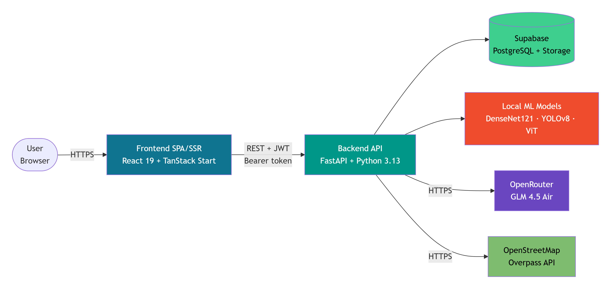

**Figure 3.1** — System context: XRayVision AI and its external actors.

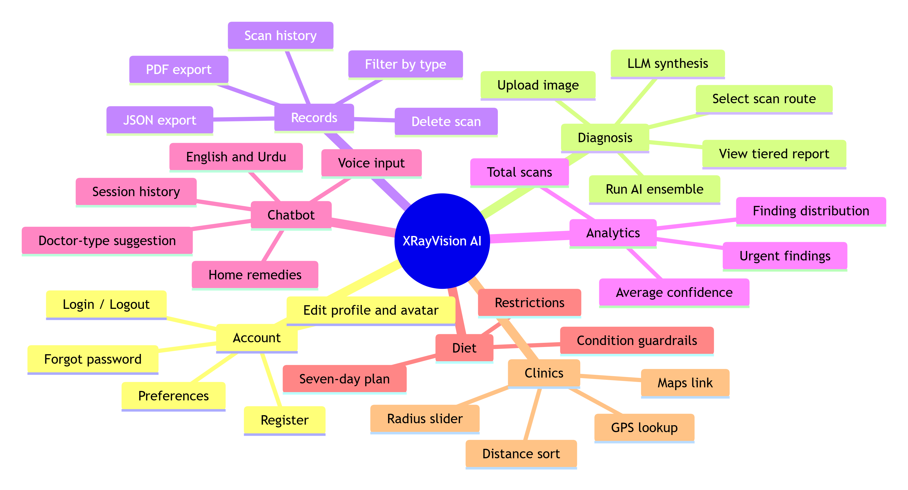

**Figure 3.2** — Product function decomposition.

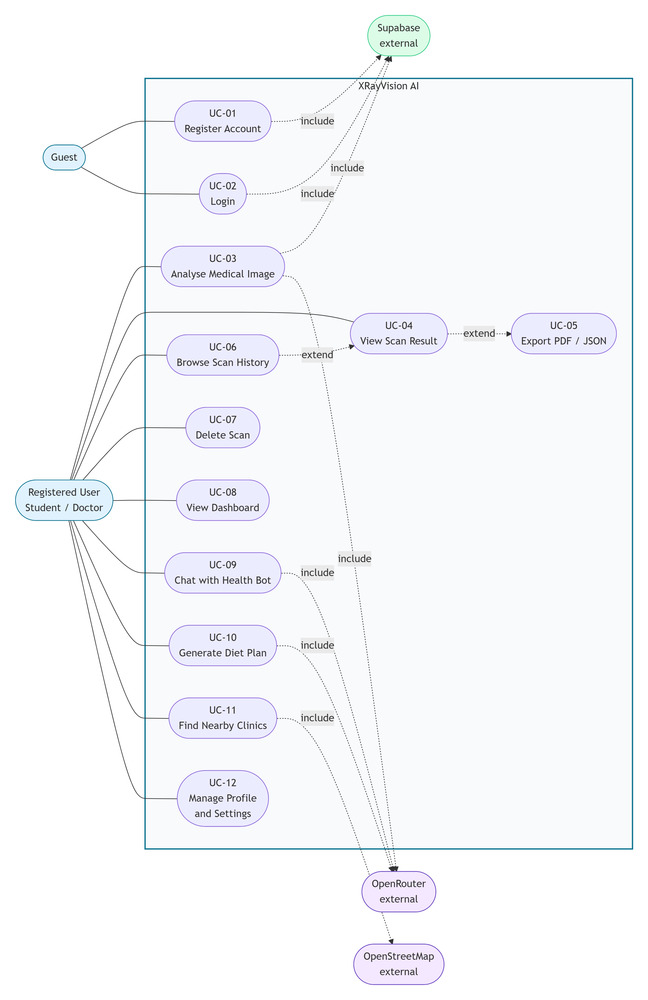

**Figure 3.3** — Use case diagram, system overview.

The primary use case is **UC-03, Analyse Medical Image**. Its exception handling illustrates the
system's degradation philosophy: of eight specified exception flows, only four are treated as
failures. LLM synthesis failure and image upload failure are explicitly *not* errors — the flow
continues and a complete result is still returned to the user.

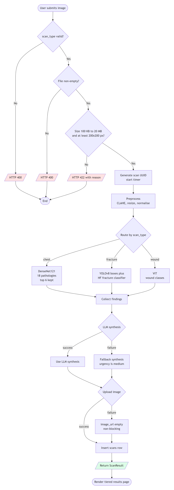

**Figure 3.4** — Activity diagram for the image analysis pipeline, showing validation gates
(red), degradation branches and the success path (green).

## 3.6 Feasibility Study

**Table 3.3 — Feasibility assessment summary**

| Dimension | Assessment | Basis |
|---|---|---|
| **Technical** | Feasible | All required models are publicly available and run on CPU. The team had prior experience with Python, React and REST design. The principal technical risk — CPU inference latency — was mitigated by routing rather than ensembling. |
| **Economic** | Feasible at zero cost | Vercel, Hugging Face Spaces, Supabase and OpenRouter all provide sufficient free tiers. No licence, GPU or hosting expenditure was incurred. |
| **Operational** | Feasible | The target users are already fluent with web applications. The interface requires no training; the analysis workflow is three steps. |
| **Legal / ethical** | Feasible with constraints | The system must not be presented as a medical device, must carry disclaimers, and must not request or store patient-identifying information. These became requirements C-4, C-6 and NFR-S1. |
| **Schedule** | Feasible | Delivered within the two-semester FYP window. The principal schedule risk was model integration, which was front-loaded. |

<!-- pagebreak -->

# Chapter 4: System Design

## 4.1 Architectural Overview

XRayVision AI is a **three-tier layered architecture** deployed as a client–server system. Internally
the backend follows a **router → service → repository** layering, with strict rules about what each
layer may do.

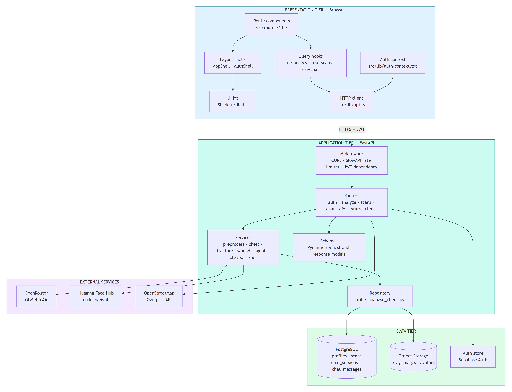

**Figure 4.1** — Three-tier layered architecture with external service integrations.

**Table 4.1 — Layer responsibilities and prohibitions**

| Layer | Module pattern | Permitted | Prohibited |
|---|---|---|---|
| Route component | `src/routes/*.tsx` | Render UI, call hooks | Calling `fetch` directly |
| Query hook | `src/hooks/use-*.ts` | Wrap TanStack Query around the API client | Containing business rules |
| HTTP client | `src/lib/api.ts` | Build requests, attach JWT, normalise errors | Rendering anything |
| Router | `backend/app/routers/*.py` | Validate input, enforce auth and rate limits | Running ML, writing SQL |
| Service | `backend/app/services/*.py` | ML inference, LLM prompting, business rules | Knowing about HTTP |
| Repository | `backend/app/utils/supabase_client.py` | All database and storage access | Containing domain logic |

These prohibitions are not stylistic. Keeping ML logic out of routers means every model can be
invoked and tested without an HTTP client; keeping SQL out of services means the persistence
technology can be replaced without touching business logic.

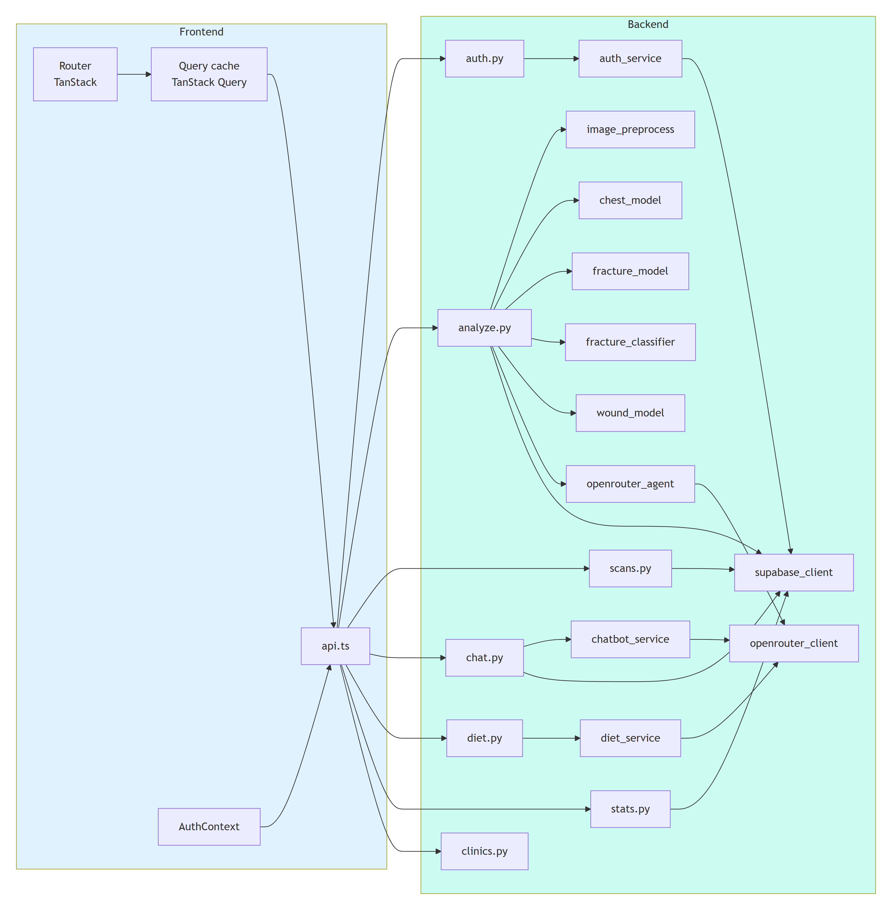

**Figure 4.2** — Component diagram showing module-level dependencies.

## 4.2 Database Design

The data model comprises four tables. Supabase's `auth.users` table is managed by the authentication
service; `profiles` extends it one-to-one.

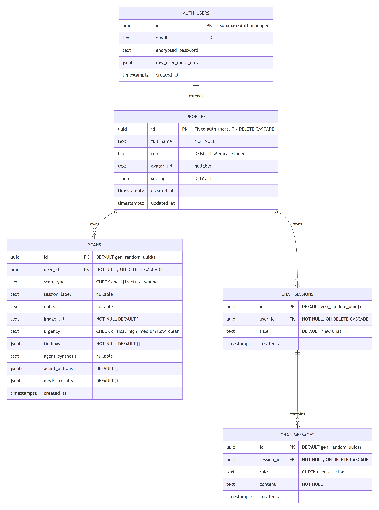

**Figure 4.3** — Entity relationship diagram.

**Table 4.2 — Database tables and their purpose**

| Table | Purpose | Key design note |
|---|---|---|
| `profiles` | Extends `auth.users` with display name, role, avatar and preferences | `settings` is JSONB so new preferences need no migration |
| `scans` | One row per completed analysis | `findings`, `agent_actions` and `model_results` are JSONB |
| `chat_sessions` | One row per chatbot conversation | Cascades from `profiles` |
| `chat_messages` | One row per message | Cascades from `chat_sessions` |

**Why JSONB for findings.** Findings are always read as a complete set alongside their parent scan and
are never queried across scans. Normalising them into a separate table would introduce a join with no
functional benefit. The trade-off — losing the ability to index individual finding attributes — is
accepted because no requirement needs it.

**Cascade design.** Every foreign key to `profiles` uses `ON DELETE CASCADE`, so deleting a user
account removes their profile, scans, chat sessions and chat messages in a single operation. This
satisfies the data retention requirement without application-level cleanup logic.

Four indexes support the access patterns: `user_id` on `scans` and `chat_sessions`, `created_at DESC`
on `scans` for reverse-chronological history, and `session_id` on `chat_messages`.

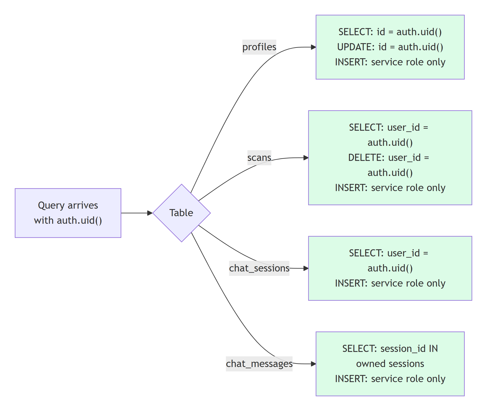

**Figure 4.4** — Row Level Security policy design.

Row Level Security is enabled on all four tables. Read policies restrict `SELECT` to rows owned by
`auth.uid()`. Writes are performed by the backend using the service-role key, after the backend has
independently verified the JWT and resolved the owning user. Ownership is therefore checked twice —
once in the application handler and once by the database — so a single missed `WHERE` clause cannot
become a data breach.

## 4.3 Data Flow Design

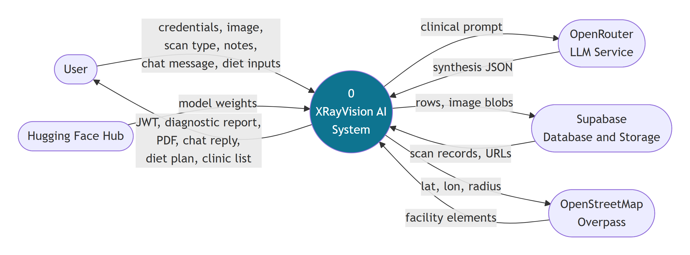

**Figure 4.5** — Data Flow Diagram, Level 0 (context diagram).

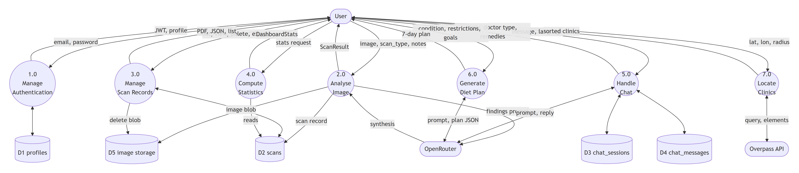

**Figure 4.6** — Data Flow Diagram, Level 1: seven major processes and five data stores.

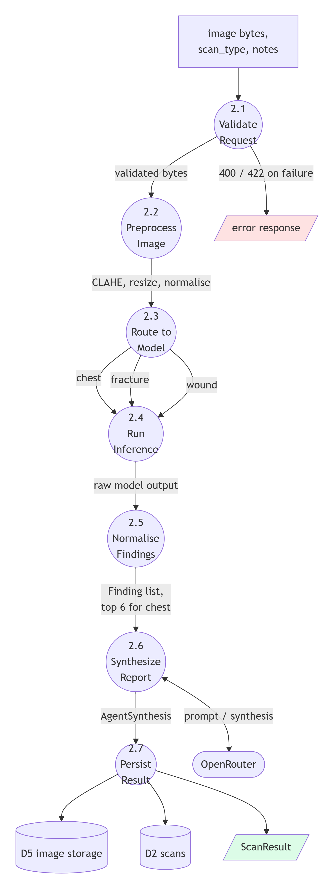

**Figure 4.7** — Data Flow Diagram, Level 2: decomposition of Process 2.0, "Analyse Image", into
seven sub-processes from validation through persistence.

## 4.4 Class Design

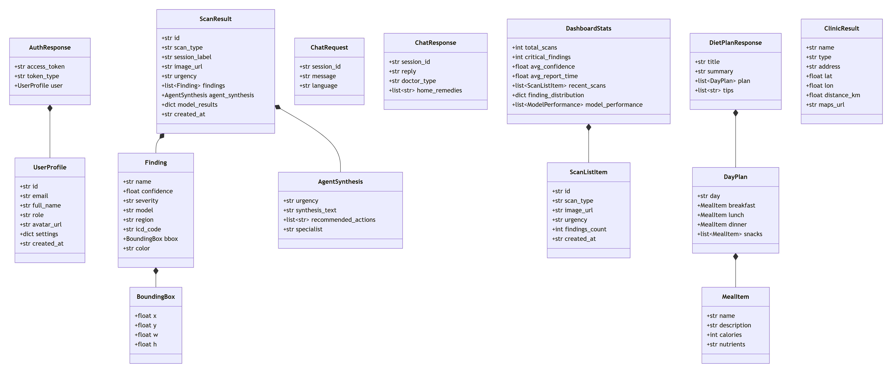

**Figure 4.8** — Class diagram of the domain model as expressed in Pydantic schemas.

The domain model is defined once, in Pydantic, and mirrored in TypeScript for the frontend. `Finding`
is the central abstraction: every model, regardless of architecture, must express its output as a
`Finding` with a name, confidence, severity, originating model and optional bounding box. This
uniform contract is what allows the routed ensemble to add or replace models without changing the
results page.

## 4.5 Behavioural Design

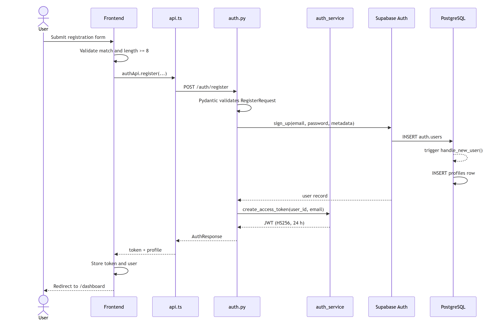

**Figure 4.9** — Sequence diagram: registration and login, including the database trigger that
creates the profile row.


**Figure 4.10** — Sequence diagram: the image analysis pipeline, showing both degradation branches
(LLM failure and storage failure) that continue rather than abort.

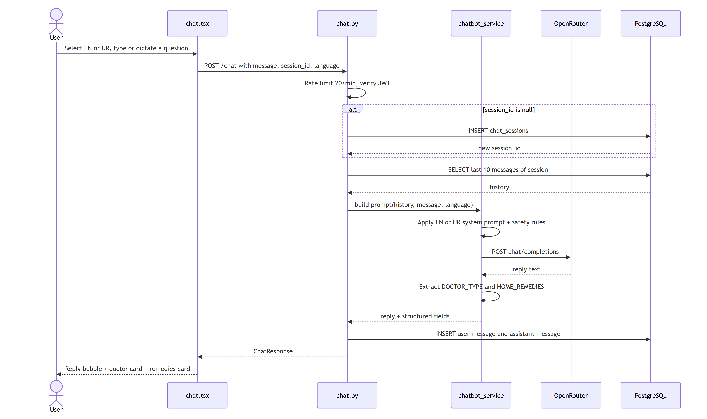

**Figure 4.11** — Sequence diagram: bilingual chat with context window and structured field
extraction.

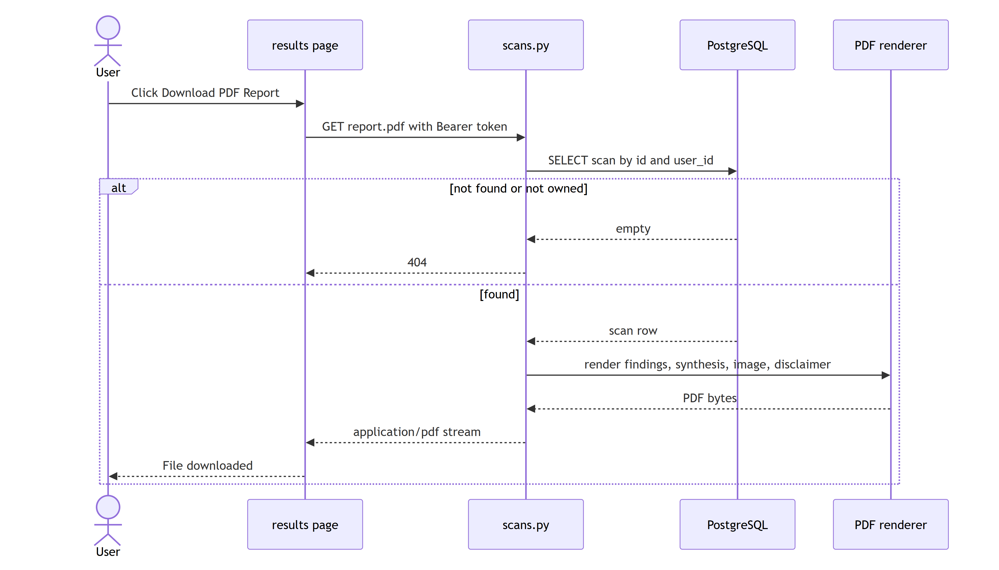

**Figure 4.12** — Sequence diagram: PDF report export with ownership verification.

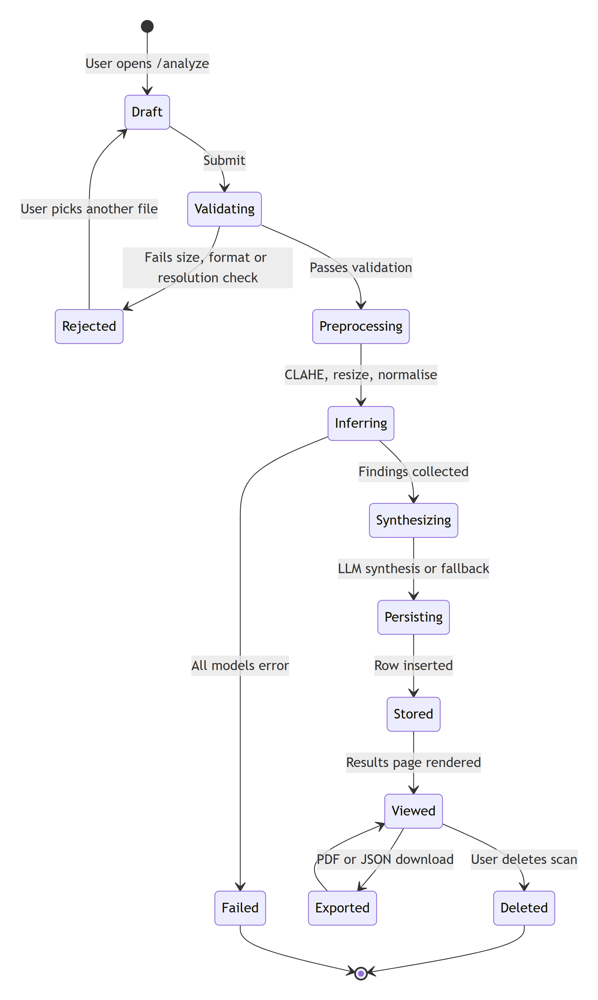

**Figure 4.13** — State diagram: the lifecycle of a scan from draft to deletion.

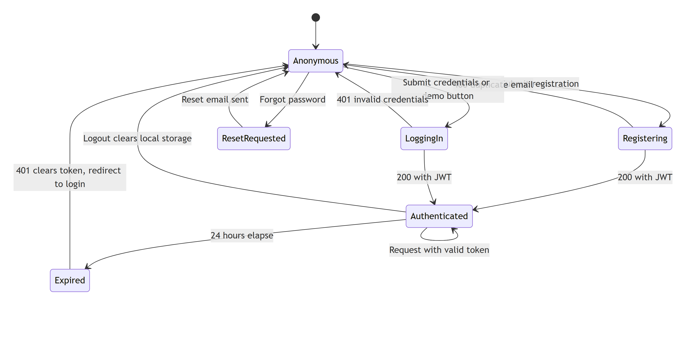

**Figure 4.14** — State diagram: authentication session lifecycle including 24-hour expiry.

## 4.6 Interface Design

The API exposes twenty-one endpoints. All communication is JSON over HTTPS except image upload
(`multipart/form-data`) and PDF export (`application/pdf`). Authenticated requests carry an
`Authorization: Bearer` header.

Seven HTTP status codes carry defined meanings: 200 success; 400 malformed domain input; 401
authentication failure; 404 resource not found or not owned; 422 input failed quality validation; 429
rate limit exceeded; 500 unrecoverable server error. The distinction between 400 and 422 is
deliberate — 400 signals a malformed request, 422 signals a well-formed request whose *image* failed
quality checks, which is a different corrective action for the user.

## 4.7 User Interface Design

Two layout shells are used. `AuthShell` presents a split layout for unauthenticated pages.
`AppShell` provides the authenticated layout: a collapsible sidebar with eight destinations, a header
with page title and account menu, and — pinned at the bottom of the sidebar — a permanent
**EDUCATIONAL USE ONLY** badge.

Placing the disclaimer in the shell rather than on individual pages is a deliberate design decision.
A disclaimer that must be added to each new page will eventually be forgotten on one; a disclaimer
rendered by the shell cannot be.

The results page implements the confidence tiering that Chapter 1 identified as central: **Primary
Findings** at 65 % confidence and above, **Secondary Findings** between 50 % and 65 %, and
**Borderline** findings below 50 % collapsed behind an expander. A banner appears whenever any
finding falls below 60 %.

## 4.8 Design Decisions and Rationale

**Table 4.3 — Key design decisions and rationale**

| # | Decision | Alternative considered | Rationale |
|---|---|---|---|
| D-1 | Routed ensemble | Run all models, merge outputs | A chest model applied to a wound photograph produces noise. Routing cuts CPU cost roughly threefold and keeps reports focused. |
| D-2 | LLM synthesis layer | Display raw model scores | Multi-label probability vectors are not actionable for the target user. |
| D-3 | Fallback synthesis on LLM failure | Return HTTP 503 | The findings are the valuable output; the prose is an enhancement. |
| D-4 | Non-blocking image upload | Abort on storage failure | The report is worth more than the thumbnail. `image_url` is nullable by design. |
| D-5 | Discard negative detector boxes | Report them as "normal" | A negative box covers a region, not the study. Reporting it as normal would be clinically unsafe. |
| D-6 | Background model preloading | Synchronous load at startup | Free-tier health checks time out during a multi-model synchronous load. |
| D-7 | Stateless JWT | Server-side sessions | The backend may scale to zero; in-memory sessions would be lost on cold start. |
| D-8 | Ownership checked in handler *and* RLS | Handler check alone | Defence in depth. |
| D-9 | Single HTTP client module | `fetch` inside components | One place for JWT attachment, URL normalisation and 401 handling. |
| D-10 | Confidence tiering in the UI | Flat sorted list | Uncertainty must be structurally visible, not left to the reader. |
| D-11 | Cap chest findings at six | Report all eighteen classes | Eighteen near-threshold labels bury the signal. |
| D-12 | Hard-coded fallback diet plan | Return malformed LLM output | Condition-specific nutrition advice must never be partially generated. |
| D-13 | Three Overpass mirrors | A single endpoint | Public Overpass instances rate-limit aggressively. |
| D-14 | JSONB for findings | Normalised findings table | Always read whole with the parent scan; a join would add nothing. |
| D-15 | Public storage buckets | Signed URLs | Simplifies rendering while the backend may be cold. **Recorded as a known limitation** — see §6.5. |

<!-- pagebreak -->

# Chapter 5: Implementation

## 5.1 Development Environment and Tools

**Table 5.1 — Development environment and tools**

| Category | Technology | Version | Role |
|---|---|---|---|
| Frontend framework | React | 19 | UI rendering |
| Frontend meta-framework | TanStack Start | — | SSR, file-based routing |
| Routing / data | TanStack Router, TanStack Query | — | Navigation, server state caching |
| Styling | TailwindCSS, Shadcn/ui, Radix | — | Design system and accessible primitives |
| Language (frontend) | TypeScript | 5.x | Type safety |
| Backend framework | FastAPI | 0.115 | REST API, OpenAPI generation |
| Language (backend) | Python | 3.13 | Backend runtime |
| ASGI server | Uvicorn | — | HTTP serving |
| Validation | Pydantic | v2 | Request/response schemas, settings |
| Rate limiting | SlowAPI | 0.1.9 | Per-IP request limiting |
| ML runtime | PyTorch | — | Model inference |
| Chest model library | TorchXRayVision | — | Pretrained DenseNet121 |
| Detection | Ultralytics YOLOv8 | — | Fracture localisation |
| Transformers | Hugging Face Transformers | — | ViT wound classifier |
| Image processing | OpenCV, Pillow, pydicom | — | CLAHE, decoding, DICOM support |
| Database | Supabase PostgreSQL | 15+ | Persistence with RLS |
| Storage | Supabase Storage | — | Image and avatar objects |
| LLM | OpenRouter GLM 4.5 Air (free tier) | — | Clinical synthesis, chatbot, diet |
| Frontend hosting | Vercel | — | Static + SSR deployment |
| Backend hosting | Hugging Face Spaces (Docker) | — | Containerised API on port 7860 |
| Version control | Git / GitHub | — | Source management |
| Editor | Visual Studio Code | — | Development |

## 5.2 Backend Implementation

The backend is organised into four packages under `backend/app/`: `routers` (HTTP boundary),
`services` (business and ML logic), `models` (Pydantic schemas) and `utils` (persistence).

**Application factory.** `main.py` exposes `create_app()`, which configures CORS, installs the rate
limiter, registers seven routers and declares two unauthenticated health endpoints. Configuration is
read through a cached Pydantic `Settings` object, so no environment variable is read at more than one
place in the codebase.

**Startup strategy.** A FastAPI lifespan handler starts model loading in a daemon background thread
and returns immediately, so the server accepts requests while models are still loading.

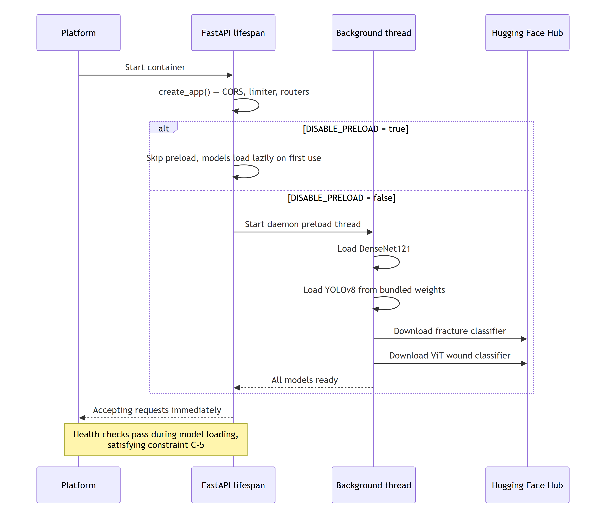

**Figure 5.4** — Backend startup sequence. Health checks pass during model loading.

This was not an optimisation but a necessity: free-tier platforms apply a startup health-check
timeout that a synchronous multi-model load exceeds. When `DISABLE_PRELOAD=true`, preloading is
skipped entirely and models load lazily on first use, allowing the platform to run on hosts with
512 MB of memory — authentication, chat and diet remain available even where image analysis would
exhaust memory.

**Rate limiting.** SlowAPI applies a 200 requests/minute global default, with stricter per-endpoint
limits on the LLM-backed routes.

**Table 5.4 — Rate limiting configuration**

| Scope | Limit | Rationale |
|---|---|---|
| Global default | 200 / minute | General abuse protection |
| `POST /analyze` | 10 / minute | CPU inference is the scarcest resource |
| `POST /chat` | 20 / minute | Conversational pacing, LLM quota protection |
| `POST /diet` | 10 / minute | LLM quota protection |

## 5.3 Frontend Implementation

The frontend uses file-based routing: each file in `src/routes/` maps to one URL. State is separated
into two categories — server state, owned by TanStack Query and accessed through hooks in
`src/hooks/`; and authentication state, held in a React context in `src/lib/auth-context.tsx`.

**The single-client rule.** Every network call passes through `src/lib/api.ts`. No component calls
`fetch` directly. This module attaches the bearer token, normalises the base URL (stripping a
trailing slash to prevent double-slash 404s), and centralises 401 handling: any 401 clears the stored
token and redirects to the sign-in page, so an expired session recovers automatically.

**The analysis wizard.** `analyze.tsx` implements a three-step flow — upload, route selection,
context — with the accepted formats and size limits stated on screen rather than discovered through
an error message.

**The results page.** `results.$scanId.tsx` is the most involved component. It scales bounding boxes
from normalised coordinates to rendered image dimensions at any viewport size, implements the three
confidence tiers, provides layer toggles for findings, heatmap and labels, and supports zoom between
0.5× and 2.5×.

## 5.4 Preprocessing Pipeline

Every uploaded image passes through validation before any model sees it:

```
size < 100 KB           → reject (insufficient pixel data)
size > 20 MB            → reject (exceeds upload limit)
not decodable as image  → reject (unless DICOM)
width or height < 200px → reject (unreliable at this resolution)
```

DICOM files bypass the PIL-based dimension check and are decoded by `pydicom` at preprocessing time.
Validated images then receive CLAHE contrast enhancement [10], are resized to the target model's
input dimensions and are normalised.

Rejecting low-quality input is itself a safety measure. A model will return a confident-looking score
for a 150 × 150 pixel thumbnail; the score will be meaningless. Refusing the input is more honest
than processing it.

## 5.5 AI Model Integration

**Table 5.2 — AI model inventory**

| Model | Source | Task | Input | Output |
|---|---|---|---|---|
| DenseNet121 | TorchXRayVision [5] | 18 chest pathology classes | 224×224 grayscale | Per-class probabilities, capped at top 6 |
| YOLOv8 | Ultralytics [7], custom weights | Fracture localisation | Original-size BGR | Positive bounding boxes only |
| Fracture classifier | Hugging Face [15] | Image-level fracture screening | 224×224 RGB | Fracture / normal probability |
| ViT | Hugging Face [16] | Wound classification | RGB PIL image | Top-1 wound category |
| GLM 4.5 Air | OpenRouter | Clinical synthesis | Structured findings | Urgency, prose, actions, specialist |

**Routing.** The dispatch function selects models by scan type: `chest` invokes DenseNet121;
`fracture` invokes both YOLOv8 and the screening classifier; `wound` invokes the ViT. Each invocation
is wrapped individually in exception handling, and inference runs in a worker thread via
`asyncio.to_thread` so the event loop is never blocked. A model that fails records its error in
`model_results.model_errors` and the pipeline continues.

**The two-stage fracture workflow.** Fracture assessment uses detection *and* classification
together. YOLOv8 localises where it can; the classifier provides an image-level fracture suspicion
independent of localisation. Critically, `Not_Fracture` detector boxes are discarded, as established
in §4.8 (D-5) — a negative box covers a region, not the study.

**Model models are used as supplied.** No fine-tuning was performed. Fine-tuning without a properly
labelled, clinically supervised dataset would risk degrading models that were trained on far more
data than we could assemble, while creating a false impression of domain adaptation.

## 5.6 LLM Synthesis

The synthesis service constructs a prompt from the structured findings, the scan type and the user's
clinical notes, and requests a response containing four fields: an urgency label from the closed set
{critical, high, medium, low, clear}, a synthesis paragraph, a list of recommended actions and a
specialist suggestion.

Three constraints are enforced:

1. **The model receives findings, not the image.** It cannot introduce a finding that no vision model
   produced.
2. **Urgency comes from a closed vocabulary.** Free-text urgency would be unparseable and
   incomparable across scans.
3. **Failure is non-fatal.** If the call fails or the response cannot be parsed, a fallback synthesis
   is substituted with `urgency: "medium"` and the recommendation to consult a radiologist.

The same client serves the chatbot and diet planner. The chatbot applies a language-specific system
prompt, includes the previous ten messages as context, and extracts `DOCTOR_TYPE` and `HOME_REMEDIES`
fields for display as structured cards. The diet service applies condition-specific guardrails — DASH
principles for hypertension, low-glycaemic-index guidance for diabetes, and a renal-dietitian
referral note for kidney disease — and validates that the returned plan contains exactly seven
complete days, substituting a pre-validated fallback plan if it does not.

## 5.7 Clinic Locator

The locator queries the OpenStreetMap Overpass API [14] for facilities tagged `hospital`, `clinic`,
`doctors`, `pharmacy` or `health_centre` within a radius, then ranks results by great-circle distance
computed with the Haversine formula:

```
d = 2R * arcsin( sqrt( sin^2(dphi/2) + cos(phi1) * cos(phi2) * sin^2(dlambda/2) ) )

where R = 6371 km, phi = latitude in radians, lambda = longitude in radians
```

where $R = 6371$ km. Three Overpass mirrors are attempted in sequence, because the public instances
rate-limit aggressively and a single endpoint made the feature unreliable in testing.

## 5.8 Security Implementation

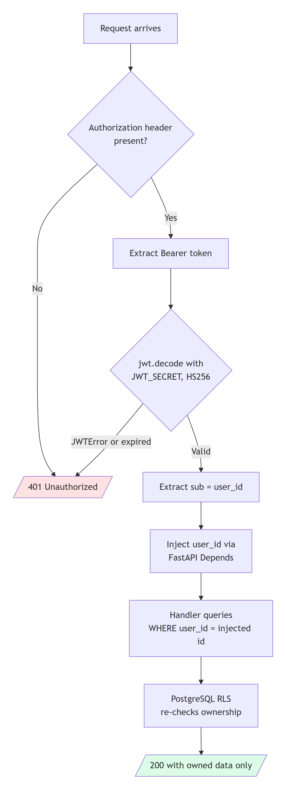

**Figure 5.1** — Authentication and authorisation flow with double ownership verification.

Security is implemented in eight layers: HTTPS transport; a CORS allowlist restricted to configured
origins in production; per-IP rate limiting; stateless HS256 JWTs with 24-hour expiry and a minimum
32-character secret; Pydantic validation of every request body; Row Level Security on all four
tables; environment-variable secret management; and storage paths keyed by opaque UUIDs so no
patient-identifying filename is ever required.

Password hashing is delegated entirely to Supabase Auth. Implementing password storage ourselves
would have added risk without adding capability.

## 5.9 Error Handling and Degradation

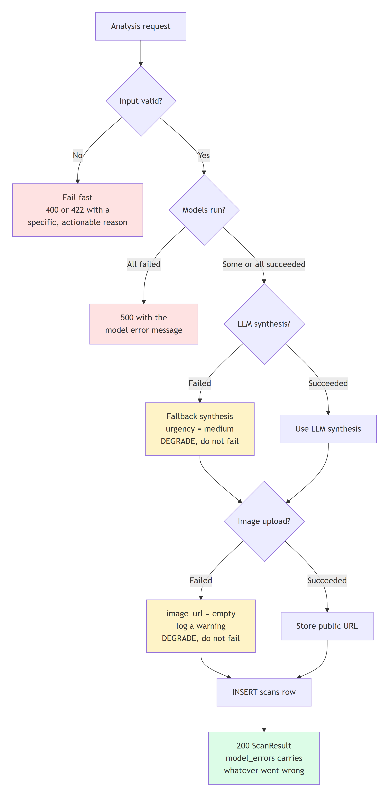

**Figure 5.2** — Error handling and degradation decision tree. Red paths fail fast; amber paths
degrade and continue; green is the returned result.

The governing principle is that **a partial result is more useful than an error page**. Failures are
classified into three categories:

- **Fail fast** — invalid input. Return 400 or 422 immediately with a specific, actionable message.
- **Degrade** — a non-essential dependency failed. Continue and record what was lost.
- **Hard failure** — every model failed. Return 500 with the underlying error.

## 5.10 Deployment

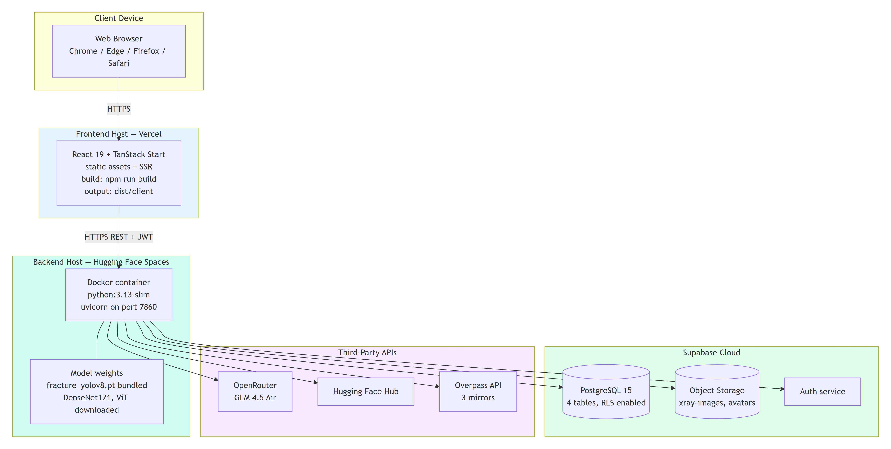

**Figure 5.3** — Deployment diagram across four hosting environments.

The frontend builds to static assets plus an SSR bundle and deploys to Vercel. The backend builds to
a Docker image listening on port 7860 — the Hugging Face Spaces convention — with all configuration
supplied as environment secrets. The repository additionally contains a Render configuration and a
Cloudflare Workers configuration, retained as portability evidence.

## 5.11 Implementation Challenges

**Table 5.5 — Implementation challenges and solutions**

| # | Challenge | Solution |
|---|---|---|
| C1 | Free-tier health checks timed out while loading four models | Background daemon thread loading; server accepts requests immediately (D-6) |
| C2 | Memory exhaustion on 512 MB hosts | `DISABLE_PRELOAD` flag for lazy per-model loading |
| C3 | CPU inference latency when running all models | Routed ensemble — one or two models per request instead of four (D-1) |
| C4 | Event loop blocked during synchronous inference | `asyncio.to_thread` for all model calls |
| C5 | LLM free tier intermittently unavailable | Fallback synthesis path; analysis never fails on LLM error (D-3) |
| C6 | Malformed LLM JSON for diet plans | Strict seven-day validation with a pre-validated fallback (D-12) |
| C7 | Public Overpass endpoints rate-limiting | Three-mirror sequential fallback (D-13) |
| C8 | Bounding boxes misaligned across viewport sizes | Normalised coordinates scaled at render time against actual image dimensions |
| C9 | Double-slash 404s from a trailing slash in the API base URL | Centralised URL normalisation in the single HTTP client |
| C10 | Avatar updates not visible after upload due to caching | Cache-busting timestamp query parameter on the returned URL |
| C11 | Detector emitting non-anatomical class labels | **Not resolved.** Documented as defect DEF-03 in §6.5 |

<!-- pagebreak -->

# Chapter 6: Testing and Evaluation

## 6.1 Testing Strategy

Testing was specified under IEEE 829 [19] across five levels: unit (individual service functions),
integration (router → service → repository chains, exercised through the generated Swagger UI),
system (end-to-end browser journeys), security (crafted requests probing authentication and
isolation), and acceptance (supervisor demonstration).

Ninety-three test cases were specified, each with a requirement reference, preconditions, test data,
numbered steps and an expected result. Coverage was verified against the requirements traceability
matrix: **every functional requirement has at least one corresponding test case**.

**Table 6.1 — Test case distribution by module**

| Module | Cases | Executed | Pending | Failed |
|---|---|---|---|---|
| Authentication | 11 | 1 | 10 | 0 |
| Image analysis | 16 | 2 | 14 | 0 |
| Scans and records | 12 | 4 | 8 | 0 |
| Dashboard | 5 | 4 | 1 | 0 |
| Chatbot | 8 | 0 | 8 | 0 |
| Diet planner | 6 | 0 | 6 | 0 |
| Clinic locator | 6 | 2 | 4 | 0 |
| Settings and profile | 4 | 0 | 4 | 0 |
| System | 5 | 0 | 5 | 0 |
| Security | 9 | 0 | 8 | 1 |
| Performance | 5 | 0 | 5 | 0 |
| Usability | 6 | 4 | 2 | 0 |
| **Total** | **93** | **17** | **75** | **1** |

## 6.2 Statement on Execution Status

We report execution status without inflation. Of ninety-three specified cases, **seventeen were
executed** against the live deployment using an automated browser session signed in to the
demonstration account, with screenshot evidence retained for each. **Seventy-five remain pending** —
principally those requiring real medical image fixtures, deliberate negative-path inputs,
instrumented timing measurements, or multiple accounts for isolation testing. **One case failed**,
and is reported in §6.5.

A test case that has not been run is not a passing test case. Presenting the specification as though
it were an execution report would be a misrepresentation, and we have not done so.

## 6.3 Executed Test Results

**Table 6.2 — Executed test results**

| Test ID | Requirement | Verified behaviour | Result |
|---|---|---|---|
| TC-AUTH-05 | FR-005, FR-006 | Valid credentials authenticate and land on the dashboard with populated data | Pass |
| TC-ANLZ-02 | FR-020, FR-022 | Fracture scan renders bounding boxes; no `Not_Fracture` finding appears in the response or UI | Pass |
| TC-ANLZ-12 | FR-023 | A scan with no findings above threshold stores urgency `clear` and renders an empty-findings state | Pass |
| TC-SCAN-01 | FR-029 | History lists the user's scans in reverse-chronological order | Pass |
| TC-SCAN-03 | FR-027, FR-028 | Opening a scan renders image, overlays, findings and synthesis for that scan | Pass |
| TC-SCAN-04 | FR-028a | Findings grouped as Primary (≥65 %), Secondary (50–65 %) and collapsed Borderline (<50 %) | Pass |
| TC-SCAN-05 | FR-028b | A sub-60 % finding triggers the radiologist-review banner | Pass |
| TC-DASH-01 | FR-034 | Four headline statistics render with correct values | Pass |
| TC-DASH-02 | FR-035 | Finding distribution renders as a ranked frequency list | Pass |
| TC-DASH-03 | FR-036 | Recent analyses list links through to full reports | Pass |
| TC-DASH-04 | FR-036a | Per-model average confidence renders for all three vision models | Pass |
| TC-CLIN-02 | FR-049 | Radius slider spans 1–20 km with a 5 km default | Pass |
| TC-CLIN-04 | UI-5 | Pre-search empty state renders with OpenStreetMap attribution | Pass |
| TC-UI-01 | UI-1 | All six landing page sections render without blank regions | Pass |
| TC-UI-03 | NFR-S1, LR-1 | Educational-use badge present in the shell on every authenticated page; full disclaimer on reports | Pass |
| TC-UI-04 | NFR-Q3 | Analysis wizard states accepted formats and size limits on screen | Pass |
| TC-UI-05 | UI-4, NFR-Q11 | Every urgency badge carries a text label alongside its colour | Pass |
| TC-SEC-09 | NFR-SEC8 | Repository scanned for tracked secrets | **Fail** — see DEF-01 |

The safety-critical behaviours verified here are worth emphasising: TC-ANLZ-02 confirms the
negative-detection rule (D-5) holds in the deployed system; TC-SCAN-04 and TC-SCAN-05 confirm that
confidence tiering and the low-confidence review flag operate as designed; and TC-UI-03 confirms the
disclaimer is genuinely unconditional.

## 6.4 Observed System Metrics

Measurements taken from the deployed instance's dashboard across 31 stored analyses:

**Table 7.1 — Observed system metrics on the deployed instance**

| Metric | Observed value |
|---|---|
| Total stored analyses | 31 |
| Analyses rated high or critical urgency | 15 |
| Mean finding confidence across all scans | 63.2 % |
| Mean end-to-end report time | 8.4 s |
| Mean DenseNet121 confidence | 84.7 % |
| Mean YOLOv8 confidence | 89.1 % |
| Mean ViT confidence | 82.3 % |

The 8.4-second mean report time satisfies target NFR-P1 (≤ 15 s) on a warm backend. Most frequent
findings across the stored set were Lung Opacity (10 occurrences), Lung Lesion (8), and Nodule, Mass
and Enlarged Cardiomediastinum (3 each).

These are operational metrics from the system's own analytics, not a controlled experiment. They
describe the system's behaviour on the images it has processed; they are **not** measurements of
diagnostic accuracy, which was outside this project's scope (§1.6).

## 6.5 Defects

**Table 6.3 — Open defects**

| ID | Severity | Description | Status |
|---|---|---|---|
| DEF-01 | Medium | The root `.env` file is tracked in version control. It contains the API base URL, the Supabase project URL and the Supabase **publishable** anon key. No service-role key, LLM key or JWT secret is exposed, so this is a hygiene defect rather than a credential compromise — but the file is listed in `.gitignore` and should not be tracked. **Remediation:** `git rm --cached .env`. | Open |
| DEF-02 | Low | `backend/README.md` instructs the operator to create the `xray-images` storage bucket as *private*, while the implementation creates it with `public: True` and serves images through public URLs. The root README is correct; the backend README contradicts it. **Remediation:** correct the backend README. | Open |
| DEF-03 | Medium | The fracture detector was observed emitting a non-anatomical class label (`Vase`) as a low-confidence secondary finding on a wrist radiograph, alongside a correct high-confidence fracture finding from the screening classifier. This indicates that generic detector classes are reaching the findings list rather than being filtered to the fracture vocabulary. The `ALLOW_GENERIC_YOLO_WEIGHTS` configuration guard exists for precisely this condition but did not prevent it in the deployed instance. **Impact:** confusing, non-clinical labels appear in the Secondary and Borderline tiers. The confidence tiering limits the harm — the spurious labels appeared at 52.7 % and below, and the correct finding dominated the Primary tier — but the behaviour is incorrect. **Remediation:** constrain reported detector classes to an explicit fracture label vocabulary and verify the deployed weights. | Open |

DEF-03 is the most substantive finding of the evaluation, and we report it deliberately. It
illustrates a general hazard in multi-model systems: a model integrated correctly at the API level
can still be wrong at the *semantic* level, and no amount of exception handling detects a
confidently-returned nonsense label. It also demonstrates the value of the confidence tiering design
— the spurious output was automatically relegated below the correct finding rather than presented as
equally authoritative.

<!-- pagebreak -->

# Chapter 7: Results and Discussion

## 7.1 Delivered System

The system is publicly deployed and operational. The following figures show the delivered interface.


**Figure 7.1** — Public landing page.


**Figure 7.2** — Dashboard showing per-user analytics, recent analyses, finding distribution and
per-model confidence.


**Figure 7.3** — Three-step analysis wizard with format and size constraints stated on screen.


**Figure 7.4** — Diagnostic report: bounding-box overlays, tiered findings, low-confidence review
banner, LLM synthesis, recommended actions, specialist referral and full confidence table.


**Figure 7.5** — Bilingual health chatbot with English/Urdu toggle.


**Figure 7.6** — GPS clinic locator with radius control and OpenStreetMap attribution.

Figure 7.4 is worth reading closely, because it demonstrates several design decisions operating
together. The scan carries a **HIGH** urgency badge with a text label, not colour alone (D-10,
NFR-Q11). A blue banner warns that findings below 60 % confidence are present. The Primary tier
contains a single high-confidence fracture finding at 96.7 % with an ICD-10 code; the Secondary tier
contains a 52.7 % finding; three further findings below 50 % are collapsed. The LLM synthesis
explicitly identifies the low-confidence findings as probable false positives and closes by stating
that the analysis is educational and should not replace evaluation by a qualified radiologist. A full
confidence table lists every finding with its originating model.

It also shows DEF-03: the spurious `Vase` labels are visible in the Secondary and Borderline tiers.
We have not cropped them out of this thesis.

## 7.2 Achievement Against Objectives

**Table 7.2 — Objectives achieved against Chapter 1 criteria**

| # | Objective | Criterion | Outcome |
|---|---|---|---|
| O1 | Routed ensemble | Correct dispatch; wrong model never run | **Achieved.** Three routes dispatch correctly; verified in TC-ANLZ-02 |
| O2 | LLM synthesis | Urgency, prose, actions, specialist on every analysis | **Achieved.** Present on all stored scans; fallback path preserves the analysis on failure |
| O3 | Visible uncertainty | Tiering plus sub-60 % review flag | **Achieved.** Verified in TC-SCAN-04 and TC-SCAN-05 |
| O4 | Supporting features | History, exports, analytics, chatbot, diet, clinics | **Achieved.** All implemented and deployed; export payloads pending verification |
| O5 | Data isolation | No cross-user access through any endpoint | **Partially verified.** Implemented at two layers; cross-account test (TC-SEC-04) pending execution |
| O6 | Zero-cost deployment | Free tiers, CPU-only | **Achieved.** No expenditure incurred |
| O7 | Professional documentation | SRS, SDD, tests, manual; defects reported | **Achieved.** All four documents delivered; three defects reported openly |

Six of seven objectives were fully achieved. O5 is marked *partially verified* rather than achieved:
the two-layer isolation mechanism is implemented and the code path is straightforward, but the
adversarial cross-account test has not been executed, and we do not claim verification we have not
performed.

## 7.3 Discussion

**On routing versus ensembling.** The decision to route rather than ensemble (D-1) was made for
performance under a CPU-only constraint, but its more valuable consequence turned out to be
diagnostic focus. Running a chest pathology model on a wound photograph produces output that is not
merely useless but actively misleading — plausible-looking labels with real confidence scores.
Routing eliminates a whole class of confusing output.

**On the LLM as a translation layer.** The synthesis layer is the component that turns model output
into something a student can act on. Constraining it to reason only over findings it is given — never
over the image — keeps it a translator rather than a second, unvalidated diagnostician. The fallback
path (D-3) proved its worth in practice: free-tier LLM availability is intermittent, and without the
fallback a substantial fraction of analyses would have failed outright.

**On making uncertainty structural.** The confidence tiering was designed to communicate uncertainty
to users. It turned out to also contain model errors. When DEF-03 caused spurious labels to enter the
findings list, tiering automatically relegated them below the correct finding. A flat sorted list
would have presented them with equal visual weight. Design decisions made for user comprehension had
a defensive benefit we did not anticipate.

**On the cost of free infrastructure.** Zero cost is not free of consequence. Cold starts add 30–60
seconds to the first request after inactivity. Memory limits forced the `DISABLE_PRELOAD` path. LLM
quota required rate limiting. Every one of these constraints shaped the architecture, and the
resulting design is arguably more robust for having been forced to assume that dependencies fail.

**On what we did not do.** We did not fine-tune the models, and we did not evaluate their diagnostic
accuracy. Both were deliberate. Fine-tuning without a properly labelled, clinically supervised dataset
would risk degrading models trained on vastly more data than we could assemble, while creating a
false impression of domain adaptation. Claiming accuracy figures without a validation set and
clinical supervision would be worse — it would be the exact overclaiming that makes medical AI tools
hazardous.

## 7.4 Comparison with Related Work

Relative to the systems surveyed in §2.7, this work is distinguished by breadth of integration rather
than depth of any single component. CheXNet-class research systems exceed our chest component in
rigour of evaluation, but are not deployable applications. TorchXRayVision provides the model we use
but no application layer. Commercial systems offer clinical validation we cannot match, at a cost
that excludes the users we target. General-purpose LLM chat interfaces accept images but bring no
specialist clinical model and present no calibrated confidence.

Our contribution is the working combination: three imaging modalities, correct routing, LLM
synthesis, structurally visible uncertainty, and public deployment at zero cost.

## 7.5 Ethical and Safety Considerations

**Framing.** The system is presented as an educational tool throughout — in the application shell, on
every report, in the repository README and in this thesis. This framing is not a disclaimer bolted on
at the end; it determined design decisions D-5, D-10 and D-11.

**The false-negative hazard.** The most dangerous outcome is a user concluding from a `clear` result
that a study is normal. Three mitigations address this: negative detector boxes are discarded rather
than reported as normality (D-5); confidence is always displayed; and low-confidence results trigger
an explicit review recommendation. None of these eliminates the hazard. It is inherent to the
category of tool, and honesty about it is the only responsible position.

**Privacy.** No patient-identifying information is requested or stored. Storage paths are keyed by
opaque UUIDs. Users may delete any scan permanently, and account deletion cascades to all associated
data. We note against this that the storage buckets are public (D-15) — an unguessable URL is not the
same as an access-controlled one, and §8.3 lists this as a limitation to be remediated.

**Automation bias.** A fluent, confident paragraph is persuasive independently of correctness. The
system counters this by always displaying the numerical confidences the prose was derived from, by
tiering findings, and by instructing the language model to state its own limitations — which, as
Figure 7.4 shows, it does.

**Language access.** Urdu support with right-to-left rendering and voice input was included because
health information tools in Pakistan are overwhelmingly English-only. The same safety constraints
apply to both languages.

<!-- pagebreak -->

# Chapter 8: Conclusion and Future Work

## 8.1 Conclusion

This thesis presented XRayVision AI, a deployed web platform that integrates three clinically
pretrained vision models and a large language model into an educational medical imaging tool
operating entirely on free-tier infrastructure with CPU-only inference.

The work set out to close an accessibility gap. Capable medical imaging models are freely available,
but they are research artefacts rather than usable systems, they present output in a form learners
cannot act on, they rarely communicate uncertainty adequately, and the infrastructure normally assumed
around them is beyond the reach of a teaching institution. The delivered system addresses each of
these: it provides the full application layer, translates model output into clinical prose through a
constrained LLM, makes uncertainty structurally visible through three confidence tiers and an
explicit review flag, and does so at zero cost.

Two design principles proved more valuable than anticipated. **Safety by construction** — encoding
safety into structure rather than into warnings — meant that when a model produced incorrect output
(DEF-03), the confidence tiering automatically contained it. **Graceful degradation** — treating
dependency failure as a reason to downgrade rather than to abort — meant the system remained useful
on infrastructure that fails routinely.

The system was specified, designed and verified to professional standards, and its limitations are
documented rather than concealed. Seventeen of ninety-three test cases were executed and three
defects remain open, including one substantive semantic defect in the fracture detector's label
handling. We report these because a thesis that presents only what worked teaches less than one that
also reports what did not.

## 8.2 Contributions

1. **An integrated, publicly deployed multi-modal medical imaging platform** combining chest
   pathology screening, fracture localisation and wound classification with LLM report synthesis.
2. **A routed ensemble architecture** that dispatches by declared scan type rather than executing all
   models, making multi-model inference viable on CPU-only free-tier infrastructure.
3. **A confidence tiering presentation** that makes model uncertainty structurally visible and, as
   demonstrated in §7.3, provides incidental containment of model error.
4. **An explicit negative-evidence safety rule** — that a detector's absence of detection is never
   reported as normality — implemented and verified.
5. **A degradation architecture** in which the failure of the language model, of object storage or of
   any individual vision model downgrades rather than destroys the result.
6. **A complete professional documentation set** (IEEE 830, 1016 and 829) with honest reporting of
   verification status and open defects.
7. **Bilingual English/Urdu health information access** with right-to-left rendering and voice input.

## 8.3 Limitations

1. Diagnostic accuracy was not independently validated; no clinical performance claim is made.
2. DEF-03 — non-anatomical detector labels reach the findings list — is unresolved.
3. Seventy-five of ninety-three test cases remain unexecuted.
4. Storage buckets are public; URL obscurity is not access control.
5. Rate limiting is per-IP and in-memory, so it resets on restart and is shared by users behind NAT.
6. No refresh-token rotation; users must re-authenticate every 24 hours.
7. No audit log; deletions are not traceable.
8. Uploaded files are not scanned for malicious content before decoding.
9. Cold starts add 30–60 seconds to the first request after inactivity.
10. Cross-browser verification was performed on Chromium only.

## 8.4 Future Work

**Table 8.1 — Future work priorities**

| Priority | Item | Rationale |
|---|---|---|
| **Immediate** | Resolve DEF-03 by constraining detector output to an explicit fracture label vocabulary | Incorrect labels currently reach users |
| **Immediate** | Execute the remaining 75 test cases | Verification is incomplete |
| **Immediate** | Close DEF-01 and DEF-02 | Repository hygiene and documentation correctness |
| **High** | Migrate storage to private buckets with short-lived signed URLs | Removes reliance on URL obscurity |
| **High** | Add an automated test suite (pytest, Vitest) integrated into CI | Currently no automated regression protection exists |
| **High** | Clinical validation against a labelled evaluation set under supervision | Required before any accuracy claim |
| **Medium** | Redis-backed rate limiting keyed by user identity | Survives restarts; fairer behind NAT |
| **Medium** | Refresh-token rotation | Removes the 24-hour re-authentication burden |
| **Medium** | Append-only audit log | Traceability for deletions |
| **Medium** | Explainability overlays (Grad-CAM) for the chest model | Localisation for chest findings, matching the fracture route |
| **Medium** | Malware scanning of uploads before decoding | Defence against crafted files |
| **Lower** | GPU inference tier for reduced latency | Requires funding |
| **Lower** | Additional imaging modalities (CT, MRI) | Substantial scope extension |
| **Lower** | PACS / DICOM-network integration | Required for any real clinical deployment |
| **Lower** | Additional regional languages | Broadens access further |

## 8.5 Closing Remarks

The most useful lesson from this project was not technical. It was that in a domain where being wrong
has consequences, the discipline of designing for uncertainty and for failure produces a better
system than designing for the success case and adding warnings afterwards. The confidence tiering
that contained a model defect, and the fallback path that kept the system useful through intermittent
LLM availability, were both consequences of assuming things would go wrong.

We hope the system is useful to students learning to read radiographs, and that the documentation —
including its account of what did not work — is useful to anyone attempting similar work.

<!-- pagebreak -->

# References

[1] P. Rajpurkar, J. Irvin, K. Zhu, B. Yang, H. Mehta, T. Duan, D. Ding, A. Bagul, C. Langlotz, K. Shpanskaya, M. P. Lungren, and A. Y. Ng, "CheXNet: Radiologist-level pneumonia detection on chest X-rays with deep learning," *arXiv preprint arXiv:1711.05225*, 2017.

[2] G. Huang, Z. Liu, L. van der Maaten, and K. Q. Weinberger, "Densely connected convolutional networks," in *Proc. IEEE Conf. Computer Vision and Pattern Recognition (CVPR)*, 2017, pp. 4700–4708.

[3] X. Wang, Y. Peng, L. Lu, Z. Lu, M. Bagheri, and R. M. Summers, "ChestX-ray8: Hospital-scale chest X-ray database and benchmarks on weakly-supervised classification and localization of common thorax diseases," in *Proc. IEEE Conf. Computer Vision and Pattern Recognition (CVPR)*, 2017, pp. 2097–2106.

[4] J. Irvin, P. Rajpurkar, M. Ko, Y. Yu, S. Ciurea-Ilcus, C. Chute, H. Marklund, B. Haghgoo, R. Ball, K. Shpanskaya, et al., "CheXpert: A large chest radiograph dataset with uncertainty labels and expert comparison," in *Proc. AAAI Conf. Artificial Intelligence*, vol. 33, 2019, pp. 590–597.

[5] J. P. Cohen, J. D. Viviano, P. Bertin, P. Morrison, P. Torabian, M. Guarrera, M. P. Lungren, A. Chaudhari, R. Brooks, M. Hashir, and H. Bertrand, "TorchXRayVision: A library of chest X-ray datasets and models," in *Proc. Medical Imaging with Deep Learning (MIDL)*, 2022. [Online]. Available: https://github.com/mlmed/torchxrayvision

[6] J. Redmon, S. Divvala, R. Girshick, and A. Farhadi, "You only look once: Unified, real-time object detection," in *Proc. IEEE Conf. Computer Vision and Pattern Recognition (CVPR)*, 2016, pp. 779–788.

[7] G. Jocher, A. Chaurasia, and J. Qiu, "Ultralytics YOLOv8," 2023. [Online]. Available: https://docs.ultralytics.com

[8] A. Vaswani, N. Shazeer, N. Parmar, J. Uszkoreit, L. Jones, A. N. Gomez, Ł. Kaiser, and I. Polosukhin, "Attention is all you need," in *Advances in Neural Information Processing Systems (NeurIPS)*, 2017, pp. 5998–6008.

[9] A. Dosovitskiy, L. Beyer, A. Kolesnikov, D. Weissenborn, X. Zhai, T. Unterthiner, M. Dehghani, M. Minderer, G. Heigold, S. Gelly, J. Uszkoreit, and N. Houlsby, "An image is worth 16x16 words: Transformers for image recognition at scale," in *Proc. Int. Conf. Learning Representations (ICLR)*, 2021.

[10] K. Zuiderveld, "Contrast limited adaptive histogram equalization," in *Graphics Gems IV*, P. S. Heckbert, Ed. San Diego, CA: Academic Press, 1994, pp. 474–485.

[11] G. Litjens, T. Kooi, B. E. Bejnordi, A. A. A. Setio, F. Ciompi, M. Ghafoorian, J. A. W. M. van der Laak, B. van Ginneken, and C. I. Sánchez, "A survey on deep learning in medical image analysis," *Medical Image Analysis*, vol. 42, pp. 60–88, 2017.

[12] A. Esteva, B. Kuprel, R. A. Novoa, J. Ko, S. M. Swetter, H. M. Blau, and S. Thrun, "Dermatologist-level classification of skin cancer with deep neural networks," *Nature*, vol. 542, no. 7639, pp. 115–118, 2017.

[13] P. Rajpurkar, J. Irvin, R. L. Ball, K. Zhu, B. Yang, H. Mehta, T. Duan, D. Ding, A. Bagul, C. P. Langlotz, et al., "Deep learning for chest radiograph diagnosis: A retrospective comparison of the CheXNeXt algorithm to practicing radiologists," *PLoS Medicine*, vol. 15, no. 11, e1002686, 2018.

[14] OpenStreetMap Foundation, "Overpass API." [Online]. Available: https://wiki.openstreetmap.org/wiki/Overpass_API

[15] prithivMLmods, "Bone-Fracture-Detection," Hugging Face Model Hub. [Online]. Available: https://huggingface.co/prithivMLmods/Bone-Fracture-Detection

[16] PayamFard123, "dermaintel-wound-classifier," Hugging Face Model Hub. [Online]. Available: https://huggingface.co/PayamFard123/dermaintel-wound-classifier

[17] *IEEE Recommended Practice for Software Requirements Specifications*, IEEE Std 830-1998, IEEE, 1998.

[18] *IEEE Standard for Information Technology — Systems Design — Software Design Descriptions*, IEEE Std 1016-2009, IEEE, 2009.

[19] *IEEE Standard for Software and System Test Documentation*, IEEE Std 829-2008, IEEE, 2008.

[20] World Health Organization, *International Statistical Classification of Diseases and Related Health Problems, 10th Revision (ICD-10)*. Geneva, Switzerland: WHO, 2016.

[21] S. Ramírez, "FastAPI documentation." [Online]. Available: https://fastapi.tiangolo.com

[22] TanStack, "TanStack Start, Router and Query documentation." [Online]. Available: https://tanstack.com

[23] Supabase Inc., "Supabase documentation." [Online]. Available: https://supabase.com/docs

[24] OpenRouter, "OpenRouter API documentation." [Online]. Available: https://openrouter.ai/docs

[25] Hugging Face, "Transformers documentation." [Online]. Available: https://huggingface.co/docs/transformers

<!-- pagebreak -->

# Appendix A: System Screenshots

Additional interface screenshots captured from the live deployment.


**Figure A.1** — Account registration.


**Figure A.2** — Sign-in, including the one-click demonstration account.


**Figure A.3** — Scan history.


**Figure A.4** — Diet plan generator.


**Figure A.5** — User profile.


**Figure A.6** — Settings: appearance, analysis preferences and notifications.


**Figure A.7** — Responsive layout at 390 × 844 pixels.

<!-- pagebreak -->

# Appendix B: API Reference

**Table 5.3 — REST API endpoint summary**

| # | Method | Endpoint | Auth | Rate limit | Purpose |
|---|---|---|---|---|---|
| 1 | POST | `/auth/register` | — | 200/min | Create an account |
| 2 | POST | `/auth/login` | — | 200/min | Authenticate, return JWT |
| 3 | POST | `/auth/forgot-password` | — | 200/min | Trigger a reset email |
| 4 | GET | `/auth/me` | JWT | 200/min | Current user profile |
| 5 | POST | `/auth/avatar` | JWT | 200/min | Upload a profile picture |
| 6 | PATCH | `/auth/profile` | JWT | 200/min | Update name and role |
| 7 | PATCH | `/auth/settings` | JWT | 200/min | Update preferences |
| 8 | POST | `/analyze` | JWT | **10/min** | Upload and analyse an image |
| 9 | GET | `/scans` | JWT | 200/min | List scan history |
| 10 | GET | `/scans/{id}` | JWT | 200/min | Retrieve one scan |
| 11 | DELETE | `/scans/{id}` | JWT | 200/min | Delete a scan and its image |
| 12 | GET | `/scans/{id}/report.pdf` | JWT | 200/min | Download a PDF report |
| 13 | GET | `/scans/{id}/export.json` | JWT | 200/min | Export raw findings |
| 14 | POST | `/chat` | JWT | **20/min** | Send a chatbot message |
| 15 | GET | `/chat/sessions` | JWT | 200/min | List chat sessions |
| 16 | GET | `/chat/sessions/{id}/messages` | JWT | 200/min | Retrieve a conversation |
| 17 | POST | `/diet` | JWT | **10/min** | Generate a diet plan |
| 18 | GET | `/stats` | JWT | 200/min | Dashboard statistics |
| 19 | GET | `/clinics` | JWT | 200/min | Find nearby facilities |
| 20 | GET | `/` | — | 200/min | Service metadata |
| 21 | GET | `/health` | — | 200/min | Health check |

Interactive documentation is generated automatically and available at `/docs` (Swagger UI) and
`/redoc` (ReDoc) on the running backend.

<!-- pagebreak -->

# Appendix C: Database Schema

The complete schema is provided in `backend/supabase_schema.sql`. Its structure is summarised below.

**Tables.** `profiles` (extends `auth.users` one-to-one), `scans`, `chat_sessions`, `chat_messages`.

**Constraints.** `scans.scan_type` is constrained to `chest | fracture | wound`; `scans.urgency` to
`critical | high | medium | low | clear`; `chat_messages.role` to `user | assistant`. Every foreign
key referencing `profiles` specifies `ON DELETE CASCADE`.

**Indexes.** `idx_scans_user_id`, `idx_scans_created_at` (descending), `idx_chat_sessions_user_id`,
`idx_chat_messages_session_id`.

**Row Level Security.** Enabled on all four tables. `SELECT` policies restrict access to rows owned by
`auth.uid()`; `INSERT` is performed by the backend service role after independent JWT verification.

**Trigger.** `handle_new_user()` fires `AFTER INSERT ON auth.users` and creates the corresponding
`profiles` row, defaulting `role` to `Medical Student`.

**Storage buckets.** `xray-images` (path `{user_id}/{scan_id}.{ext}`) and `avatars` (path
`{user_id}.{ext}`), both created idempotently at first use.

<!-- pagebreak -->

# Appendix D: Configuration Reference

| Variable | Default | Purpose |
|---|---|---|
| `SUPABASE_URL` | — | Supabase project URL |
| `SUPABASE_KEY` | — | Service-role key (server-side only) |
| `SUPABASE_ANON_KEY` | — | Public anon key |
| `OPENROUTER_API_KEY` | — | LLM API key |
| `OPENROUTER_MODEL` | `z-ai/glm-4.5-air:free` | LLM model identifier |
| `OPENROUTER_TIMEOUT_SECONDS` | `60` | LLM request timeout |
| `HF_TOKEN` | — | Hugging Face read token |
| `JWT_SECRET` | — | HS256 signing secret, minimum 32 characters |
| `JWT_ALGORITHM` | `HS256` | Token signing algorithm |
| `JWT_EXPIRY_HOURS` | `24` | Token lifetime |
| `YOLO_WEIGHTS_PATH` | `models/fracture_yolov8.pt` | Fracture detector weights |
| `ALLOW_GENERIC_YOLO_WEIGHTS` | `false` | Guard against non-medical checkpoints — see DEF-03 |
| `FRACTURE_CLASSIFIER_ENABLED` | `true` | Enable image-level fracture screening |
| `FRACTURE_CLASSIFIER_MODEL_NAME` | `prithivMLmods/Bone-Fracture-Detection` | HF fracture classifier |
| `WOUND_MODEL_NAME` | `PayamFard123/dermaintel-wound-classifier` | HF ViT wound classifier |
| `CONFIDENCE_THRESHOLD` | `0.40` | Minimum confidence for a reported finding |
| `FRONTEND_URL` | `http://localhost:5173` | Primary CORS origin |
| `ALLOWED_ORIGINS` | — | Additional comma-separated production origins |
| `DISABLE_PRELOAD` | `false` | Skip preloading on memory-constrained hosts |

<!-- pagebreak -->

<!-- center -->
&nbsp;

**XRayVision AI**

*A Web-Based AI-Assisted Platform for Automated X-Ray Fracture Detection,
Chest Pathology Screening and Clinical Report Generation*

&nbsp;

School of Software Engineering

Minhaj University Lahore

August 2026

&nbsp;

---

**Educational use only.**

This system is not a certified medical device.

All outputs are AI-generated estimates intended to support, not replace,
the clinical judgement of a qualified radiologist.
<!-- endcenter -->
