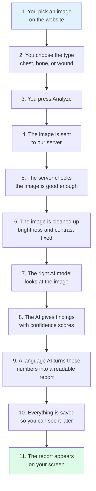
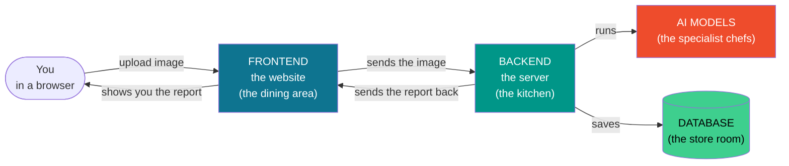
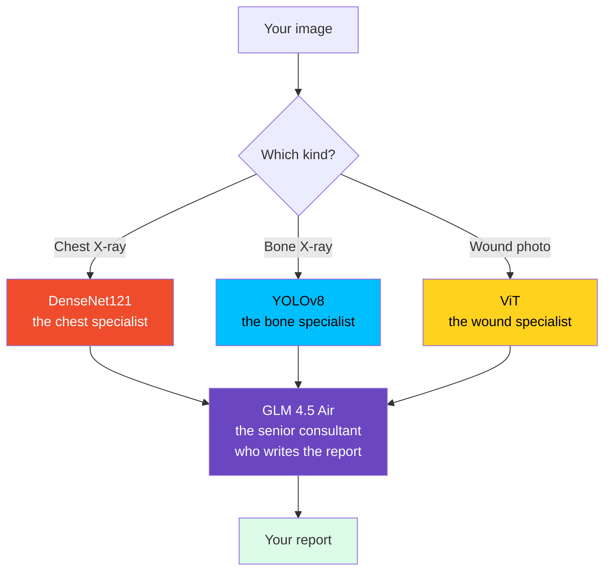

# XRayVision AI — Explained Simply

**A plain-language guide to what this project is, what it is built from, and how it works.**

No prior knowledge assumed. If you can use a website, you can follow this document.

| | |
|---|---|
| **Project** | XRayVision AI |
| **Students** | Muhammad Ali Raza (2022F-MUL-BSSWE-017), Hamza Afzal (2022F-MUL-BSSWE-027) |
| **Supervisor** | Maam Misbah — Lecturer, School of Software Engineering |
| **Institution** | Minhaj University Lahore |
| **Live application** | https://x-ray-vision-board.vercel.app |

---

## Table of Contents

1. [What is this project?](#1-what-is-this-project)
2. [What problem does it solve?](#2-what-problem-does-it-solve)
3. [What happens when you upload an X-ray](#3-what-happens-when-you-upload-an-x-ray)
4. [The three parts of the system](#4-the-three-parts-of-the-system)
5. [The technology stack, explained one by one](#5-the-technology-stack-explained-one-by-one)
6. [The AI models, explained](#6-the-ai-models-explained)
7. [How we keep it safe](#7-how-we-keep-it-safe)
8. [Words you will hear, in plain English](#8-words-you-will-hear-in-plain-english)
9. [Likely viva questions and simple answers](#9-likely-viva-questions-and-simple-answers)

---

## 1. What is this project?

**XRayVision AI is a website where you upload a medical image and get an AI-written report back in a
few seconds.**

That is the whole idea. Three kinds of image are accepted:

| You upload | The system checks for |
|---|---|
| A **chest X-ray** | 18 lung and heart conditions — pneumonia, fluid, enlarged heart, and so on |
| A **bone X-ray** | Fractures, and it draws a box around where it thinks the break is |
| A **photo of a wound** | What type of wound it is |

You get back: what was found, how confident the AI is about each finding (as a percentage), how
urgent it looks, what to do next, and which kind of doctor to see.

> **Very important:** this is a **learning tool**, not a doctor and not a medical device. It exists so
> a medical student can practise reading X-rays and get instant feedback. Nobody should make a real
> medical decision from it. That warning is written on every page of the app itself.

---

## 2. What problem does it solve?

**There are not enough radiologists.**

A radiologist is a doctor who specialises in reading X-rays. Pakistan has very few of them compared
to the number of patients, and most are in big cities. In smaller towns, X-rays are often read by
doctors who are not radiology specialists, or sent away and the report comes back days later.

**And medical students learning to read X-rays get feedback slowly.**

If you are a student practising on X-ray images, you have to wait for a teacher to tell you whether
you read it correctly.

**The AI already exists — but it is hard to use.**

Researchers have already trained very good AI models on hundreds of thousands of real X-rays, and
they give them away for free. But they release them as *research files* — you cannot just open them
and use them. There is no website, no login, no upload button, no report. Just a file that a
programmer has to figure out.

**So our project is the bridge.** We took those free expert models and built everything around them
that turns them into something a student can actually open in a browser and use.

---

## 3. What happens when you upload an X-ray

Here is the whole journey, step by step.

The whole thing usually takes **8 to 15 seconds**.

### Explaining the important steps

**Step 5 — checking the image.** If the picture is too small, too blurry, or too large, we refuse it
and tell you why. This matters: an AI will happily give you a confident-looking answer for a
terrible photo, and that answer will be nonsense. Refusing a bad image is more honest than processing
it.

**Step 6 — cleaning the image.** X-rays come out with very different brightness. We adjust the
contrast so faint details become easier for the AI to see. This is like adjusting brightness on a
dark photo before looking at it closely.

**Step 7 — the *right* model.** We do not run all the AI models on every image. A chest specialist
looking at a photo of a wound would say something confident and completely wrong. So we only run the
model that matches what you said you uploaded.

**Step 9 — turning numbers into words.** The AI models output something like
`Lung Opacity: 0.74, Infiltration: 0.61`. That is not useful to a student. So we hand those numbers
to a **language AI** (the same kind of technology as ChatGPT) and ask it to write a short clinical
paragraph explaining what those findings mean together, how urgent they are, and what to do next.

---

## 4. The three parts of the system

Every website like this has three parts. Think of a restaurant:

| Part | Restaurant analogy | In our project |
|---|---|---|
| **Frontend** | The dining area — what customers see and touch | The website in your browser: buttons, pages, the upload box |
| **Backend** | The kitchen — where the actual work happens | Our server: runs the AI, checks your login, decides what to send back |
| **Database** | The store room — where things are kept | Where your scans, reports and chat history are saved permanently |

**Why separate them?** Because they do completely different jobs. The website needs to look good and
respond instantly. The server needs to run heavy AI calculations. Keeping them apart means we can
change one without breaking the other — and we can put each one on the kind of computer that suits
it best.

---

## 5. The technology stack, explained one by one

"Tech stack" just means **the list of tools we used to build it**. Below, each tool gets three
questions answered: *what is it, why did we use it, and what would happen without it.*

### 5.1 The frontend — the part you see

#### React

**What is it?** React is a tool for building the visual part of a website. Instead of writing one
giant page, you build small reusable pieces called *components* — a button, a card, a navigation bar
— and snap them together like LEGO blocks.

**Why we used it.** Our app has many screens that reuse the same pieces. A "finding card" appears on
the results page and in history. With React we build it once and use it everywhere.

**Without it?** We would rewrite the same HTML over and over, and every small change would have to be
made in ten places.

#### TypeScript

**What is it?** TypeScript is JavaScript (the language browsers speak) with **type checking** added.
It means you tell the computer "this variable holds a number" and it warns you *before you run the
code* if you accidentally put text there.

**Why we used it.** It catches mistakes while you are typing instead of when a user hits the bug.

**Without it?** More bugs would reach users, and we would find them by accident instead of instantly.

#### TanStack Start

**What is it?** A **framework** built on top of React. If React gives you LEGO bricks, a framework
gives you the instruction booklet and the baseplate — it handles page navigation, loading data, and
building the finished site.

**Why we used it.** It gives us *file-based routing*: create a file called `chat.tsx` and the address
`/chat` automatically works. It also handles fetching data from our server and remembering it so the
same information is not downloaded twice.

> **Note for the viva:** you may be asked "why not Next.js?" Next.js is the most famous framework of
> this kind and does the same job. TanStack Start is a newer alternative built by the same team as
> TanStack Query, which we were already using for data fetching — so the two fit together naturally.
> Either would have worked.

#### TailwindCSS and Shadcn/ui

**What are they?** **CSS** is the language that controls how a website looks — colours, spacing,
fonts. **TailwindCSS** lets you write those styles as short labels directly on the element, like
`text-blue-600` instead of writing a separate style file. **Shadcn/ui** is a collection of
ready-made, good-looking components — dialogs, dropdowns, switches — that you copy into your project.

**Why we used them.** Speed and consistency. We got a professional-looking interface without
designing every button from zero, and everything follows the same spacing and colour system.

**Without them?** Weeks spent writing style rules, and an app where every page looks slightly
different.

### 5.2 The backend — the part that does the work

#### Python

**What is it?** A programming language known for being easy to read.

**Why we used it.** Almost all AI and machine-learning tools are written for Python. If you want to
run an AI model, Python is the natural choice — everything else is a fight.

#### FastAPI

**What is it?** A tool for building an **API**. An API is how two programs talk to each other. Our
website cannot run AI models itself, so it *asks* our server to do it. FastAPI is what listens for
those requests and answers them.

**Why we used it.** It is fast, it is Python (so it sits next to our AI code), and it **writes its own
documentation**. Visit `/docs` on our server and you get a live page listing every command the API
understands, with a "Try it out" button. We did not write that page — FastAPI generated it.

**Without it?** We would hand-write the request handling and the documentation separately, and they
would drift apart.

#### Uvicorn

**What is it?** The program that actually listens on the network and hands requests to FastAPI. FastAPI
is the chef; Uvicorn is the waiter who brings the orders in.

#### Pydantic

**What is it?** A tool that checks incoming data is the right shape before your code touches it.

**Why we used it.** Someone could send our server nonsense — a password that is a number, a scan type
that does not exist. Pydantic rejects it automatically with a clear message.

**Without it?** We would write dozens of manual `if` checks, and forget some.

#### SlowAPI (rate limiting)

**What is it?** It limits how many requests one person can make per minute.

**Why we used it.** Running AI costs computing power, and our free-tier services have quotas. Without
a limit, one person hitting "Analyze" fifty times would use up the day's budget for everyone.

**Our limits:** 10 analyses per minute, 20 chat messages per minute, 200 requests per minute overall.

### 5.3 The data — where things are kept

#### Supabase

**What is it?** A service that gives you three things in one: a **database**, **file storage**, and a
**login system**. It is built on PostgreSQL.

**Why we used it.** Building login securely is hard and easy to get wrong. Supabase handles password
storage, password-reset emails and sessions for us, and it is free at our scale.

**Without it?** We would run our own database server and write our own password handling — more work,
and more chances to make a security mistake.

#### PostgreSQL

**What is it?** The actual database — a very well-tested system for storing information in tables,
like a much stricter and much faster spreadsheet.

**Our tables:**

| Table | What it holds |
|---|---|
| `profiles` | Your name, role, profile picture, preferences |
| `scans` | Every analysis: the findings, the report, the urgency, the date |
| `chat_sessions` | Each conversation with the chatbot |
| `chat_messages` | Each message inside those conversations |

#### JWT (JSON Web Token)

**What is it?** A signed digital pass. When you log in, the server gives your browser a token. Every
later request carries that token, and the server checks the signature to confirm it is really you.

**Why we used it.** The server does not have to remember who is logged in — the token proves it by
itself. That matters because our free hosting puts the server to sleep when nobody is using it, and
anything the server was "remembering" would be lost.

**Our token expires after 24 hours**, which is why you sign in again the next day.

### 5.4 Hosting — where it all lives

#### Vercel

**What is it?** A hosting service for websites. We give it our code, it builds it and puts it online.

**What it hosts:** the frontend — the part you see.

#### Docker and Hugging Face Spaces

**What is Docker?** A way to package a program *together with everything it needs to run* — the right
Python version, the right libraries, all of it — into one box called an **image**. That box then runs
identically on any computer.

**Why it matters.** "It works on my laptop" is the oldest problem in software. Docker removes it: the
box that works on your laptop is the exact same box that runs on the server.

**Hugging Face Spaces** is a free hosting service that runs Docker boxes and is designed for AI
projects. It hosts our backend.

#### OpenStreetMap (Overpass API)

**What is it?** OpenStreetMap is a free, community-built map of the world — like Wikipedia, but for
maps. The Overpass API is how you ask it questions, such as "list every hospital within 5 km of this
point."

**Why we used it.** It powers our clinic finder, and it is free. Google Maps would charge us.

---

## 6. The AI models, explained

We use **four** AI systems. The easiest way to understand them is as a team of four specialists.

### DenseNet121 — the chest specialist

**What it does.** Looks at a chest X-ray and reports which of 18 conditions it thinks are present,
each with a confidence percentage.

**What kind of AI is it?** A **CNN** — a Convolutional Neural Network. This is the standard design
for AI that looks at images. It works in layers: early layers spot simple things like edges and
shadows, and later layers combine those into meaningful patterns like "this shadow shape looks like
fluid in the lung."

**Where did it come from?** Researchers trained it on **over 700,000 real clinical X-rays** and
published it free. We did not train it — and that is the honest and correct choice. We could never
gather enough labelled medical images to do better, and pretending otherwise would be dishonest.

### YOLOv8 — the bone specialist

**What it does.** Finds fractures and **draws a box** around each one.

**What does YOLO mean?** "You Only Look Once." Older systems scanned an image many times over,
checking small regions one by one. YOLO looks at the whole picture a single time and predicts all the
boxes at once — which is why it is fast enough to run without an expensive graphics card.

**Why boxes matter.** A percentage tells you *whether* something was found. A box tells you *where* —
so a student can look at that exact spot and judge whether the AI was right. That is much better for
learning.

**An important safety rule.** If YOLO finds nothing, that does **not** mean the X-ray is normal. It
means the model did not recognise anything. Those two things are very different, and confusing them
in medicine is dangerous. So we never report "no detection" as "healthy."

### ViT — the wound specialist

**What it does.** Classifies a photo of a wound into categories.

**What is a Vision Transformer?** A newer design than CNNs. It chops the image into small squares,
treats them like words in a sentence, and uses the same technology that powers language models to
work out how those squares relate to each other. It is good at judging colour and texture — exactly
what matters when looking at a wound.

### GLM 4.5 Air — the report writer

**What it does.** Takes the findings from whichever model ran and writes them up as a readable
clinical paragraph, plus an urgency level and a list of next steps.

**What is an LLM?** A Large Language Model — the same family of technology as ChatGPT. It is very
good at turning structured information into natural sentences.

**How we keep it honest.** This is important, because a fluent paragraph sounds convincing whether or
not it is correct. Three rules:

1. **It never sees the image.** It only receives the findings the vision models produced. So it
   cannot invent a finding that no model actually detected.
2. **Its urgency rating must be one of five fixed words** — critical, high, medium, low, clear. It
   cannot make up its own.
3. **Its paragraph is always shown next to the actual numbers** it was based on, so a reader can
   check the words against the evidence.

It is a translator, not a second doctor.

---

## 7. How we keep it safe

Medical software has one failure that matters more than all the others: **someone believing a wrong
answer.** Here is how the design fights that.

### Confidence is always visible

Every finding shows a percentage. Findings are then split into three groups on screen:

| Group | Confidence | Meaning |
|---|---|---|
| **Primary Findings** | 65% and above | The AI is fairly sure |
| **Secondary Findings** | 50% – 65% | Less sure — treat with caution |
| **Borderline** | Below 50% | Weak signals, hidden by default |

If *any* finding is below 60%, a banner appears saying a radiologist should review the scan.

**This turned out to protect us in a real way.** We found a genuine bug where the system produced a
meaningless label on one scan. Because of this grouping, the wrong label was automatically pushed
into the lower tiers while the correct finding stayed on top. A plain sorted list would have shown
them as equals.

### Nothing breaks completely

Our system depends on outside services, and free services fail sometimes. So instead of giving up,
the system gives you *less*:

| If this fails | You still get |
|---|---|
| The report-writing AI | All the findings, with a standard message instead of the paragraph |
| Image storage | The full report, just without the saved image |
| One of the AI models | Whatever the other models found |

**A partial answer is more useful than an error page.**

### Your data is yours

Your scans, chats and statistics are visible only to you. This is checked **twice** — once by our
server code, and again by the database itself using a feature called Row Level Security. If one check
had a bug, the other still holds.

### The warning is built in, not bolted on

The "Educational use only" badge is drawn by the app's main layout, not written on individual pages.
That means it is impossible to add a new page and forget to include the warning.

---

## 8. Words you will hear, in plain English

| Word | Plain meaning |
|---|---|
| **API** | How two programs talk to each other. Like a waiter carrying orders between you and the kitchen. |
| **Frontend** | The part you see and click. |
| **Backend** | The part that does the work, on a server. |
| **Framework** | A ready-made structure so you do not build everything from zero. |
| **Library** | A bundle of code someone else wrote that you use in your project. |
| **Database** | Organised permanent storage. A very strict, very fast spreadsheet. |
| **Model** | A trained AI. It has already learned from examples and now makes predictions. |
| **Training** | Showing an AI thousands of examples until it learns the pattern. **We did not train — we used models others trained.** |
| **Inference** | Actually *using* a trained model to get an answer. This is what happens when you press Analyze. |
| **CNN** | Convolutional Neural Network — the standard AI design for looking at images. |
| **LLM** | Large Language Model — AI that reads and writes text, like ChatGPT. |
| **Confidence** | How sure the model is, as a percentage. Higher is more sure — never a guarantee. |
| **Bounding box** | The rectangle drawn around something the AI spotted. |
| **JWT / token** | A signed digital pass proving you are logged in. |
| **CLAHE** | A contrast-improvement technique applied to the X-ray before the AI sees it. |
| **DICOM** | The file format that real hospital scanners produce (`.dcm`). |
| **ICD-10** | The worldwide standard code for a diagnosis. Lets our findings match official medical coding. |
| **Rate limiting** | Capping how many requests one person can make per minute. |
| **Docker** | Packaging a program with everything it needs, so it runs the same everywhere. |
| **Deployment** | Putting your project online so other people can use it. |
| **Free tier** | The free level of a paid service. Our entire project runs on free tiers. |
| **Cold start** | When a sleeping server wakes up. It makes the first request slow. |
| **Row Level Security** | A database rule that stops one user seeing another user's rows. |

---

## 9. Likely viva questions and simple answers

**Q: What is your project in one sentence?**
A website where you upload a medical image and an AI gives you a structured report in a few seconds,
built as a learning tool for medical students.

**Q: Did you train the AI models yourself?**
No, and that was deliberate. The models we use were trained by researchers on hundreds of thousands
of clinical images and published free. We could not gather a dataset anywhere near that size, so
training our own would have produced a worse model while sounding more impressive. Our contribution
is the *system* — turning research files into a working, deployed application with safety built in.

**Q: What is FastAPI?**
A Python tool for building an API — the thing that receives requests from our website and answers
them. We chose it because it is fast, it works naturally with Python AI code, and it generates its
own interactive documentation.

**Q: Why did you use React?**
It lets you build the interface as small reusable pieces instead of repeating the same code on every
page. Our app has nine screens sharing the same components.

**Q: What is the difference between frontend and backend?**
The frontend is the website in your browser — what you see and click. The backend is our server —
it runs the AI, checks your login and talks to the database. They communicate over an API.

**Q: Why do you run only one model instead of all of them?**
Because a chest model looking at a wound photo gives confident nonsense. Running only the matching
model keeps the report meaningful, and it also runs about three times faster — which matters because
we run on free hosting with no graphics card.

**Q: How do you know the AI is right?**
We do not, and we never claim to. That is why every finding shows a confidence percentage, why
findings are split into three confidence tiers, and why anything below 60% triggers a message telling
the user to have a radiologist review it. We did not validate clinical accuracy — that would need a
labelled test set and medical supervision, which was outside our scope. The thesis says this openly.

**Q: What happens if the AI service goes down?**
The analysis still works. You get all the model findings with a standard message in place of the
written summary. We designed every external dependency so that failure reduces what you get rather
than stopping it.

**Q: How much did it cost to build?**
Nothing. Every service — hosting, database, storage, the language model — runs on a free tier, and
all AI runs on a normal processor with no graphics card. That was a hard requirement from the start.

**Q: Can this be used in a hospital?**
No. It is not a certified medical device, it has not been clinically validated, and it does not
connect to hospital systems. It is an educational tool, and it says so on every screen.

**Q: What is the biggest weakness?**
Two things, and both are in the thesis. First, we never validated diagnostic accuracy. Second, we
found a real bug where the fracture detector produced a meaningless label because the deployed server
was loading the wrong model file. We traced the cause and documented it rather than hiding it.

**Q: What would you do next?**
Fix that model-loading bug, run the remaining test cases, move image storage behind proper access
control, and add an automatic test suite so bugs are caught before users see them.

---

## Where to read more

| You want | Read |
|---|---|
| What the system must do | [Software Requirements Specification](01-SRS.md) |
| How it is built, with diagrams | [Software Design Document](02-SDD.md) |
| How it was tested and what broke | [Test Documentation](03-Test-Cases.md) |
| How to actually use the app | [User Manual](04-User-Manual.md) |
| The full academic write-up | [Thesis](05-Thesis.md) |

---

*XRayVision AI — Minhaj University Lahore*
*Educational use only. Not a certified medical device.*
