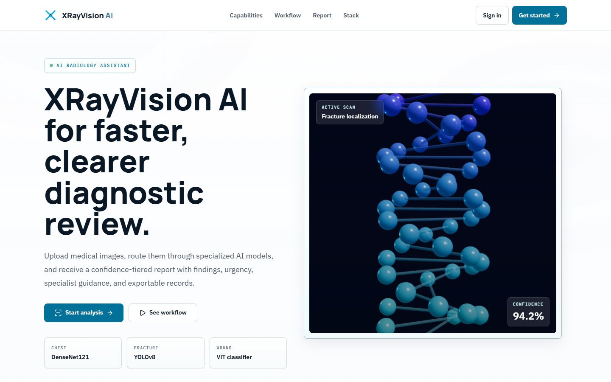
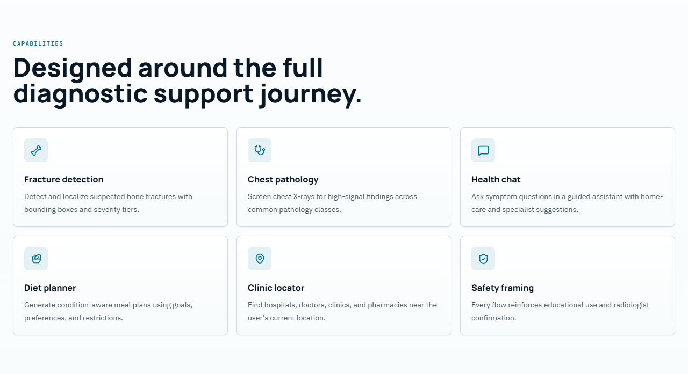
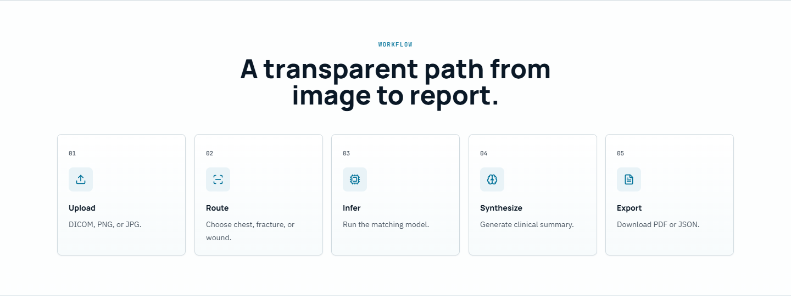
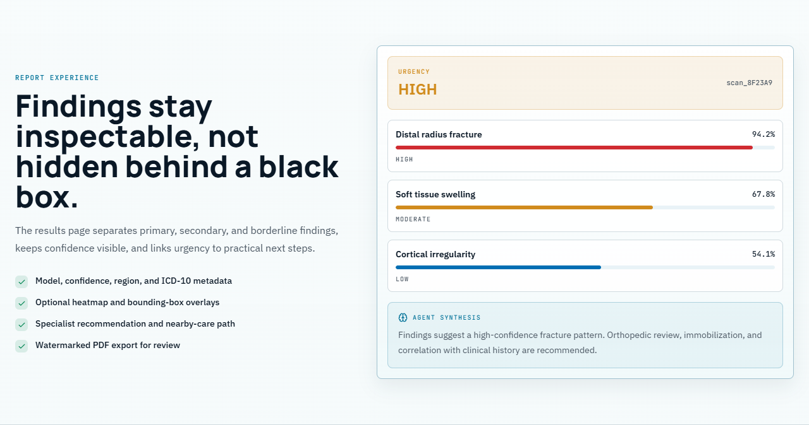

# XRayVision AI — Project Documentation

Final Year Project documentation set for **XRayVision AI**, a full-stack medical diagnostic platform.

| Field | Value |
|---|---|
| **Project title** | Web-Based AI Chatbot for Automated X-Ray Fracture Detection |
| **Institution** | Minhaj University Lahore — School of Software Engineering |
| **Programme** | BSSE, 8th Semester — Final Year Project |
| **Students** | Muhammad Ali Raza (2022F-MUL-BSSWE-017) · Hamza Afzal (2022F-MUL-BSSWE-027) |
| **Supervisor** | Maam Misbah — Lecturer, School of Software Engineering |
| **Product version** | 2.1.0 |
| **Live application** | https://x-ray-vision-board.vercel.app |

---

## The Documents

| # | Document | What it answers | Size |
|---|---|---|---|
| 0 | **[Handover note](HANDOVER.md)** | **Start here.** What you have, the five things to do, the three things not to do, and the honest status. | 1 page |
| ★ | **[Explained Simply](06-Simple-Guide.md)** | **No jargon.** What the project is, every technology explained one by one, how the AI works, and likely viva questions with answers. Start here if you are new to the project. | Plain language |
| 1 | **[Software Requirements Specification](01-SRS.md)** | *What* must the system do? Scope, users, 60+ numbered functional requirements, use case model, non-functional targets, constraints. | IEEE 830 format |
| 2 | **[Software Design Document](02-SDD.md)** | *How* is it built? Architecture, ERD, DFDs (levels 0–2), class diagram, sequence diagrams, state diagrams, algorithms, security design, deployment. | IEEE 1016 format |
| 3 | **[Test Documentation](03-Test-Cases.md)** | *How was it verified?* Test plan, environment, test data, 93 test case specifications, traceability, defect log. | IEEE 829 format |
| 4 | **[User Manual](04-User-Manual.md)** | *How do I use it?* Step-by-step guide to every feature, with screenshots from the live deployment, troubleshooting and FAQ. | End-user guide |
| 5 | **[Thesis](05-Thesis.md)** | The bound submission document. Title page, certificate, declaration, abstract, eight chapters, IEEE references and four appendices — drawing on documents 1–4. | FYP thesis |

> 📘 **For submission, use [`XRayVision_AI_Thesis.docx`](XRayVision_AI_Thesis.docx)** — the thesis
> formatted for binding: A4, Times New Roman 12 pt, 1.5 line spacing, 1.5-inch binding margin,
> roman-numeral front matter, arabic body pagination, and an automatic Table of Contents field.
> See [Printing and Binding](#printing-and-binding).

> 📄 **Every document also exists as a ready-to-open `.html` file in this folder** with all diagrams
> already rendered — no editor extension required, and it prints straight to PDF.
> See [Viewing the Diagrams](#viewing-the-diagrams).

Supporting material also in the repository:

| Document | Location |
|---|---|
| Enterprise Technical Documentation (27 pages, PDF) | [`../XRayVision_AI_Documentation.pdf`](../XRayVision_AI_Documentation.pdf) |
| Project overview and quick start | [`../README.md`](../README.md) |
| Backend setup and model reference | [`../backend/README.md`](../backend/README.md) |
| Security policy | [`../SECURITY.md`](../SECURITY.md) |
| Contribution guidelines | [`../CONTRIBUTING.md`](../CONTRIBUTING.md) |
| Code of conduct | [`../CODE_OF_CONDUCT.md`](../CODE_OF_CONDUCT.md) |
| Database schema | [`../backend/supabase_schema.sql`](../backend/supabase_schema.sql) |

---

## Screenshot Gallery

Every screenshot below was captured from the **live deployment** at
`https://x-ray-vision-board.vercel.app` using an automated Chromium session signed in to the demo
account. The source files are in [`screenshots/`](screenshots/).

### Public pages



**Landing page** — `01a-landing-hero.png`



**Capabilities section** — `01b-landing-capabilities.png`



**Workflow section** — `01c-landing-workflow.png`



**Report-experience section** — `01d-landing-report.png`


**Landing page, full length** — `01-landing.png`

### Authentication


**Sign-in**, including the one-click demo account — `02-login.png`


**Registration** — `03-register.png`


**Password reset** — `04-forgot-password.png`

### The application


**Dashboard** — per-user analytics, recent analyses, finding distribution and per-model confidence —
`05-dashboard.png`


**New Analysis** — the three-step upload wizard — `06-analyze-upload.png`


**Diagnostic report** — bounding-box overlays, tiered findings, low-confidence banner, LLM synthesis,
recommended actions and the full confidence table — `13-results.png`


**Scan history** — `07-history.png`


**Health chatbot** — English/Urdu toggle with voice input — `08-chat.png`


**Diet planner** — `09-diet.png`


**Clinic locator** — radius control and OpenStreetMap attribution — `10-clinics.png`


**Profile** — `11-profile.png`


**Settings** — appearance, analysis preferences and notifications — `12-settings.png`

### Responsive


**Mobile layout** at 390 × 844 — `14-landing-mobile.png`

*Also in [`screenshots/`](screenshots/) but not shown above: `01e-landing-trust.png` (the statistics
strip, too wide and short to reproduce usefully at page scale).*

---

## Reading Order

**For the evaluation committee**
1. [SRS §1–2](01-SRS.md) — what the system is and who it is for
2. [SDD §2](02-SDD.md#2-system-architecture) — the architecture
3. [User Manual §6–7](04-User-Manual.md#6-running-an-analysis-core-feature) — the core feature in action
4. [Test Documentation §16](03-Test-Cases.md#16-test-summary-report) — verification status

**For a developer joining the project**
1. [`../README.md`](../README.md) — set up and run it
2. [SDD §5](02-SDD.md#5-component-design) — where the code lives
3. [SDD §6](02-SDD.md#6-interface-design) — the API contract
4. [SDD §12](02-SDD.md#12-design-decisions-and-rationale) — why it is built this way

**For an end user**
Go straight to the [User Manual](04-User-Manual.md).

---

## Viewing the Diagrams

The diagrams are written in **Mermaid** inside the Markdown files. Depending on how you open the
docs, you may need to do nothing — or you may see nothing at all. Here is what works:

### ✅ Easiest — open the ready-made HTML

Every document has been pre-rendered to a **self-contained HTML file** with all diagrams baked in as
SVG. **Just double-click it.** No extension, no internet connection, no build step.

| Open this | For |
|---|---|
| [`README.html`](README.html) | This index |
| [`01-SRS.html`](01-SRS.html) | Requirements specification |
| [`02-SDD.html`](02-SDD.html) | Design document — all 18 diagrams rendered |
| [`03-Test-Cases.html`](03-Test-Cases.html) | Test documentation |
| [`04-User-Manual.html`](04-User-Manual.html) | User manual with screenshots |
| [`05-Thesis.html`](05-Thesis.html) | Thesis, browser edition |
| [`06-Simple-Guide.html`](06-Simple-Guide.html) | Plain-language guide |

### 📕 Or just take the PDFs

Every document is also pre-printed to A4 PDF in [`pdf/`](pdf/), with page numbers in the footer.
Nothing to install, nothing to render — email them, upload them, print them. The index PDF
includes the full screenshot gallery.

| File | Pages | Contents |
|---|---|---|
| [`00-START-HERE-Handover.pdf`](pdf/00-START-HERE-Handover.pdf) | 3 | Handover note — read first |
| [`01-Project-Explained-Simply.pdf`](pdf/01-Project-Explained-Simply.pdf) | 14 | **Plain-language guide** — the stack and the project, no jargon |
| [`02-Documentation-Index.pdf`](pdf/02-Documentation-Index.pdf) | 21 | This index, including the screenshot gallery |
| [`03-Software-Requirements-Specification.pdf`](pdf/03-Software-Requirements-Specification.pdf) | 25 | Requirements specification |
| [`04-Software-Design-Document.pdf`](pdf/04-Software-Design-Document.pdf) | 32 | Design document |
| [`05-Test-Documentation.pdf`](pdf/05-Test-Documentation.pdf) | 45 | Test documentation |
| [`06-User-Manual.pdf`](pdf/06-User-Manual.pdf) | 27 | User manual |
| [`07-Thesis-browser-edition.pdf`](pdf/07-Thesis-browser-edition.pdf) | 79 | Thesis, browser edition (not the submission copy) |

> ⚠️ **Which thesis file do I submit?**
> `05-Thesis-browser-edition.pdf` is convenient for reading and emailing, but it is **not** the
> submission copy — it uses the web stylesheet and has no paginated contents table.
> **The bound copy comes from [`XRayVision_AI_Thesis.docx`](XRayVision_AI_Thesis.docx):** open it in
> Word, press **F9** on the contents field, then *File → Save as → PDF*. That version carries Times
> New Roman, 1.5 spacing, the binding margin and real page numbers in the Table of Contents.

You can also print any `.html` yourself with **Ctrl + P → Save as PDF** — the stylesheet has print
rules that keep tables, diagrams and screenshots from being split across pages.

---

## Printing and Binding

The submission copy is **[`XRayVision_AI_Thesis.docx`](XRayVision_AI_Thesis.docx)** (about 11 MB,
with all 22 diagrams and 13 screenshots embedded).

**Formatting already applied**

| Setting | Value |
|---|---|
| Page size | A4 |
| Margins | 1.5 in left (binding edge), 1 in top / right / bottom |
| Body font | Times New Roman, 12 pt |
| Line spacing | 1.5 |
| Front matter pagination | Lower-case roman numerals (i, ii, iii …) |
| Body pagination | Arabic, restarting at 1 from Chapter 1 |
| Headings | Times New Roman bold, outline levels set for the contents field |
| Tables | 27, full content width, header rows shaded and repeated |
| Figures | 35, centred with italic captions |

**Before you print — two steps in Word**

1. **Build the contents table.** Open the file, click the Table of Contents placeholder, then press
   **F9** (or right-click → *Update Field* → *Update entire table*). Word fills in the entries and
   their page numbers. Repeat this after any edit that changes pagination.
2. **Fill in the signature blocks** on the Certificate of Approval and Declaration pages, and sign
   them.

**Then check against your department's template.** The formatting above follows the common Pakistani
university thesis convention, but departments differ on details — required certificate wording, logo
placement, font choice, and whether an abstract word limit applies. Compare against the template your
department issues and adjust; everything is plain Word formatting, so nothing here is locked.

**To regenerate the `.docx` after editing.** The Word file is generated from
[`05-Thesis.md`](05-Thesis.md), so edit the Markdown and rebuild rather than editing both. If you
edit the `.docx` directly, treat it as the new master and stop rebuilding, or your changes will be
overwritten. Build instructions are in [`tools/README.md`](tools/README.md).

---

## Rebuilding the Documents

The Markdown files are the single source of truth; the `.html` and `.docx` files are generated. Three
scripts in [`tools/`](tools/) regenerate them:

```bash
cd docs/tools
pip install playwright && python -m playwright install chromium
npm install

python build_html.py              # Markdown -> HTML + diagrams/*.svg
python render_diagrams_png.py     # SVG -> print-quality PNG
node build_thesis_docx.js         # Thesis Markdown -> Word
```

See [`tools/README.md`](tools/README.md) for prerequisites, the authoring markers used in the thesis,
and how to change the Word formatting.

### Viewing the Markdown source instead

| Where you open the `.md` file | Do diagrams render? |
|---|---|
| **GitHub / GitLab** (web) | ✅ Yes, automatically |
| **VS Code — built-in preview** | ❌ **No.** VS Code cannot render Mermaid on its own. Install the free extension **Markdown Preview Mermaid Support** (`bierner.markdown-mermaid`), then reopen the preview. |
| **Obsidian, Typora** | ✅ Yes |
| **Plain text editor** | ❌ You will see the diagram source code |

> **If your diagrams are blank in VS Code, that is expected** — it is the editor, not the document.
> Either install the extension above or just open the matching `.html` file.

### Individual diagram files

Each diagram is also saved separately as an SVG in [`diagrams/`](diagrams/) — 22 files, named after
their source document and position (e.g. `02-SDD-diagram-03.svg` is the ERD). Use these to paste a
single diagram into a thesis chapter, a slide deck or a poster. SVG is vector, so it stays sharp at
any print size.

**Diagram inventory**

| Diagram | Type | Location |
|---|---|---|
| Product context | Graph | [SRS §2.1](01-SRS.md#21-product-perspective) |
| Product functions | Mindmap | [SRS §2.2](01-SRS.md#22-product-functions) |
| Use case diagram | Graph | [SRS §5.1](01-SRS.md#51-use-case-diagram--system-overview) |
| Analysis activity diagram | Flowchart | [SRS §5.3](01-SRS.md#53-activity-diagram--analysis-pipeline) |
| Layered architecture | Graph | [SDD §2.1](02-SDD.md#21-architectural-style) |
| Component diagram | Graph | [SDD §2.2](02-SDD.md#22-component-diagram) |
| Entity relationship diagram | ER diagram | [SDD §3.1](02-SDD.md#31-entity-relationship-diagram) |
| RLS policy map | Graph | [SDD §3.5](02-SDD.md#35-row-level-security-policy-design) |
| DFD Level 0 (context) | Graph | [SDD §4.1](02-SDD.md#41-dfd-level-0--context-diagram) |
| DFD Level 1 | Graph | [SDD §4.2](02-SDD.md#42-dfd-level-1--major-processes) |
| DFD Level 2 (analysis) | Graph | [SDD §4.3](02-SDD.md#43-dfd-level-2--process-20-analyse-image-decomposed) |
| Domain class diagram | Class diagram | [SDD §5.3](02-SDD.md#53-class-diagram--domain-model-pydantic-schemas) |
| Registration/login sequence | Sequence | [SDD §7.1](02-SDD.md#71-sequence-diagram--registration-and-login) |
| Image analysis sequence | Sequence | [SDD §7.2](02-SDD.md#72-sequence-diagram--image-analysis-primary-flow) |
| Chat sequence | Sequence | [SDD §7.3](02-SDD.md#73-sequence-diagram--bilingual-chat) |
| PDF export sequence | Sequence | [SDD §7.4](02-SDD.md#74-sequence-diagram--pdf-report-export) |
| Scan lifecycle | State diagram | [SDD §7.5](02-SDD.md#75-state-diagram--scan-lifecycle) |
| Auth session lifecycle | State diagram | [SDD §7.6](02-SDD.md#76-state-diagram--authentication-session) |
| Auth/authorisation flow | Graph | [SDD §9.1](02-SDD.md#91-authentication-and-authorisation-flow) |
| Degradation decision tree | Graph | [SDD §10](02-SDD.md#10-error-handling-and-degradation-design) |
| Deployment diagram | Graph | [SDD §11.1](02-SDD.md#111-deployment-diagram) |
| Startup sequence | Sequence | [SDD §11.2](02-SDD.md#112-startup-sequence) |

**22 diagrams** across the two design documents.

---

## Status

| Document | Status |
|---|---|
| SRS | ✅ Complete — 60+ functional requirements, 12 use cases, full NFR set |
| SDD | ✅ Complete — 22 diagrams, algorithms, design rationale |
| Test Documentation | ⚠️ Specifications complete (93 cases). **17 verified against the live deployment; 75 pending execution; 1 defect open.** See the notice at the top of the document. |
| User Manual | ✅ Complete — every feature documented with live screenshots |
| Thesis | ✅ Complete — 8 chapters, 25 IEEE references, 4 appendices; Word edition ready for binding |

### Open items before final submission

1. **Update the Table of Contents field** in the `.docx` (select it and press F9) and sign the certificate and declaration pages.
2. **Execute the pending test cases** and fill in the Actual Result columns — see [§16.1](03-Test-Cases.md#161-coverage-by-module). Then update Chapter 6 of the thesis, which currently reports 17 of 93 executed.
3. ~~Close DEF-01~~ — **done.** The root `.env` has been untracked (`git rm --cached .env`); the local file is untouched.
4. ~~Close DEF-02~~ — **done.** `backend/README.md` now states the `xray-images` bucket is public, matching the implementation.
5. **Fix DEF-03** — root cause found: the bundled `backend/models/fracture_yolov8.pt` is correct (`Fracture`/`Not_Fracture`), but the deployed backend was loading the generic COCO checkpoint `yolov8n.pt` (which contains `vase`). Correct `YOLO_WEIGHTS_PATH` on the deployed Space, and validate the loaded model's class vocabulary at startup instead of trusting its filename.
6. **Check the thesis against your department's template** — certificate wording, logo placement and font requirements vary by department.

---

## Medical Disclaimer

**XRayVision AI is an educational tool. It is NOT a certified medical device.** All outputs are
AI-generated estimates intended to support, not replace, the clinical judgement of a qualified
radiologist. Do not use this software for diagnosis or treatment decisions.

---

*XRayVision AI — Project Documentation — Minhaj University Lahore*
